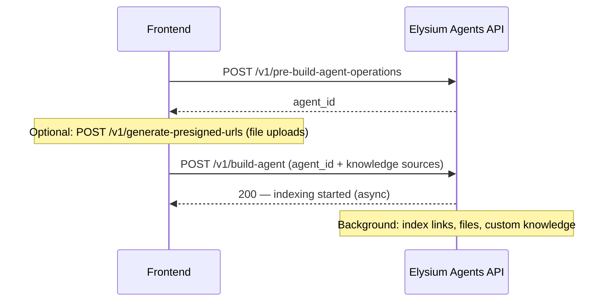

# Agent create & update APIs — frontend guide

Reference for the **Elysium Agents** agent create and update request bodies. Covers what each endpoint accepts today, validation rules, and async vs synchronous behavior.

**Base path:** `/elysium-agents/elysium-atlas/agent`

**Auth:** `Authorization: Bearer <session_jwt>` with `user_id`, `team_id`, and `role`.

**RBAC:** Create and update require **owner** or **admin**. See [frontend-agents-rbac-guide.md](./frontend-agents-rbac-guide.md).

**Tool linking:** See [frontend-tools-api-guide.md](./frontend-tools-api-guide.md#agent-linking-tool_ids) for `tool_ids` validation rules.

---

## Overview — create vs update flow

Agent creation is typically a **two-step** flow:



**Update** uses a single endpoint that either applies changes **immediately** or starts a **background re-index**, depending on the fields sent.

| Endpoint | Purpose |
|----------|---------|
| `POST /v1/pre-build-agent-operations` | Create agent shell + initial config |
| `POST /v1/generate-presigned-urls` | S3 upload URLs before build (files) |
| `POST /v1/build-agent` | Index knowledge sources (async) |
| `POST /v1/update-agent` | Update config and/or re-index (sync or async) |

---

## 1. Create agent shell

`POST /elysium-agents/elysium-atlas/agent/v1/pre-build-agent-operations`

Creates the `atlas_agents` document with defaults and returns `agent_id`. Does **not** index links/files yet.

### Request body

| Field | Type | Required | Notes |
|-------|------|----------|-------|
| `agent_name` | `string` | No | If sent, must be unique for the user; otherwise default `"my-agent"` |
| `retrieval_strategy` | `string` | No | `"simple"` \| `"orchestrated"`. Default `"simple"` |
| `llm_model` | `string` | No | Must be a supported model ID. Default `"gpt-4o-mini"` |
| `lead_collection_config` | `object` | No | See [Lead collection config](#lead-collection-config) |
| `tool_ids` | `string[]` | No | Team tool Mongo `_id`s. Default `[]`. Max 50 |

`owner_user_id` and `team_id` are set from the JWT — do not send them.

### Supported `llm_model` values

| Model ID |
|----------|
| `gpt-4o-mini` |
| `gpt-4.1-mini` |
| `gpt-5-nano-2025-08-07` |
| `openai/gpt-oss-120b` |
| `openai/gpt-oss-20b` |
| `claude-3-7-sonnet-latest` |
| `claude-sonnet-4-0` |
| `claude-sonnet-4-5` |
| `claude-haiku-4-5` |
| `grok-4-1-fast-non-reasoning` |
| `grok-4-1-fast-reasoning` |
| `grok-code-fast-1` |
| `deepseek-v4-flash` |
| `deepseek-v4-pro` |

### Example request

```json
{
  "agent_name": "Support Bot",
  "retrieval_strategy": "simple",
  "llm_model": "gpt-4o-mini",
  "lead_collection_config": {
    "enable_lead_capturing": false
  },
  "tool_ids": ["674a1b2c3d4e5f6789012345"]
}
```

### Success `200`

```json
{
  "success": true,
  "message": "Agent created successfully.",
  "agent_id": "674a1b2c3d4e5f6789012345"
}
```

### Other responses

| Status | When |
|--------|------|
| `200` + `success: false` | Duplicate `agent_name` for user |
| `400` | Invalid `retrieval_strategy`, `llm_model`, `lead_collection_config`, or `tool_ids` |
| `403` | Not owner/admin, plan limit, or no team context |

---

## 2. Generate presigned URLs (optional, before build)

`POST /elysium-agents/elysium-atlas/agent/v1/generate-presigned-urls`

Use when uploading files to S3 before calling `build-agent`.

### Request body

| Field | Type | Required | Notes |
|-------|------|----------|-------|
| `files` | `array` | Yes | List of file upload descriptors |

Each item in `files`:

| Field | Type | Required | Notes |
|-------|------|----------|-------|
| `folder_path` | `string` | Yes | S3 folder path |
| `filename` | `string` | Yes | File name |
| `filetype` | `string` | Yes | MIME type |
| `visibility` | `string` | No | `"private"` (default) \| `"public"` |

### Example

```json
{
  "files": [
    {
      "folder_path": "atlas/agents/674a.../docs",
      "filename": "handbook.pdf",
      "filetype": "application/pdf",
      "visibility": "private"
    }
  ]
}
```

Response includes presigned upload URLs keyed by file — use returned `file_key` values in `build-agent` `files` array.

---

## 3. Build agent (index knowledge)

`POST /elysium-agents/elysium-atlas/agent/v1/build-agent`

Indexes links, files, and custom knowledge in the **background**. Returns immediately; poll agent status / `get-agent-details` for progress.

If `agent_id` is omitted, a minimal agent document is created first (prefer `pre-build-agent-operations` instead).

### Request body

| Field | Type | Required | Notes |
|-------|------|----------|-------|
| `agent_id` | `string` | No* | From pre-build step. *Required in normal flow |
| `base_url` | `string` | No | Normalized and stored on agent |
| `tool_ids` | `string[]` | No | Replaces attached tools when sent |
| `links` | `string[]` | No | URLs to crawl and index |
| `files` | `array` | No | Uploaded files to index — see [Files](#files-array) |
| `custom_texts` | `array` | No | Custom text chunks — see [Custom texts](#custom-texts-array) |
| `qa_pairs` | `array` | No | Q&A pairs — see [QA pairs](#qa-pairs-array) |

### Files array

Each item (after S3 upload):

```json
{
  "file_name": "handbook.pdf",
  "file_key": "s3/path/to/handbook.pdf"
}
```

### Custom texts array

Each item:

| Field | Type | Required |
|-------|------|----------|
| `custom_text_alias` | `string` | Yes |
| `custom_text` | `string` | Yes |

```json
{
  "custom_text_alias": "return_policy",
  "custom_text": "Returns are accepted within 30 days..."
}
```

### QA pairs array

Each item:

| Field | Type | Required |
|-------|------|----------|
| `qna_alias` | `string` | Yes |
| `question` | `string` | Yes |
| `answer` | `string` | Yes |

```json
{
  "qna_alias": "shipping_time",
  "question": "How long does shipping take?",
  "answer": "Standard shipping takes 3–5 business days."
}
```

### Example build request

```json
{
  "agent_id": "674a1b2c3d4e5f6789012345",
  "base_url": "https://example.com",
  "tool_ids": ["674a1b2c3d4e5f6789012346"],
  "links": [
    "https://example.com/about",
    "https://example.com/pricing"
  ],
  "files": [
    {
      "file_name": "handbook.pdf",
      "file_key": "atlas/agents/674a.../handbook.pdf"
    }
  ],
  "custom_texts": [
    {
      "custom_text_alias": "return_policy",
      "custom_text": "Returns are accepted within 30 days."
    }
  ],
  "qa_pairs": [
    {
      "qna_alias": "hours",
      "question": "What are your business hours?",
      "answer": "Monday–Friday, 9am–5pm EST."
    }
  ]
}
```

### Success `200`

```json
{
  "success": true,
  "message": "Your agent is being build.",
  "agent_id": "674a1b2c3d4e5f6789012345"
}
```

Agent status becomes `"indexing"` while the background job runs, then `"active"` when complete. Use `agent_current_task` / `progress` from `get-agent-details` for UI progress.

---

## 4. Update agent

`POST /elysium-agents/elysium-atlas/agent/v1/update-agent`

**`agent_id` is required.**

Behavior splits into two paths:

| Path | When | Response |
|------|------|----------|
| **Immediate** | Payload has **no re-index fields** (or only empty knowledge arrays) | `200` — `"Agent updated successfully."` |
| **Background re-index** | Payload includes any [re-index field](#re-index-fields) | `200` — `"Your agent is being updated."` — poll status |

Both paths run validation and apply [basic attributes](#basic-attributes-immediate-always-applied-when-present) first.

---

### Re-index fields

Sending **any** of these (with a non-empty value, for arrays) triggers background re-indexing:

| Field | Type | Notes |
|-------|------|-------|
| `links` | `string[]` | Empty array `[]` is ignored — does not trigger re-index |
| `files` | `array` | Same format as build. Empty `[]` ignored |
| `custom_texts` | `array` | Same format as build. Empty `[]` ignored |
| `qa_pairs` | `array` | Same format as build. Empty `[]` ignored |
| `base_url` | `string` | |
| `agent_name` | `string` | |
| `system_prompt` | `string` | |
| `llm_model` | `string` | Supported model IDs only |
| `temperature` | `number` | |

During re-index, `agent_status` becomes `"updating"` then returns to the requested status (or prior user-settable status).

---

### Basic attributes (immediate — always applied when present)

Applied synchronously on every update call (even when re-index is also triggered):

| Field | Type | Notes |
|-------|------|-------|
| `agent_icon` | `string` | URL or path |
| `primary_color` | `string` | Hex color |
| `secondary_color` | `string` | Hex color |
| `text_color` | `string` | Hex color |
| `welcome_message` | `string` | Widget welcome text |
| `placeholder_text` | `string` | Chat input placeholder |
| `retrieval_strategy` | `string` | `"simple"` \| `"orchestrated"` |
| `lead_collection_config` | `object` | Partial merge — see below |
| `tool_ids` | `string[]` | Team tool IDs. Max 50 |
| `agent_status` | `string` | `"active"` \| `"inactive"` \| `"disabled"` — applied immediately on non-re-index path; on re-index path applied after job completes |

---

### Lead collection config

Object with allowed keys only:

| Key | Type | Default |
|-----|------|---------|
| `enable_lead_capturing` | `boolean` | `false` |

**Create:** full object replaces defaults.

**Update:** partial object merged into stored config (only sent keys change).

```json
{
  "lead_collection_config": {
    "enable_lead_capturing": true
  }
}
```

---

### Example — metadata-only update (immediate)

```json
{
  "agent_id": "674a1b2c3d4e5f6789012345",
  "welcome_message": "Hi! How can I help you today?",
  "primary_color": "#1a73e8",
  "tool_ids": [],
  "agent_status": "active"
}
```

**Response:**

```json
{
  "success": true,
  "message": "Agent updated successfully.",
  "agent_id": "674a1b2c3d4e5f6789012345",
  "agent_status": "active"
}
```

---

### Example — update with re-index (async)

```json
{
  "agent_id": "674a1b2c3d4e5f6789012345",
  "system_prompt": "You are a helpful support assistant for Acme Corp.",
  "llm_model": "gpt-4o-mini",
  "temperature": 0.7,
  "links": ["https://example.com/docs", "https://example.com/faq"],
  "tool_ids": ["674a1b2c3d4e5f6789012346"],
  "agent_status": "active"
}
```

**Response:**

```json
{
  "success": true,
  "message": "Your agent is being updated.",
  "agent_id": "674a1b2c3d4e5f6789012345"
}
```

---

## Field reference — quick lookup

### Create (`pre-build` + `build`)

| Field | pre-build | build | update |
|-------|:---------:|:-----:|:------:|
| `agent_id` | — | ✓ | ✓ (required) |
| `agent_name` | ✓ | — | ✓ (re-index) |
| `retrieval_strategy` | ✓ | — | ✓ (immediate) |
| `llm_model` | ✓ | — | ✓ (re-index) |
| `lead_collection_config` | ✓ | — | ✓ (immediate) |
| `tool_ids` | ✓ | ✓ | ✓ (immediate) |
| `base_url` | — | ✓ | ✓ (re-index) |
| `links` | — | ✓ | ✓ (re-index) |
| `files` | — | ✓ | ✓ (re-index) |
| `custom_texts` | — | ✓ | ✓ (re-index) |
| `qa_pairs` | — | ✓ | ✓ (re-index) |
| `system_prompt` | — | — | ✓ (re-index) |
| `temperature` | — | — | ✓ (re-index) |
| `agent_icon` | — | — | ✓ (immediate) |
| `primary_color` / `secondary_color` / `text_color` | — | — | ✓ (immediate) |
| `welcome_message` / `placeholder_text` | — | — | ✓ (immediate) |
| `agent_status` | — | — | ✓ (immediate) |

---

## Validation & errors

| Status | Typical cause |
|--------|----------------|
| `400` | Missing `agent_id` on update; invalid `retrieval_strategy`, `llm_model`, `agent_status`, `lead_collection_config`, or `tool_ids` |
| `401` | Invalid or expired JWT |
| `403` | Member role; not on agent's team; plan limit on create; no `team_id` in JWT |
| `500` | Unexpected server error |

### Common validation messages

- `Invalid retrieval_strategy '…'. Allowed values: orchestrated, simple.`
- `Invalid llm_model '…'. Allowed values: …`
- `agent_status must be one of: active, disabled, inactive.`
- `One or more tool_ids are invalid or do not belong to this team.`
- `tool_ids must be an array of tool ID strings.`

---

## Frontend checklist

### Create flow

1. Ensure JWT has active `team_id`.
2. Call **pre-build** with name, model, strategy, tools → store `agent_id`.
3. If files needed: **generate-presigned-urls** → upload to S3 → collect `file_key`s.
4. Call **build-agent** with `agent_id` + knowledge arrays.
5. Poll **get-agent-details** until `agent_status` is `"active"` (or handle `"indexing"` UI).

### Update flow

1. Always send `agent_id`.
2. Decide sync vs async: if payload includes re-index fields, show loading/progress UI.
3. **`tool_ids`**, colors, welcome message, etc. can be updated without re-index.
4. Empty `links: []` does **not** clear indexed links — use `remove-agent-links` for that.
5. Gate create/update UI on JWT `role` — members get `403`.

---

## TypeScript types (optional)

```typescript
type RetrievalStrategy = "simple" | "orchestrated";
type AgentStatus = "active" | "inactive" | "disabled";

interface LeadCollectionConfig {
  enable_lead_capturing?: boolean;
}

interface PreBuildAgentRequest {
  agent_name?: string;
  retrieval_strategy?: RetrievalStrategy;
  llm_model?: string;
  lead_collection_config?: LeadCollectionConfig;
  tool_ids?: string[];
}

interface AgentFileInput {
  file_name: string;
  file_key: string;
}

interface CustomTextInput {
  custom_text_alias: string;
  custom_text: string;
}

interface QaPairInput {
  qna_alias: string;
  question: string;
  answer: string;
}

interface BuildAgentRequest {
  agent_id?: string;
  base_url?: string;
  tool_ids?: string[];
  links?: string[];
  files?: AgentFileInput[];
  custom_texts?: CustomTextInput[];
  qa_pairs?: QaPairInput[];
}

interface UpdateAgentRequest {
  agent_id: string;
  // Re-index fields
  links?: string[];
  files?: AgentFileInput[];
  custom_texts?: CustomTextInput[];
  qa_pairs?: QaPairInput[];
  base_url?: string;
  agent_name?: string;
  system_prompt?: string;
  llm_model?: string;
  temperature?: number;
  // Immediate fields
  agent_icon?: string;
  primary_color?: string;
  secondary_color?: string;
  text_color?: string;
  welcome_message?: string;
  placeholder_text?: string;
  retrieval_strategy?: RetrievalStrategy;
  lead_collection_config?: LeadCollectionConfig;
  tool_ids?: string[];
  agent_status?: AgentStatus;
}
```

---

## Related docs

- [frontend-agents-rbac-guide.md](./frontend-agents-rbac-guide.md) — roles and permissions
- [frontend-tools-api-guide.md](./frontend-tools-api-guide.md) — custom tools CRUD and `tool_ids`
- [backend-team-rbac-guide.md](./backend-team-rbac-guide.md) — JWT and team context
