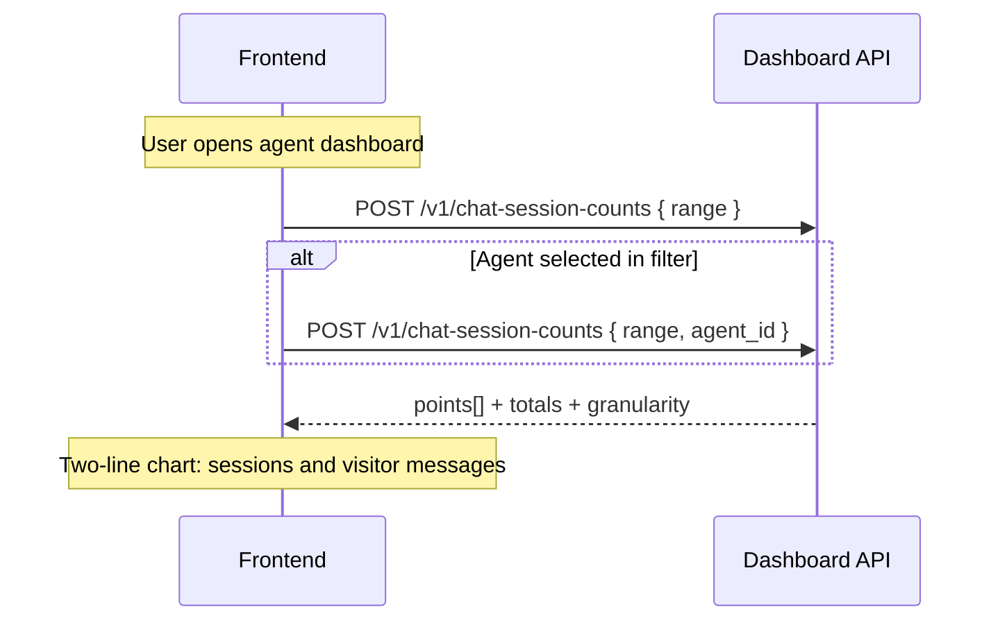

# Agent dashboard APIs — frontend guide

Reference for the first Atlas **agent performance** chart: **new chat sessions and visitor messages**.

Use this as a **two-line chart** (or grouped bars): sessions created vs visitor messages sent in the same UTC buckets.

**Base path:** `/elysium-agents/elysium-atlas/dashboard`

**Auth:** `Authorization: Bearer <session_jwt>` with `user_id`, `team_id`, and `role`.

**Scope:** JWT `team_id`.

- **No `agent_id`** — all agents on that team.
- **With `agent_id`** — that agent only. The agent must belong to the JWT team.

**RBAC** (any active team member):

| Role       | `chat-session-counts` |
| ---------- | :-------------------: |
| **owner**  |           ✓           |
| **admin**  |           ✓           |
| **member** |           ✓           |

See [frontend-agents-rbac-guide.md](./frontend-agents-rbac-guide.md).

---

## What each series counts

| Series                                     | Source                                      | Meaning                                                                                      |
| ------------------------------------------ | ------------------------------------------- | -------------------------------------------------------------------------------------------- |
| Sessions (`count`)                         | `atlas_chat_sessions.created_at`            | New captured sessions in the bucket, **including sessions with no visitor message**          |
| Visitor messages (`visitor_message_count`) | `atlas_chat_mesages` where `role` is `user` | Visitor messages **sent** in the bucket, including messages on sessions that started earlier |

These are independent. A returning visitor can add messages with **0** new sessions that day.

Agent / team-member / tool messages are **not** included.

---

## Time windows

Buckets are **UTC**, not the browser timezone. Daily ranges **include today**. `last_365_days` is **the last 12 UTC calendar months** (current month + previous 11), not 365 daily points.

| `range`         | `granularity` | Points | Window                                     |
| --------------- | ------------- | ------ | ------------------------------------------ |
| `today`         | `day`         | 1      | Start of today UTC → start of tomorrow UTC |
| `last_7_days`   | `day`         | 7      | Today + previous 6 UTC days                |
| `last_30_days`  | `day`         | 30     | Today + previous 29 UTC days               |
| `last_365_days` | `month`       | 12     | Current UTC month + previous 11 months     |

`start_at` is **inclusive**. `end_at` is **exclusive** (start of the next UTC day, or start of the next UTC month for `last_365_days`).

`points` always has one entry per bucket, **including zeros**. Do not fill gaps or re-bucket on the client.

Use `granularity` to format axis labels:

- `day` → `points[].date` is `YYYY-MM-DD`
- `month` → `points[].date` is `YYYY-MM` (e.g. `2026-09`)

UI label for `last_365_days`: **Last 12 months**.

---

## Endpoint

| Method | Path                      | Purpose                                               |
| ------ | ------------------------- | ----------------------------------------------------- |
| `POST` | `/v1/chat-session-counts` | Session + visitor-message counts for a two-line chart |

---

## Chat session counts

`POST /elysium-agents/elysium-atlas/dashboard/v1/chat-session-counts`

### Request (all team agents)

```json
{
  "range": "last_7_days"
}
```

### Request (single agent, last 12 months)

```json
{
  "range": "last_365_days",
  "agent_id": "674a1b2c3d4e5f6789012345"
}
```

| Field      | Type     | Required | Notes                                                         |
| ---------- | -------- | -------- | ------------------------------------------------------------- |
| `range`    | `string` | Yes      | `today` \| `last_7_days` \| `last_30_days` \| `last_365_days` |
| `agent_id` | `string` | No       | Omit for every agent on the team                              |

Unknown keys are rejected (`422`).

### Success `200` — daily (`last_7_days`)

```json
{
  "success": true,
  "range": "last_7_days",
  "timezone": "UTC",
  "granularity": "day",
  "agent_id": null,
  "start_at": "2026-09-15T00:00:00.000Z",
  "end_at": "2026-09-22T00:00:00.000Z",
  "total": 48,
  "total_visitor_messages": 173,
  "points": [
    { "date": "2026-09-15", "count": 4, "visitor_message_count": 11 },
    { "date": "2026-09-16", "count": 9, "visitor_message_count": 28 },
    { "date": "2026-09-17", "count": 6, "visitor_message_count": 19 },
    { "date": "2026-09-18", "count": 0, "visitor_message_count": 3 },
    { "date": "2026-09-19", "count": 11, "visitor_message_count": 40 },
    { "date": "2026-09-20", "count": 8, "visitor_message_count": 32 },
    { "date": "2026-09-21", "count": 10, "visitor_message_count": 40 }
  ]
}
```

`2026-09-18` is a valid pattern: **no new sessions**, but visitors on older sessions still messaged.

### Success `200` — monthly (`last_365_days`)

```json
{
  "success": true,
  "range": "last_365_days",
  "timezone": "UTC",
  "granularity": "month",
  "agent_id": null,
  "start_at": "2025-10-01T00:00:00.000Z",
  "end_at": "2026-10-01T00:00:00.000Z",
  "total": 412,
  "total_visitor_messages": 1580,
  "points": [
    { "date": "2025-10", "count": 28, "visitor_message_count": 90 },
    { "date": "2025-11", "count": 31, "visitor_message_count": 110 },
    { "date": "2025-12", "count": 40, "visitor_message_count": 150 },
    { "date": "2026-01", "count": 22, "visitor_message_count": 70 },
    { "date": "2026-02", "count": 19, "visitor_message_count": 61 },
    { "date": "2026-03", "count": 35, "visitor_message_count": 140 },
    { "date": "2026-04", "count": 41, "visitor_message_count": 165 },
    { "date": "2026-05", "count": 38, "visitor_message_count": 148 },
    { "date": "2026-06", "count": 44, "visitor_message_count": 176 },
    { "date": "2026-07", "count": 36, "visitor_message_count": 130 },
    { "date": "2026-08", "count": 48, "visitor_message_count": 190 },
    { "date": "2026-09", "count": 30, "visitor_message_count": 150 }
  ]
}
```

When `agent_id` is sent, the response echoes that id instead of `null`.

### Response fields

| Field                            | Type             | Description                                                      |
| -------------------------------- | ---------------- | ---------------------------------------------------------------- |
| `range`                          | `string`         | Echo of the requested window                                     |
| `timezone`                       | `string`         | Always `"UTC"`                                                   |
| `granularity`                    | `string`         | `day` or `month` — how `points[].date` is bucketed               |
| `agent_id`                       | `string \| null` | Filter used, or `null` for team-wide                             |
| `start_at`                       | `string`         | Inclusive window start (ISO-8601 UTC)                            |
| `end_at`                         | `string`         | Exclusive window end (ISO-8601 UTC)                              |
| `total`                          | `number`         | Sum of `points[].count` (new sessions)                           |
| `total_visitor_messages`         | `number`         | Sum of `points[].visitor_message_count`                          |
| `points`                         | `array`          | Oldest bucket first                                              |
| `points[].date`                  | `string`         | `YYYY-MM-DD` when `granularity` is `day`; `YYYY-MM` when `month` |
| `points[].count`                 | `number`         | New sessions in that bucket                                      |
| `points[].visitor_message_count` | `number`         | Visitor messages sent in that bucket                             |

A team with no agents still returns the full `points` series with zeros for both series.

### Errors

| Status | When                                                                     |
| ------ | ------------------------------------------------------------------------ |
| `400`  | JWT missing `user_id`                                                    |
| `401`  | Missing or invalid JWT                                                   |
| `403`  | No team in JWT, not a team member, or `agent_id` belongs to another team |
| `404`  | `agent_id` does not exist                                                |
| `422`  | Invalid `range`, empty `agent_id`, or extra fields                       |
| `500`  | Unexpected server error                                                  |

---

## Recommended UI flow



### Chart mapping

| UI                     | Field                                                                                           |
| ---------------------- | ----------------------------------------------------------------------------------------------- |
| Range tabs / select    | `today`, `last_7_days`, `last_30_days`, `last_365_days` (label the last one **Last 12 months**) |
| Agent dropdown         | omit `agent_id` for “All agents”; pass selected agent otherwise                                 |
| KPI — sessions         | `total`                                                                                         |
| KPI — visitor messages | `total_visitor_messages`                                                                        |
| X axis                 | `points[].date` — format with `granularity`                                                     |
| Line 1                 | `points[].count` — **New sessions**                                                             |
| Line 2                 | `points[].visitor_message_count` — **Visitor messages**                                         |
| Empty buckets          | already `0` on both series — keep the tick                                                      |

This is a **multi-line** chart, not a stacked bar: the two series are different units (sessions vs messages) and should not be stacked. Use a shared x-axis and a legend. If the scales differ a lot (many messages per session), a dual y-axis is optional — start with one axis.

Example month tick: `2026-09` → `Sep 2026`. Do not split monthly points into days on the client.

Label the axis as UTC (or convert tick labels locally without changing the buckets). Mixing local “today” with these UTC buckets will shift the last point around midnight.

### Suggested controls

1. Range control bound to `range`.
2. Agent filter from `POST /elysium-atlas/agent/v1/list-agents`. Empty selection = team-wide.
3. Re-fetch on either control change. No pagination.

---

## TypeScript types

```typescript
type DashboardDateRange =
  | "today"
  | "last_7_days"
  | "last_30_days"
  | "last_365_days";

type DashboardGranularity = "day" | "month";

interface ChatSessionCountsRequest {
  range: DashboardDateRange;
  agent_id?: string;
}

interface ChatSessionCountPoint {
  date: string; // YYYY-MM-DD (day) or YYYY-MM (month)
  count: number; // new sessions
  visitor_message_count: number;
}

interface ChatSessionCountsResponse {
  success: true;
  range: DashboardDateRange;
  timezone: "UTC";
  granularity: DashboardGranularity;
  agent_id: string | null;
  start_at: string;
  end_at: string;
  total: number;
  total_visitor_messages: number;
  points: ChatSessionCountPoint[];
}
```

---

## Error handling summary

| Status | Typical cause                                 |
| ------ | --------------------------------------------- |
| `400`  | JWT missing `user_id`                         |
| `401`  | Invalid or expired JWT                        |
| `403`  | Not on team, or agent belongs to another team |
| `404`  | Filter `agent_id` not found                   |
| `422`  | Invalid body (`range` misspelled, extra keys) |
| `500`  | Unexpected server error                       |
