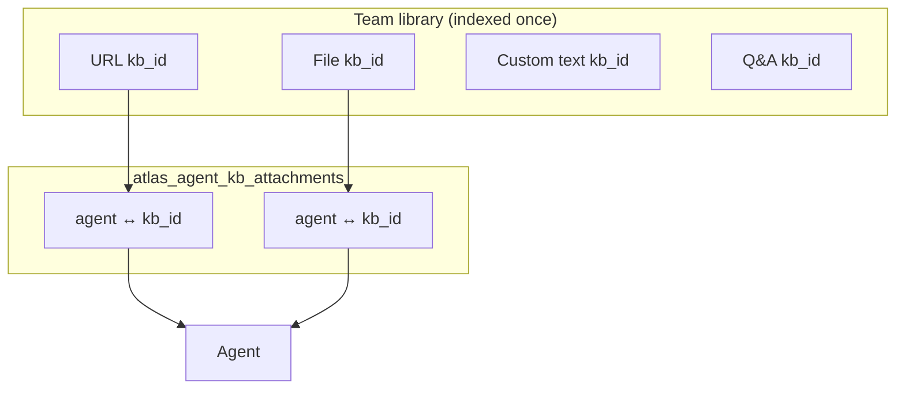
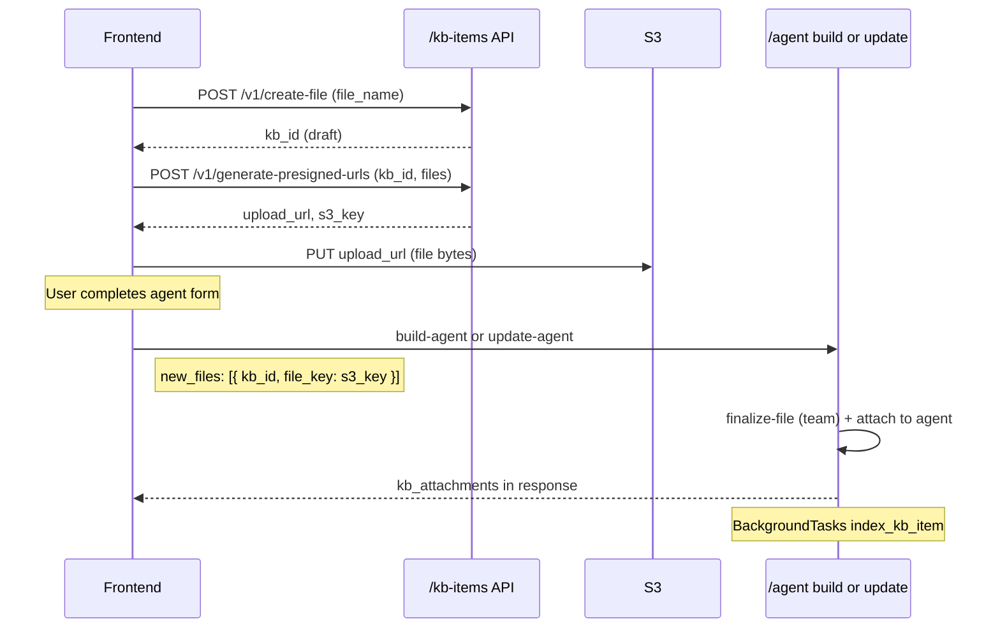

# Agent knowledge attachments- frontend guide

How to attach **team-level knowledge items** to an agent during create and update. Items are indexed once per team; attaching to an agent only creates a link row- no re-embedding.

**Related docs:**

- [frontend-kb-items-api-guide.md](./frontend-kb-items-api-guide.md)- team KB library CRUD, presigned file upload, indexing
- [frontend-agent-create-update-api-guide.md](./frontend-agent-create-update-api-guide.md)- agent shell, config, tools
- [team-knowledge-bases-plan.md](./team-knowledge-bases-plan.md)- architecture

**Base paths:**

| Area            | Path                                     |
| --------------- | ---------------------------------------- |
| Agent           | `/elysium-agents/elysium-atlas/agent`    |
| Team KB library | `/elysium-agents/elysium-atlas/kb-items` |

**Auth:** `Authorization: Bearer <session_jwt>` with `user_id`, `team_id`, and `role`. Create/update require **owner** or **admin**.

---

## Mental model



- **One Mongo row per `(agent_id, kb_id)` pair** in `atlas_agent_kb_attachments`.
- **`kb_ids` are not stored on `atlas_agents`** (unlike `tool_ids`).
- **Attach/detach does not re-index.** Indexing runs when the team item is created or updated.
- **Deleting an agent** removes attachment rows only; team items stay in the library.
- **Deleting a team KB item** removes it from every agent that had it attached.

---

## Agent form UX (recommended)

The agent create/edit form should let users:

1. **Pick existing items** from the team library (search/list via `/kb-items` APIs).
2. **Add new items inline** (URL, custom text, Q&A)- created on the team first, then linked to the agent when save runs.
3. **Add new files**- presigned upload flow **before** save; finalize + attach on save.

On save, call **`build-agent`** (first full config) or **`update-agent`** (later changes) with the fields below.

---

## Request fields (build-agent & update-agent)

### Attach existing team items

| Field            | Type       | Description                       |
| ---------------- | ---------- | --------------------------------- |
| `kb_attachments` | `object[]` | Items already in the team library |

Each entry:

| Field         | Type     | Required | Values                                        |
| ------------- | -------- | -------- | --------------------------------------------- |
| `kb_id`       | `string` | Yes      | Mongo `_id` from a team KB item               |
| `source_type` | `string` | Yes      | `url` \| `file` \| `custom_text` \| `qa_pair` |

```json
"kb_attachments": [
  { "kb_id": "675a1f2b3c4d5e6f7a8b9c0d", "source_type": "file" },
  { "kb_id": "676b2c3d4e5f678901234567", "source_type": "url" }
]
```

### Create new items inline (team + attach in one save)

| Field              | Type       | Creates                     | Indexes on save? |
| ------------------ | ---------- | --------------------------- | ---------------- |
| `new_urls`         | `string[]` | One URL item per string     | Yes (background) |
| `new_custom_texts` | `object[]` | Custom text items           | Yes (background) |
| `new_qa_pairs`     | `object[]` | Q&A items                   | Yes (background) |
| `new_files`        | `object[]` | Finalizes draft file shells | Yes (background) |

**Custom text** (`new_custom_texts`):

```json
{
  "custom_text_alias": "return_policy",
  "custom_text": "Returns accepted within 30 days..."
}
```

**Q&A** (`new_qa_pairs`):

```json
{
  "qna_alias": "shipping_time",
  "question": "How long does shipping take?",
  "answer": "Standard shipping is 3–5 business days."
}
```

**Files** (`new_files`)- see [File flow](#file-flow-presigned-upload-then-save) below.

You can combine **`kb_attachments`** and **`new_*`** in the same request. New items are created on the team, then included in the attachment set.

### Inline deduplication (no re-index)

When using **`new_*`** fields, the API checks the team library first. If a matching item already exists, it **attaches the existing `kb_id`** and does **not** re-index.

| Inline field       | Match key                                    | If match found                                   |
| ------------------ | -------------------------------------------- | ------------------------------------------------ |
| `new_urls`         | Normalized `url`                             | Attach existing URL item                         |
| `new_files`        | `file_name` (finalized file with `file_key`) | Attach existing file; discard unused draft shell |
| `new_custom_texts` | `custom_text_alias`                          | Attach existing custom text                      |
| `new_qa_pairs`     | `qna_alias`                                  | Attach existing Q&A                              |

**Notes:**

- Duplicate inline content does **not** update the library item- only attaches. To change content, use `/kb-items` update APIs (which re-index).
- For files, dedupe applies when another team file with the same `file_name` is already finalized. A redundant draft from `create-file` is deleted if skipped.
- **`kb_attachments`** with an existing `kb_id` never triggers indexing (unchanged).

---

## Sync semantics

| Endpoint       | `kb_attachments` in body | Behavior                                                            |
| -------------- | ------------------------ | ------------------------------------------------------------------- |
| `build-agent`  | Omitted                  | Only inline `new_*` items are attached (if any)                     |
| `build-agent`  | `[]`                     | No attachments (unless `new_*` also sent)                           |
| `build-agent`  | `[...]`                  | **Replace** full set = listed items + any inline-created items      |
| `update-agent` | Omitted                  | Existing attachments **unchanged**; inline `new_*` are **appended** |
| `update-agent` | `[]`                     | **Detach all** (inline `new_*` still attach after clear)            |
| `update-agent` | `[...]`                  | **Replace** full set = listed items + any inline-created items      |

**Removing an item from the agent UI:** send `update-agent` with an updated `kb_attachments` array that omits that `kb_id`. The team library item is **not** deleted.

---

## File flow (presigned upload, then save)

Files must be uploaded to S3 **before** `build-agent` / `update-agent`. The agent API does **not** accept file bytes.



### Step-by-step

1. **`POST /kb-items/v1/create-file`**

```json
{ "file_name": "employee-handbook.pdf" }
```

Save `kb_id` (status `draft`).

2. **`POST /kb-items/v1/generate-presigned-urls`**

```json
{
  "kb_id": "675a1f2b3c4d5e6f7a8b9c0d",
  "files": [
    { "file_name": "employee-handbook.pdf", "filetype": "application/pdf" }
  ]
}
```

3. **`PUT`** file to `upload_url` from the response (use `Content-Type` = `filetype`).

4. On agent save, send **`new_files`** (do **not** call `/kb-items/v1/finalize-file` separately unless you also use the library UI):

```json
{
  "agent_id": "674a1b2c3d4e5f6789012345",
  "new_files": [
    {
      "kb_id": "675a1f2b3c4d5e6f7a8b9c0d",
      "file_key": "teams/{team_id}/kb_items/675a.../files/employee-handbook.pdf"
    }
  ]
}
```

The agent API finalizes the team file item, starts indexing, and attaches it to the agent.

**Alternative:** call `/kb-items/v1/finalize-file` from the library flow, then attach with `kb_attachments` only:

```json
"kb_attachments": [
  { "kb_id": "675a1f2b3c4d5e6f7a8b9c0d", "source_type": "file" }
]
```

---

## Endpoints

### Build agent

`POST /elysium-agents/elysium-atlas/agent/v1/build-agent`

Applies agent config (background) **and** syncs KB attachments (synchronous).

**Example- existing items + new URL + new file:**

```json
{
  "agent_id": "674a1b2c3d4e5f6789012345",
  "system_prompt": "You are a helpful support agent.",
  "tool_ids": [],
  "kb_attachments": [
    { "kb_id": "675a1f2b3c4d5e6f7a8b9c0d", "source_type": "custom_text" }
  ],
  "new_urls": ["https://example.com/pricing"],
  "new_custom_texts": [
    {
      "custom_text_alias": "warranty",
      "custom_text": "All products include a 1-year warranty."
    }
  ],
  "new_files": [
    {
      "kb_id": "676b2c3d4e5f678901234567",
      "file_key": "teams/673.../kb_items/676b.../files/handbook.pdf"
    }
  ]
}
```

**Success `200`:**

```json
{
  "success": true,
  "message": "Your agent is being built.",
  "agent_id": "674a1b2c3d4e5f6789012345",
  "kb_attachments": [
    {
      "attachment_id": "679...",
      "agent_id": "674a...",
      "kb_id": "675a...",
      "team_id": "673...",
      "source_type": "custom_text",
      "attached_by_user_id": "672...",
      "attached_at": "2026-06-28T12:00:00Z",
      "status": "ready",
      "title": "return_policy",
      "custom_text_alias": "return_policy"
    }
  ]
}
```

`kb_attachments` is included when the request changed knowledge attachments. Item `status` may be `indexing` for newly created inline items.

### Update agent

`POST /elysium-agents/elysium-atlas/agent/v1/update-agent`

Same KB fields as build. Other agent fields (icon, colors, `tool_ids`, etc.) behave as before.

**Example- replace attachment set:**

```json
{
  "agent_id": "674a1b2c3d4e5f6789012345",
  "kb_attachments": [
    { "kb_id": "675a1f2b3c4d5e6f7a8b9c0d", "source_type": "url" }
  ]
}
```

**Example- add one new Q&A without changing existing attachments:**

```json
{
  "agent_id": "674a1b2c3d4e5f6789012345",
  "new_qa_pairs": [
    {
      "qna_alias": "hours",
      "question": "What are your hours?",
      "answer": "Mon–Fri 9am–6pm EST."
    }
  ]
}
```

### Get agent details (all attachment types)

`POST /elysium-agents/elysium-atlas/agent/v1/get-agent-details`

```json
{ "agent_id": "674a1b2c3d4e5f6789012345" }
```

Response `agent_details` includes **`kb_attachments`**- a flat list of every attached item across all types. Use the **per-type list APIs below** when you need paginated URLs, files, custom texts, or Q&A separately (e.g. tabbed agent edit UI).

---

## List attached items by type

Paginated lists of KB items **currently attached** to an agent. Each row includes full team item fields (same as `/kb-items` list rows) plus attachment metadata.

**Auth:** any team member with read access to the agent.

### Common request body

| Field      | Type     | Required | Notes                         |
| ---------- | -------- | -------- | ----------------------------- |
| `agent_id` | `string` | Yes      | Agent to list attachments for |
| `page`     | `number` | No       | Default `1`                   |
| `limit`    | `number` | No       | Default `20`, max `100`       |

```json
{
  "agent_id": "674a1b2c3d4e5f6789012345",
  "page": 1,
  "limit": 20
}
```

### Endpoints

| Type         | Endpoint                              | Response array key |
| ------------ | ------------------------------------- | ------------------ |
| URLs (links) | `POST /v1/list-attached-urls`         | `urls`             |
| Files        | `POST /v1/list-attached-files`        | `files`            |
| Custom texts | `POST /v1/list-attached-custom-texts` | `custom_texts`     |
| Q&A pairs    | `POST /v1/list-attached-qa-pairs`     | `qa_pairs`         |

**Base path:** `/elysium-agents/elysium-atlas/agent`

### Example- attached URLs

`POST /elysium-agents/elysium-atlas/agent/v1/list-attached-urls`

**Success `200`:**

```json
{
  "success": true,
  "message": "Attached URLs fetched successfully.",
  "agent_id": "674a1b2c3d4e5f6789012345",
  "urls": [
    {
      "kb_id": "675a1f2b3c4d5e6f7a8b9c0d",
      "team_id": "673...",
      "url": "https://example.com/pricing",
      "status": "ready",
      "created_at": "2026-06-28T10:00:00Z",
      "updated_at": "2026-06-28T10:05:00Z",
      "attachment_id": "679...",
      "agent_id": "674a...",
      "source_type": "url",
      "attached_by_user_id": "672...",
      "attached_at": "2026-06-28T12:00:00Z"
    }
  ],
  "total": 1,
  "page": 1,
  "limit": 20,
  "total_pages": 1,
  "has_next": false,
  "has_prev": false
}
```

### Row fields by type

Each item includes **KB item fields** from the team library plus **attachment fields**:

| Attachment field      | Description                                   |
| --------------------- | --------------------------------------------- |
| `attachment_id`       | Junction row `_id`                            |
| `attached_at`         | When linked to this agent                     |
| `attached_by_user_id` | User who attached                             |
| `source_type`         | `url` \| `file` \| `custom_text` \| `qa_pair` |

| Type        | Item fields (from team library)                         |
| ----------- | ------------------------------------------------------- |
| URL         | `url`, `status`, `summary` (if indexed), timestamps     |
| File        | `file_name`, `file_key`, `status`, timestamps           |
| Custom text | `custom_text_alias`, `content`, `status`, timestamps    |
| Q&A         | `qna_alias`, `question`, `answer`, `status`, timestamps |

For a single item’s full detail, use `/kb-items/v1/get-url` (etc.) with `kb_id`.

### Errors

| Status | When                    |
| ------ | ----------------------- |
| `400`  | Missing `agent_id`      |
| `401`  | Invalid JWT             |
| `403`  | No read access to agent |

---

## Browsing the team library (picker UI)

Use KB item list/search APIs while building the agent form:

| Action            | Endpoint                              |
| ----------------- | ------------------------------------- |
| Search            | `POST /kb-items/v1/search-items`      |
| List URLs         | `POST /kb-items/v1/list-urls`         |
| List files        | `POST /kb-items/v1/list-files`        |
| List custom texts | `POST /kb-items/v1/list-custom-texts` |
| List Q&A          | `POST /kb-items/v1/list-qa-pairs`     |

When the user selects a row, add `{ kb_id, source_type }` to local form state, then send the full desired set in `kb_attachments` on save.

---

## Indexing and status

| Event                                                 | Indexing?        |
| ----------------------------------------------------- | ---------------- |
| Attach existing `ready` item (`kb_attachments`)       | No               |
| Inline `new_*` matches existing library item (dedupe) | No- attach only  |
| Inline `new_urls` / custom text / Q&A (new item)      | Yes (background) |
| Inline `new_files` (finalize on save, new file name)  | Yes (background) |
| Detach from agent                                     | No               |
| Update agent name / prompt / tools only               | No               |

Poll item status via `/kb-items/v1/get-*` or the **`list-attached-*`** APIs (each row includes `status`).

Typical values: `draft` → `indexing` → `ready` | `failed` (use `/kb-items/v1/reindex-item` to retry).

---

## Error cases

| Status | Typical cause                                                                           |
| ------ | --------------------------------------------------------------------------------------- |
| `400`  | Invalid `kb_id`, wrong `source_type`, item not in team, bad `file_key`, duplicate alias |
| `403`  | Not owner/admin, wrong team                                                             |
| `404`  | Agent or item not found                                                                 |

---

## TypeScript shapes (reference)

```typescript
type KbSourceType = "url" | "file" | "custom_text" | "qa_pair";

interface KbAttachmentInput {
  kb_id: string;
  source_type: KbSourceType;
}

interface KbAttachmentRow extends KbAttachmentInput {
  attachment_id: string;
  agent_id: string;
  team_id: string;
  attached_by_user_id: string;
  attached_at: string;
  status: "draft" | "indexing" | "ready" | "failed" | null;
  title?: string | null;
}

interface NewFileInput {
  kb_id: string;
  file_key: string;
}

interface ListAgentAttachedKbItemsRequest {
  agent_id: string;
  page?: number;
  limit?: number;
}

interface BuildAgentRequest {
  agent_id: string;
  system_prompt?: string;
  tool_ids?: string[];
  kb_attachments?: KbAttachmentInput[];
  new_urls?: string[];
  new_files?: NewFileInput[];
  new_custom_texts?: Array<{ custom_text_alias: string; custom_text: string }>;
  new_qa_pairs?: Array<{ qna_alias: string; question: string; answer: string }>;
}

interface UpdateAgentRequest extends BuildAgentRequest {
  agent_icon?: string;
  primary_color?: string;
  // ... other existing update fields
}
```

---

## Create-agent checklist (frontend)

1. `POST /agent/v1/pre-build-agent-operations` → `agent_id`
2. (Optional) Load library items for picker via `/kb-items` list/search
3. Load current attachments per tab via `/agent/v1/list-attached-urls`, `list-attached-files`, etc.
4. For each **new file**: `create-file` → `generate-presigned-urls` → S3 `PUT`
5. `POST /agent/v1/build-agent` with config + `kb_attachments` + `new_*`
6. Poll `list-attached-*` until items show `status: "ready"` (for chat/RAG later)

---

## Deprecated (do not use)

These fields were removed from build/update in favor of team KB items:

| Removed field                       | Replacement                                                         |
| ----------------------------------- | ------------------------------------------------------------------- |
| `links`                             | `new_urls` or team library + `kb_attachments`                       |
| `files`                             | `new_files` + presigned flow, or library + `kb_attachments`         |
| `custom_texts`                      | `new_custom_texts` or library + `kb_attachments`                    |
| `qa_pairs`                          | `new_qa_pairs` or library + `kb_attachments`                        |
| `/agent/v1/generate-presigned-urls` | `/kb-items/v1/create-file` + `/kb-items/v1/generate-presigned-urls` |
