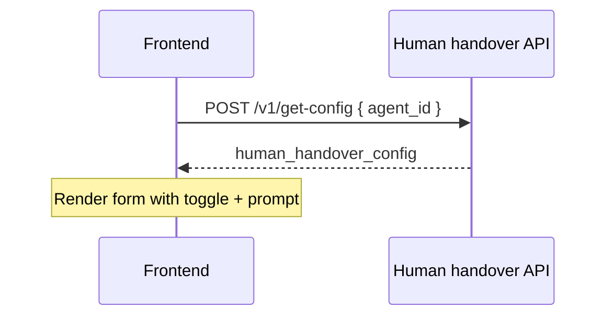

# Human handover config APIs — frontend guide

Reference for building the **human handover settings** UI in Elysium Atlas agent settings. Config is stored on each agent document (`atlas_agents.human_handover_config`). Runtime chat detection and dashboard handover badges are **not** wired yet — this guide covers **config CRUD only** (Phase 1a).

**Base path:** `/elysium-agents/elysium-atlas/human-handover`

**Auth:** `Authorization: Bearer <session_jwt>` with `user_id`, `team_id`, and `role`.

**Scope:** **Per agent** — each `atlas_agents` document has its own `human_handover_config`. Configure separately for every agent.

**RBAC** (same as lead collection and other agent settings):

| Role       | `get-config`  | `update-config` | `reset-config` |
| ---------- | :-----------: | :-------------: | :------------: |
| **owner**  |       ✓       |        ✓        |       ✓        |
| **admin**  |       ✓       |        ✓        |       ✓        |
| **member** | ✓ (view only) |        ✗        |       ✗        |

Members may **read** handover rules for agents on their team but cannot update or reset them. Hide Save / Reset when JWT `role` is `member`.

See [frontend-agents-rbac-guide.md](./frontend-agents-rbac-guide.md).

**Related:**

- [human-handover-plan.md](./human-handover-plan.md) — runtime behavior, chat pipeline, socket events (Phase 1b+)
- [frontend-lead-collection-api-guide.md](./frontend-lead-collection-api-guide.md) — similar settings-page pattern

---

## Overview

| Concept        | Detail                                                                                                                                             |
| -------------- | -------------------------------------------------------------------------------------------------------------------------------------------------- |
| Storage        | Nested on `atlas_agents.human_handover_config`                                                                                                     |
| Scope          | **Agent-level** — one config per agent                                                                                                             |
| Partial update | Only keys sent in the request body are merged                                                                                                      |
| Legacy path    | `human_handover_config` is also accepted on `pre-build-agent-operations` and `update-agent` — prefer dedicated endpoints below for the settings UI |

When enabled, the AI monitors visitor messages and detects when someone wants to speak with a human (no widget button). The team sees flagged sessions on the live chat dashboard once Phase 1b is shipped.

---

## Config shape

```json
{
  "enable_human_handover": true,
  "handover_trigger_prompt": "Detect when the visitor explicitly asks to speak with a human, real person, live agent, or representative, or expresses frustration that requires human help."
}
```

### Field reference

| Key                       | Type      | Default | Notes                                          |
| ------------------------- | --------- | ------- | ---------------------------------------------- |
| `enable_human_handover`   | `boolean` | `false` | Master toggle                                  |
| `handover_trigger_prompt` | `string`  | `""`    | Required when enabled: 10–500 chars after trim |

---

## Endpoints

| Method | Path                | Purpose                  |
| ------ | ------------------- | ------------------------ |
| `POST` | `/v1/get-config`    | Read config for an agent |
| `POST` | `/v1/update-config` | Partial merge update     |
| `POST` | `/v1/reset-config`  | Reset to defaults        |

---

## 1. Get config

`POST /elysium-agents/elysium-atlas/human-handover/v1/get-config`

### Request

```json
{
  "agent_id": "674a1b2c3d4e5f6789012345"
}
```

| Field      | Type     | Required |
| ---------- | -------- | -------- |
| `agent_id` | `string` | Yes      |

### Success `200`

```json
{
  "success": true,
  "agent_id": "674a1b2c3d4e5f6789012345",
  "human_handover_config": {
    "enable_human_handover": true,
    "handover_trigger_prompt": "Detect when the visitor explicitly asks to speak with a human or live representative."
  }
}
```

### Errors

| Status | When                           |
| ------ | ------------------------------ |
| `401`  | Missing or invalid JWT         |
| `403`  | Not allowed to read this agent |
| `404`  | Agent not found                |

---

## 2. Update config

`POST /elysium-agents/elysium-atlas/human-handover/v1/update-config`

**Partial merge** — only include keys you want to change.

### Request (full example)

```json
{
  "agent_id": "674a1b2c3d4e5f6789012345",
  "enable_human_handover": true,
  "handover_trigger_prompt": "Detect when the visitor asks to speak with a human, requests a callback from the team, or says they are frustrated and need real help."
}
```

### Request (partial — toggle only)

```json
{
  "agent_id": "674a1b2c3d4e5f6789012345",
  "enable_human_handover": false
}
```

Disabling does not clear the stored prompt; it remains for the next enable.

### Request body

| Field                     | Type      | Required | Notes                               |
| ------------------------- | --------- | -------- | ----------------------------------- |
| `agent_id`                | `string`  | Yes      |                                     |
| `enable_human_handover`   | `boolean` | No       |                                     |
| `handover_trigger_prompt` | `string`  | No       | Max 500 chars; min 10 when enabling |

At least one config key besides `agent_id` is required.

### Success `200`

```json
{
  "success": true,
  "message": "Human handover config updated successfully.",
  "agent_id": "674a1b2c3d4e5f6789012345",
  "human_handover_config": {
    "enable_human_handover": true,
    "handover_trigger_prompt": "Detect when the visitor asks to speak with a human or requests a callback from the team."
  }
}
```

### Validation errors `400`

| Message (examples)                                                    | Cause                                             |
| --------------------------------------------------------------------- | ------------------------------------------------- |
| `handover_trigger_prompt is required when human handover is enabled.` | Enabled but prompt empty or too short after merge |
| `handover_trigger_prompt must be at most 500 characters.`             | Prompt too long                                   |
| `At least one human handover field must be provided.`                 | Empty update body                                 |

### Other errors

| Status | When                           |
| ------ | ------------------------------ |
| `401`  | Invalid JWT                    |
| `403`  | Not owner/admin for this agent |
| `404`  | Agent not found                |

---

## 3. Reset config

`POST /elysium-agents/elysium-atlas/human-handover/v1/reset-config`

Resets to defaults (same as a new agent):

```json
{
  "enable_human_handover": false,
  "handover_trigger_prompt": ""
}
```

### Request

```json
{
  "agent_id": "674a1b2c3d4e5f6789012345"
}
```

### Success `200`

```json
{
  "success": true,
  "message": "Human handover config reset to defaults.",
  "agent_id": "674a1b2c3d4e5f6789012345",
  "human_handover_config": {
    "enable_human_handover": false,
    "handover_trigger_prompt": ""
  }
}
```

---

## Recommended settings page UI

Place **Human handover** in the agent settings area alongside Lead collection, system prompt, and widget appearance.

### Page structure

```
Agent settings
├── General (name, colors, welcome message)
├── AI behavior (system prompt, model)
├── Lead collection          ← existing
├── Human handover           ← this page
│   ├── Enable toggle
│   ├── Trigger prompt (textarea)
│   ├── Save / Reset buttons (owner/admin only)
│   └── Help text (what happens when enabled)
└── Knowledge base / tools
```

### Load on mount



### Save form

On Save, send the **full** config in one `update-config` call:

```json
{
  "agent_id": "...",
  "enable_human_handover": true,
  "handover_trigger_prompt": "..."
}
```

### Enable toggle UX

If the user enables handover without a valid prompt (≥ 10 characters), the API returns `400`. Validate on the client before Save:

- When `enable_human_handover` is `true`, `handover_trigger_prompt` must be ≥ 10 characters after trim
- Show the textarea only when the toggle is on (or show disabled state with helper text when off)

### Help copy (suggested)

> When enabled, the AI detects when a visitor wants to speak with a person. The chat is flagged on your team dashboard, the visitor sees a confirmation, and a name/email form is shown so you can follow up if they leave before someone joins.

### Reset

Confirm dialog → `POST /v1/reset-config` → replace local form state with response `human_handover_config`.

### Member (view-only) mode

- Call `get-config` to show current values
- Disable toggle, textarea, Save, and Reset
- Optional read-only badge: “Human handover enabled” / “Disabled”

---

## TypeScript types

```typescript
interface HumanHandoverConfig {
  enable_human_handover: boolean;
  handover_trigger_prompt: string;
}

interface GetHumanHandoverConfigRequest {
  agent_id: string;
}

interface UpdateHumanHandoverConfigRequest {
  agent_id: string;
  enable_human_handover?: boolean;
  handover_trigger_prompt?: string;
}

interface ResetHumanHandoverConfigRequest {
  agent_id: string;
}

interface GetHumanHandoverConfigResponse {
  success: true;
  agent_id: string;
  human_handover_config: HumanHandoverConfig;
}

interface UpdateHumanHandoverConfigResponse {
  success: true;
  message: string;
  agent_id: string;
  human_handover_config: HumanHandoverConfig;
}
```

---

## Example fetch helpers

```typescript
const BASE = "/elysium-agents/elysium-atlas/human-handover/v1";

async function getHumanHandoverConfig(agentId: string, token: string) {
  const res = await fetch(`${BASE}/get-config`, {
    method: "POST",
    headers: {
      "Content-Type": "application/json",
      Authorization: `Bearer ${token}`,
    },
    body: JSON.stringify({ agent_id: agentId }),
  });
  return res.json();
}

async function updateHumanHandoverConfig(
  agentId: string,
  config: Partial<HumanHandoverConfig>,
  token: string,
) {
  const res = await fetch(`${BASE}/update-config`, {
    method: "POST",
    headers: {
      "Content-Type": "application/json",
      Authorization: `Bearer ${token}`,
    },
    body: JSON.stringify({ agent_id: agentId, ...config }),
  });
  return res.json();
}
```

---

## Legacy agent create / update

`human_handover_config` can still be sent on:

- `POST .../pre-build-agent-operations` (create)
- `POST .../update-agent` (partial merge)

Prefer the dedicated endpoints above for the settings UI — they return the normalized config and consistent error messages.

---

## Coming in Phase 1c (not in config APIs)

These are documented in [human-handover-plan.md](./human-handover-plan.md) for frontend teams building the **live chat dashboard** takeover link:

| Surface        | What to expect                                                                                  |
| -------------- | ----------------------------------------------------------------------------------------------- |
| Team dashboard | Existing **Start conversation** sets `handover.assigned_to` when picking up a requested session |

## Widget runtime (Phase 1b — implemented)

### Server → visitor

| Event                       | When                                                                          |
| --------------------------- | ----------------------------------------------------------------------------- |
| `handover_requested`        | AI detected handover intent; show contact form when `show_contact_form: true` |
| `handover_contact_saved`    | Contact submitted successfully (also emitted to session room)                 |
| `handover_contact_declined` | Visitor declined the form (also emitted to session room)                      |

`handover_requested` payload:

```json
{
  "agent_id": "...",
  "chat_session_id": "...",
  "reason": "Visitor asked to speak with a human.",
  "waiting_message": "Your request to speak with a team member has been registered. Someone will join as soon as possible.",
  "show_contact_form": true,
  "contact_status": "pending"
}
```

Do **not** show the form again when `contact_status` is `provided` or `declined`.

### Visitor → server

| Event                                    | Purpose                                             |
| ---------------------------------------- | --------------------------------------------------- |
| `atlas-visitor-handover-contact`         | Submit `{ agent_id, chat_session_id, name, email }` |
| `atlas-visitor-handover-contact-decline` | Decline `{ agent_id, chat_session_id }`             |

HTTP fallback (no JWT):

- `POST /elysium-agents/elysium-atlas/human-handover/v1/submit-contact`
- `POST /elysium-agents/elysium-atlas/human-handover/v1/decline-contact`

### Team dashboard

| Event                           | When                                                                  |
| ------------------------------- | --------------------------------------------------------------------- |
| `chat_session_handover_updated` | Handover requested, contact saved/declined                            |
| `chat_session_takeover_updated` | Team member starts or ends takeover (includes handover fields on row) |

**Poll counts:** `GET /elysium-agents/atlas-visitors/chat-sessions-summary?agent_id=...` returns `handover_requested_count` for a badge on the agents/chats page.

**Session list** (`agent_visitors_list` / search / refresh): each row includes handover fields. Filter or badge when `handover_status === "requested"`. When a team member takes over, `handover_status` becomes `"assigned"` and `status` becomes `"in_conversation"`.

Session list rows include: `handover_status`, `handover_requested_at`, `handover_reason`, `handover_contact_name`, `handover_contact_email`, `handover_contact_status`.

Filter/badge when `handover_status === "requested"`.

### Visitor takeover notification

When a team member starts a conversation (with or without a prior handover request), the visitor receives:

| Event                  | Payload highlights                                             |
| ---------------------- | -------------------------------------------------------------- |
| `conversation_started` | `in_conversation_with`, `in_conversation_with_name`, `message` |

```json
{
  "agent_id": "...",
  "chat_session_id": "...",
  "in_conversation_with": "team_member_user_id",
  "in_conversation_with_name": "Jane Doe",
  "message": "You are now in conversation with Jane Doe."
}
```

Use `in_conversation_with_name` to update the widget header / agent label. Show `message` as a system notice in the chat thread.

On reconnect while takeover is active, the same `conversation_started` event is re-emitted with the handler name.

---

## Related docs

- [human-handover-plan.md](./human-handover-plan.md)
- [live-visitor-chat.md](./live-visitor-chat.md)
- [frontend-agent-create-update-api-guide.md](./frontend-agent-create-update-api-guide.md)
