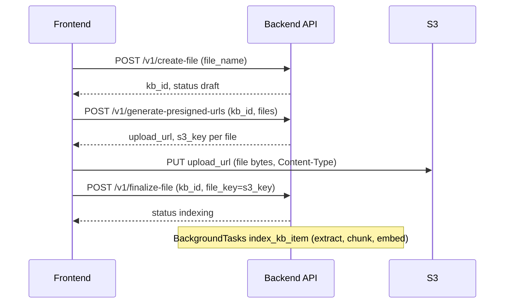

# Team knowledge items- frontend API guide

Reference for the **team knowledge library** UI: create, list, update, delete, and re-index knowledge items (URLs, files, custom texts, Q&A). Items are team-scoped under a per-item **`kb_id`**; agents attach items in a later phase (not covered here).

**Architecture:** [team-knowledge-bases-plan.md](./team-knowledge-bases-plan.md)

**Base path:** `/elysium-agents/elysium-atlas/kb-items`

**Auth:** `Authorization: Bearer <session_jwt>` on every request. JWT must include `user_id`, `team_id`, and `role` (see [backend-team-rbac-guide.md](./backend-team-rbac-guide.md)).

---

## Overview

| Concept       | Detail                                                                              |
| ------------- | ----------------------------------------------------------------------------------- |
| Scope         | **Team-level**- items belong to JWT `team_id`, not to an agent                      |
| `kb_id`       | Mongo `_id` of the item document, returned as `kb_id` in responses                  |
| `source_type` | `url` \| `file` \| `custom_text` \| `qa_pair`                                       |
| Mongo         | Metadata **and full text** for custom texts / Q&A (`content`, `question`, `answer`) |
| Qdrant        | Chunks in `team_knowledge_base`; one AI summary per item in `kb_item_catalog`       |
| Indexing      | FastAPI **BackgroundTasks** (same pattern as legacy build-agent)                    |
| Agent attach  | **Not in this phase**                                                               |

### Indexing behavior

| Event                                                | Indexing                                                 |
| ---------------------------------------------------- | -------------------------------------------------------- |
| Create (URLs batch, file finalize, custom text, Q&A) | Automatic background index                               |
| Update content                                       | Re-index that `kb_id`                                    |
| `reindex-item`                                       | Manual retry / refresh (failed items, stale URL content) |
| List / get                                           | No indexing                                              |

**Item `status`:** `draft` \| `indexing` \| `ready` \| `failed`

Poll type-specific get/list until `status` is `ready` or `failed`.

### `kb_item_catalog` summary

1. **Source-type-specific LLM prompt** (URL vs file vs custom text vs Q&A) produces a data-dense 2–3 sentence `summary`.
2. One Qdrant point per item (`id = kb_id`).
3. **Only `summary` is embedded** (`text-embedding-3-small`, 1536 dims). Chunks embed `text_content` separately.

### Alias uniqueness

`custom_text_alias` and `qna_alias` are **unique per team** (same rule as tool `name`).

---

## Roles

| Role             | Access                                           |
| ---------------- | ------------------------------------------------ |
| `owner`, `admin` | Create, update, delete, re-index, presigned URLs |
| `member`         | List and get (read-only)                         |

---

## Shared

### Re-index item

`POST /v1/reindex-item`

Retry after `failed`, or refresh content (e.g. re-scrape a URL for latest page content). Does not change `kb_id`.

**Request**

```json
{
  "kb_id": "675a1f2b3c4d5e6f7a8b9c0d",
  "source_type": "url"
}
```

**Success (`200`)**

```json
{
  "success": true,
  "message": "Re-indexing started.",
  "kb_id": "675a1f2b3c4d5e6f7a8b9c0d",
  "status": "indexing"
}
```

### Search items (server-side)

`POST /v1/search-items`

Case-insensitive **substring** search within one KB type for the active team. Same pagination shape as list endpoints. **Members** and **admins** may search.

**Request**

```json
{
  "source_type": "file",
  "search_query": "abc.pdf",
  "page": 1,
  "limit": 20
}
```

| `source_type` | Fields searched                   |
| ------------- | --------------------------------- |
| `url`         | `url`, `summary`                  |
| `file`        | `file_name`, `file_key`           |
| `custom_text` | `custom_text_alias`, `content`    |
| `qa_pair`     | `qna_alias`, `question`, `answer` |

`search_query` is trimmed, required, max **256** characters. Special regex characters are treated literally (not as patterns).

**Success (`200`)**- response array key matches the list API for that type (`urls`, `files`, `custom_texts`, or `qa_pairs`):

```json
{
  "success": true,
  "message": "Search completed successfully.",
  "source_type": "file",
  "search_query": "abc.pdf",
  "files": [
    {
      "kb_id": "675a1f2b3c4d5e6f7a8b9c0d",
      "file_name": "product-abc.pdf",
      "status": "ready",
      "summary": "..."
    }
  ],
  "total": 1,
  "page": 1,
  "limit": 20,
  "total_pages": 1,
  "has_next": false,
  "has_prev": false
}
```

Sort: `updated_at` desc, then `_id` desc (same as list).

---

## URLs

URL prep stays under `/elysium-agents/elysium-atlas`: `ping-url`, `scrape-urls`, `extract-url-links`.

### List URLs

`POST /v1/list-urls`

```json
{ "page": 1, "limit": 20 }
```

Response: `urls[]` with `kb_id`, `url`, `status`, `page_type`, `summary` (when ready), pagination fields.

### Get URL

`POST /v1/get-url`

```json
{ "kb_id": "675a1f2b3c4d5e6f7a8b9c0d" }
```

### Create URLs (batch only)

`POST /v1/create-urls`

**One `kb_id` per URL.** No single-URL create endpoint.

```json
{
  "urls": ["https://example.com/pricing", "https://example.com/faq"]
}
```

**Success (`200`)**

```json
{
  "success": true,
  "message": "URL items created. Indexing started.",
  "items": [
    {
      "kb_id": "675a...",
      "url": "https://example.com/pricing",
      "status": "indexing"
    },
    {
      "kb_id": "676b...",
      "url": "https://example.com/faq",
      "status": "indexing"
    }
  ]
}
```

### Update URL

`POST /v1/update-url`

```json
{
  "kb_id": "675a1f2b3c4d5e6f7a8b9c0d",
  "url": "https://example.com/new-pricing"
}
```

Triggers re-index.

### Delete URL

`POST /v1/delete-url`

```json
{ "kb_id": "675a1f2b3c4d5e6f7a8b9c0d" }
```

Removes Mongo + Qdrant for that `kb_id`.

---

## Files

KB files use **client-side S3 upload** via presigned URLs. The backend never receives the file bytes on the API- only metadata and the S3 key after upload.



| Step | Endpoint                       | Indexing?                      |
| ---- | ------------------------------ | ------------------------------ |
| 1    | `create-file`                  | No- Mongo shell only (`draft`) |
| 2    | `generate-presigned-urls`      | No- returns presigned PUT URL  |
| 3    | Frontend `PUT` to `upload_url` | No- direct to S3               |
| 4    | `finalize-file`                | Yes- starts background index   |

### List files

`POST /v1/list-files`

### Get file

`POST /v1/get-file`

```json
{ "kb_id": "675a1f2b3c4d5e6f7a8b9c0d" }
```

### Create file (draft shell)

`POST /v1/create-file`

```json
{ "file_name": "employee-handbook.pdf" }
```

Returns `kb_id`, `status: "draft"`.

### Generate presigned upload URL

`POST /v1/generate-presigned-urls`

```json
{
  "kb_id": "675a1f2b3c4d5e6f7a8b9c0d",
  "files": [
    {
      "file_name": "employee-handbook.pdf",
      "filetype": "application/pdf"
    }
  ]
}
```

**Response (`200`)**- one entry per file in `presigned_urls`:

```json
{
  "success": true,
  "presigned_urls": [
    {
      "status": true,
      "upload_url": "https://...",
      "s3_key": "teams/{team_id}/kb_items/{kb_id}/files/employee-handbook.pdf",
      "filename": "employee-handbook.pdf",
      "visibility": "private"
    }
  ]
}
```

**Frontend:** `PUT` the file to `upload_url` with header `Content-Type` matching `filetype`. Then call `finalize-file` with `file_key` = `s3_key`.

S3 path pattern: `teams/{team_id}/kb_items/{kb_id}/files/{file_name}`

### Finalize file (start indexing)

`POST /v1/finalize-file`

After S3 upload:

```json
{
  "kb_id": "675a1f2b3c4d5e6f7a8b9c0d",
  "file_key": "teams/acme/kb_items/675a.../files/employee-handbook.pdf"
}
```

### Replace file (same `kb_id`)

When the user uploads a **new version** of the same document:

1. `generate-presigned-urls` for the same `kb_id` (new or same `file_name`)
2. Upload to S3
3. `finalize-file` → re-indexes; **`kb_id` stays the same**

Use `reindex-item` if the file on S3 is unchanged but indexing failed.

### Delete file

`POST /v1/delete-file`

Deletes Mongo + Qdrant + S3 object.

---

## Custom texts

Full **`content` stored in Mongo** (source of truth). Qdrant holds chunks + catalog summary only.

### List custom texts

`POST /v1/list-custom-texts`

List responses return metadata (`kb_id`, `custom_text_alias`, `status`, `summary`)- not necessarily full body; use get for edit forms.

### Get custom text

`POST /v1/get-custom-text`

Returns `content` from Mongo.

### Create custom text

`POST /v1/create-custom-text`

```json
{
  "custom_text_alias": "return_policy",
  "content": "Full text of the return policy..."
}
```

`custom_text_alias` unique per team.

### Update custom text

`POST /v1/update-custom-text`

```json
{
  "kb_id": "675a1f2b3c4d5e6f7a8b9c0d",
  "custom_text_alias": "return_policy",
  "content": "Updated policy text..."
}
```

### Delete custom text

`POST /v1/delete-custom-text`

---

## Q&A pairs

**`question` and `answer` stored in Mongo.** Qdrant holds chunks + catalog summary.

### List Q&A pairs

`POST /v1/list-qa-pairs`

### Get Q&A pair

`POST /v1/get-qa-pair`

Returns `question`, `answer` from Mongo.

### Create Q&A pair

`POST /v1/create-qa-pair`

```json
{
  "qna_alias": "shipping_faq",
  "question": "How long does shipping take?",
  "answer": "Standard shipping takes 5–7 business days."
}
```

`qna_alias` unique per team.

### Update Q&A pair

`POST /v1/update-qa-pair`

### Delete Q&A pair

`POST /v1/delete-qa-pair`

---

## Pagination (list and search endpoints)

| Parameter | Default | Max   |
| --------- | ------- | ----- |
| `page`    | `1`     | -     |
| `limit`   | `20`    | `100` |

Response includes: `total`, `page`, `limit`, `total_pages`, `has_next`, `has_prev`. Sort: `updated_at` desc, then `_id` desc.

---

## Agent APIs (phase 1 changes)

**Removed immediately** from `build-agent` / `update-agent`:

- `links`, `files`, `custom_texts`, `qa_pairs`
- Agent `generate-presigned-urls`
- All agent datasource list/delete/content routes

**Unchanged for now:** `pre-build-agent-operations`, agent config, `tool_ids`, `query-agent` (retrieval wiring deferred).

---

## Deprecated → replacement

| Removed (agent routes)                                                 | Replacement                            |
| ---------------------------------------------------------------------- | -------------------------------------- |
| `generate-presigned-urls`                                              | `/kb-items/v1/generate-presigned-urls` |
| `build-agent` / `update-agent` knowledge fields                        | KB item CRUD under `/kb-items`         |
| `get-agent-urls`                                                       | `list-urls`                            |
| `get-agent-files`                                                      | `list-files`                           |
| `get-agent-custom-texts`                                               | `list-custom-texts`                    |
| `get-agent-qa-pairs`                                                   | `list-qa-pairs`                        |
| `remove-agent-links`, `delete-agent-files`, `delete-agent-custom-data` | `delete-url`, `delete-file`, etc.      |
| Agent `get-custom-text-content` / `get-qa-pair-content`                | `get-custom-text` / `get-qa-pair`      |

---

## Related docs

- [team-knowledge-bases-plan.md](./team-knowledge-bases-plan.md)
- [frontend-tools-api-guide.md](./frontend-tools-api-guide.md)
- [frontend-agent-create-update-api-guide.md](./frontend-agent-create-update-api-guide.md)- agent knowledge sections removed in phase 1
