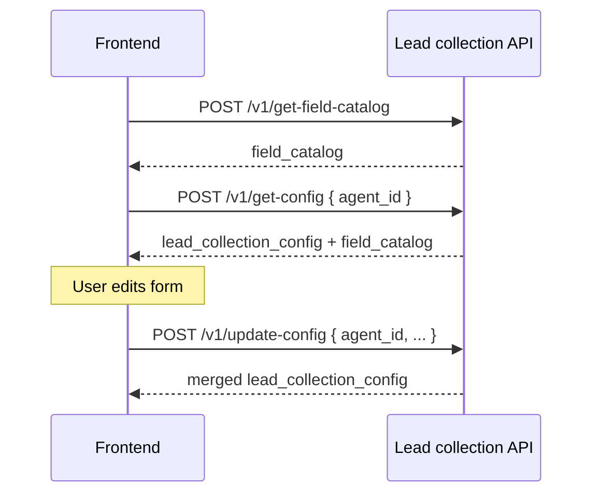

# Lead collection config APIs — frontend guide

Reference for building the **lead collection settings** UI in Elysium Atlas. Config is stored on each agent document (`atlas_agents.lead_collection_config`). Runtime chat collection is **not** wired yet — this guide covers **config CRUD only** (Phase 1a).

**Base path:** `/elysium-agents/elysium-atlas/lead-collection`

**Auth:** `Authorization: Bearer <session_jwt>` with `user_id`, `team_id`, and `role`.

**Scope:** **Per agent** — each `atlas_agents` document has its own `lead_collection_config`. Rules are not team-wide; configure them separately for every agent.

**RBAC** (same as other agent settings):

| Role       | `get-config`  | `get-field-catalog` | `update-config` | `reset-config` |
| ---------- | :-----------: | :-----------------: | :-------------: | :------------: |
| **owner**  |       ✓       |          ✓          |        ✓        |       ✓        |
| **admin**  |       ✓       |          ✓          |        ✓        |       ✓        |
| **member** | ✓ (view only) |          ✓          |        ✗        |       ✗        |

Members may **read** lead collection rules for agents on their team but cannot create, update, or reset them. Hide Save / Reset in the UI when JWT `role` is `member`.

See [frontend-agents-rbac-guide.md](./frontend-agents-rbac-guide.md).

**Related:** [lead-collection-plan.md](./lead-collection-plan.md) (runtime behavior, chat pipeline — Phase 1b).

---

## Overview

| Concept          | Detail                                                                                                                                               |
| ---------------- | ---------------------------------------------------------------------------------------------------------------------------------------------------- |
| Storage          | Nested on `atlas_agents.lead_collection_config`                                                                                                      |
| Scope            | **Agent-level** — one config per agent; not shared across agents or teams                                                                            |
| Partial update   | Only keys sent in the request body are merged                                                                                                        |
| `fields` replace | When `fields` is sent on update, it **replaces** the entire array (not per-item merge)                                                               |
| Legacy path      | `lead_collection_config` is still accepted on `pre-build-agent-operations` and `update-agent` — prefer dedicated endpoints below for the settings UI |

---

## Config shape

```json
{
  "enable_lead_capturing": true,
  "collection_trigger_prompt": "Start collecting contact details when the visitor asks about pricing, wants a demo or quote, requests a callback, or needs help that requires a human follow-up.",
  "min_messages_before_ask": 2,
  "fields": [
    { "key": "email", "required": true, "order": 1 },
    { "key": "name", "required": true, "order": 2 },
    { "key": "phone", "required": false, "order": 3 }
  ]
}
```

### Field reference

| Key                         | Type      | Default | Notes                                                    |
| --------------------------- | --------- | ------- | -------------------------------------------------------- |
| `enable_lead_capturing`     | `boolean` | `false` | Master toggle                                            |
| `collection_trigger_prompt` | `string`  | `""`    | Required when enabled: 10–500 chars after trim           |
| `min_messages_before_ask`   | `integer` | `2`     | Min **visitor** messages before trigger evaluation; 1–50 |
| `fields`                    | `array`   | `[]`    | At least one item when enabled                           |

### `fields[]` item

| Key        | Type      | Required | Notes                                                              |
| ---------- | --------- | -------- | ------------------------------------------------------------------ |
| `key`      | `string`  | Yes      | Built-in key — see [field catalog](#4-get-field-catalog)           |
| `required` | `boolean` | Yes      | All `required: true` fields must be captured for a `complete` lead |
| `order`    | `integer` | Yes      | Proactive ask order; must be ≥ 1 and unique within the array       |

### Built-in field keys (Phase 1)

| `key`      | Label    |
| ---------- | -------- |
| `email`    | Email    |
| `name`     | Name     |
| `phone`    | Phone    |
| `company`  | Company  |
| `interest` | Interest |

Use `get-field-catalog` for labels and descriptions in the UI.

---

## Endpoints

| Method | Path                    | Purpose                                 |
| ------ | ----------------------- | --------------------------------------- |
| `POST` | `/v1/get-config`        | Read config for an agent                |
| `POST` | `/v1/update-config`     | Partial merge update                    |
| `POST` | `/v1/reset-config`      | Reset to defaults                       |
| `POST` | `/v1/get-field-catalog` | List allowed field keys (no `agent_id`) |

---

## 1. Get config

`POST /elysium-agents/elysium-atlas/lead-collection/v1/get-config`

### Request

```json
{
  "agent_id": "674a1b2c3d4e5f6789012345"
}
```

| Field      | Type     | Required |
| ---------- | -------- | -------- |
| `agent_id` | `string` | Yes      |

### Success `200`

```json
{
  "success": true,
  "agent_id": "674a1b2c3d4e5f6789012345",
  "lead_collection_config": {
    "enable_lead_capturing": true,
    "collection_trigger_prompt": "Start when the visitor asks about pricing or wants a demo.",
    "min_messages_before_ask": 3,
    "fields": [
      { "key": "email", "required": true, "order": 1 },
      { "key": "name", "required": true, "order": 2 },
      { "key": "phone", "required": true, "order": 3 }
    ]
  },
  "field_catalog": [
    {
      "key": "email",
      "label": "Email",
      "description": "Visitor email address."
    }
  ]
}
```

`field_catalog` is also returned here so the settings form can render pickers without a second call.

### Errors

| Status | When                           |
| ------ | ------------------------------ |
| `401`  | Missing or invalid JWT         |
| `403`  | Not allowed to read this agent |
| `404`  | Agent not found                |

---

## 2. Update config

`POST /elysium-agents/elysium-atlas/lead-collection/v1/update-config`

**Partial merge** — only include keys you want to change.

### Request (full example)

```json
{
  "agent_id": "674a1b2c3d4e5f6789012345",
  "enable_lead_capturing": true,
  "collection_trigger_prompt": "Start when the visitor asks about pricing, demos, or enterprise scale.",
  "min_messages_before_ask": 3,
  "fields": [
    { "key": "email", "required": true, "order": 1 },
    { "key": "name", "required": true, "order": 2 },
    { "key": "phone", "required": true, "order": 3 }
  ]
}
```

### Request (partial — toggle only)

```json
{
  "agent_id": "674a1b2c3d4e5f6789012345",
  "enable_lead_capturing": false
}
```

Disabling does not clear stored prompt/fields; they remain for the next enable.

### Request body

| Field                       | Type      | Required | Notes                                    |
| --------------------------- | --------- | -------- | ---------------------------------------- |
| `agent_id`                  | `string`  | Yes      |                                          |
| `enable_lead_capturing`     | `boolean` | No       |                                          |
| `collection_trigger_prompt` | `string`  | No       | Max 500 chars; min 10 when enabling      |
| `min_messages_before_ask`   | `integer` | No       | 1–50                                     |
| `fields`                    | `array`   | No       | Replaces entire `fields` array when sent |

At least one config key besides `agent_id` is required.

### Success `200`

```json
{
  "success": true,
  "message": "Lead collection config updated successfully.",
  "agent_id": "674a1b2c3d4e5f6789012345",
  "lead_collection_config": {
    "enable_lead_capturing": true,
    "collection_trigger_prompt": "Start when the visitor asks about pricing, demos, or enterprise scale.",
    "min_messages_before_ask": 3,
    "fields": [
      { "key": "email", "required": true, "order": 1 },
      { "key": "name", "required": true, "order": 2 },
      { "key": "phone", "required": true, "order": 3 }
    ]
  }
}
```

### Validation errors `400`

| Message (examples)                                                       | Cause                                          |
| ------------------------------------------------------------------------ | ---------------------------------------------- |
| `collection_trigger_prompt is required when lead capturing is enabled.`  | Enabled but prompt empty/too short after merge |
| `fields must contain at least one field when lead capturing is enabled.` | Enabled but `fields` empty after merge         |
| `fields must have unique order values.`                                  | Duplicate `order` in request                   |
| `fields must have unique key values.`                                    | Duplicate `key` in request                     |
| `fields[0].key must be one of: ...`                                      | Invalid built-in key                           |
| `At least one lead collection field must be provided.`                   | Empty update body                              |

### Other errors

| Status | When                           |
| ------ | ------------------------------ |
| `401`  | Invalid JWT                    |
| `403`  | Not owner/admin for this agent |
| `404`  | Agent not found                |

---

## 3. Reset config

`POST /elysium-agents/elysium-atlas/lead-collection/v1/reset-config`

Resets to defaults (same as a new agent):

```json
{
  "enable_lead_capturing": false,
  "collection_trigger_prompt": "",
  "min_messages_before_ask": 2,
  "fields": []
}
```

### Request

```json
{
  "agent_id": "674a1b2c3d4e5f6789012345"
}
```

### Success `200`

```json
{
  "success": true,
  "message": "Lead collection config reset to defaults.",
  "agent_id": "674a1b2c3d4e5f6789012345",
  "lead_collection_config": {
    "enable_lead_capturing": false,
    "collection_trigger_prompt": "",
    "min_messages_before_ask": 2,
    "fields": []
  }
}
```

---

## 4. Get field catalog

`POST /elysium-agents/elysium-atlas/lead-collection/v1/get-field-catalog`

No request body. Use when building the field picker before an `agent_id` is selected.

### Success `200`

```json
{
  "success": true,
  "field_catalog": [
    {
      "key": "email",
      "label": "Email",
      "description": "Visitor email address."
    },
    {
      "key": "name",
      "label": "Name",
      "description": "Visitor full name."
    },
    {
      "key": "phone",
      "label": "Phone",
      "description": "Visitor phone number."
    },
    {
      "key": "company",
      "label": "Company",
      "description": "Visitor company or organization."
    },
    {
      "key": "interest",
      "label": "Interest",
      "description": "What the visitor is interested in; can be auto-summarized from chat."
    }
  ]
}
```

---

## Recommended UI flow



### Save form (recommended)

Send the **full** config in one `update-config` call when the user clicks Save:

```json
{
  "agent_id": "...",
  "enable_lead_capturing": true,
  "collection_trigger_prompt": "...",
  "min_messages_before_ask": 2,
  "fields": [ ... ]
}
```

### Enable toggle UX

If the user enables capturing without a valid prompt/fields, the API returns `400`. Validate on the client:

- Prompt ≥ 10 characters when enabled
- At least one field in `fields` when enabled
- Unique `order` and `key` per row

---

## TypeScript types

```typescript
type LeadFieldKey = "email" | "name" | "phone" | "company" | "interest";

interface LeadCollectionFieldConfig {
  key: LeadFieldKey;
  required: boolean;
  order: number;
}

interface LeadCollectionConfig {
  enable_lead_capturing: boolean;
  collection_trigger_prompt: string;
  min_messages_before_ask: number;
  fields: LeadCollectionFieldConfig[];
}

interface LeadFieldCatalogItem {
  key: LeadFieldKey;
  label: string;
  description: string;
}

interface GetLeadCollectionConfigRequest {
  agent_id: string;
}

interface UpdateLeadCollectionConfigRequest {
  agent_id: string;
  enable_lead_capturing?: boolean;
  collection_trigger_prompt?: string;
  min_messages_before_ask?: number;
  fields?: LeadCollectionFieldConfig[];
}

interface ResetLeadCollectionConfigRequest {
  agent_id: string;
}
```

---

## Also available on agent APIs

`lead_collection_config` remains on:

| Endpoint                                                  | Merge behavior             |
| --------------------------------------------------------- | -------------------------- |
| `POST /elysium-atlas/agent/v1/pre-build-agent-operations` | Full object on create      |
| `POST /elysium-atlas/agent/v1/update-agent`               | Partial merge (same rules) |

For the dedicated lead settings screen, use `/elysium-atlas/lead-collection/v1/*` endpoints above.

---

## Error handling summary

| Status | Typical cause                            |
| ------ | ---------------------------------------- |
| `400`  | Validation failed; empty partial update  |
| `401`  | Invalid or expired JWT                   |
| `403`  | Read/update not permitted for this agent |
| `404`  | `agent_id` not found                     |
| `500`  | Unexpected server error                  |
