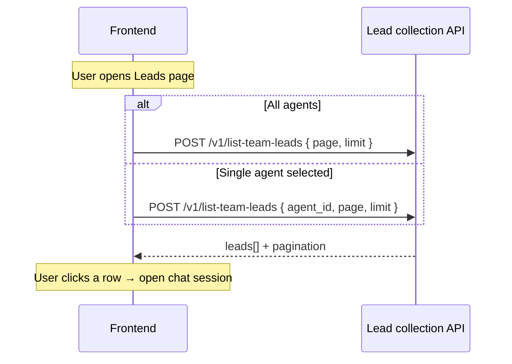

# Team leads list API — frontend guide

Reference for building the **captured leads** table in Elysium Atlas. Leads are stored in the `atlas_leads` MongoDB collection (one document per chat session with at least one captured field).

**Base path:** `/elysium-agents/elysium-atlas/lead-collection`

**Auth:** `Authorization: Bearer <session_jwt>` with `user_id`, `team_id`, and `role`.

**Scope:** **Team-level** — returns leads for the JWT `team_id`.

- **No `agent_id`** — all leads across every agent on the team, sorted by `updated_at` descending (newest first).
- **With `agent_id`** — only leads collected by that agent, same sort order.

**RBAC** (same as other team read endpoints):

| Role       | `list-team-leads` |
| ---------- | :---------------: |
| **owner**  |         ✓         |
| **admin**  |         ✓         |
| **member** |         ✓         |

All active team members may list leads for their team. When `agent_id` is provided, the user must also be allowed to read that agent.

See [frontend-agents-rbac-guide.md](./frontend-agents-rbac-guide.md).

**Related:**

- [frontend-lead-collection-api-guide.md](./frontend-lead-collection-api-guide.md) — lead collection config CRUD
- [lead-collection-plan.md](./lead-collection-plan.md) — runtime behavior and data model

---

## Pagination

Uses the same **page-based** model as agent lists and KB item lists.

| Parameter  | Type     | Default  | Description                             |
| ---------- | -------- | -------- | --------------------------------------- |
| `agent_id` | `string` | optional | Filter to leads collected by this agent |
| `page`     | `number` | `1`      | 1-based page number                     |
| `limit`    | `number` | `20`     | Items per page (max `100`)              |

### Response pagination fields

| Field         | Type      | Description                                    |
| ------------- | --------- | ---------------------------------------------- |
| `total`       | `number`  | Total leads matching the query                 |
| `page`        | `number`  | Page returned (clamped if out of range)        |
| `limit`       | `number`  | Page size used                                 |
| `total_pages` | `number`  | `ceil(total / limit)`; `0` when `total` is `0` |
| `has_next`    | `boolean` | `true` if another page exists                  |
| `has_prev`    | `boolean` | `true` if a previous page exists               |

**Out-of-range pages:** If the requested `page` exceeds `total_pages`, the API clamps to the last valid page.

**Sort order:** Newest first by `updated_at` from `atlas_leads`, then document id. Applies to both team-wide and single-agent queries.

---

## Endpoint

| Method | Path                  | Purpose                                       |
| ------ | --------------------- | --------------------------------------------- |
| `POST` | `/v1/list-team-leads` | Paginated list of captured leads for the team |

---

## List team leads

`POST /elysium-agents/elysium-atlas/lead-collection/v1/list-team-leads`

### Request (all team agents)

```json
{
  "page": 1,
  "limit": 20
}
```

### Request (single agent filter)

```json
{
  "agent_id": "674a1b2c3d4e5f6789012345",
  "page": 1,
  "limit": 20
}
```

| Field      | Type      | Required | Notes                                |
| ---------- | --------- | -------- | ------------------------------------ |
| `agent_id` | `string`  | No       | When set, only leads from this agent |
| `page`     | `integer` | No       | Default `1`, minimum `1`             |
| `limit`    | `integer` | No       | Default `20`, max `100`              |

### Success `200`

```json
{
  "success": true,
  "leads": [
    {
      "lead_id": "a1b2c3d4-e5f6-7890-abcd-ef1234567890",
      "agent_id": "674a1b2c3d4e5f6789012345",
      "chat_session_id": "sess_abc123",
      "alias_name": "Pricing inquiry — Acme Corp",
      "fields": {
        "email": "visitor@example.com",
        "name": "Jane Doe",
        "phone": "+15551234567"
      },
      "status": "complete",
      "created_at": "2026-07-05T10:15:30.123Z",
      "updated_at": "2026-07-05T10:18:42.456Z"
    },
    {
      "lead_id": "b2c3d4e5-f6a7-8901-bcde-f12345678901",
      "agent_id": "674a1b2c3d4e5f6789012345",
      "chat_session_id": "sess_def456",
      "alias_name": null,
      "fields": {
        "email": "partial@example.com"
      },
      "status": "partial",
      "created_at": "2026-07-04T14:22:10.000Z",
      "updated_at": "2026-07-04T14:25:55.789Z"
    }
  ],
  "total": 42,
  "page": 1,
  "limit": 20,
  "total_pages": 3,
  "has_next": true,
  "has_prev": false
}
```

### Lead item fields

| Field             | Type             | Description                                                                          |
| ----------------- | ---------------- | ------------------------------------------------------------------------------------ |
| `lead_id`         | `string`         | Stable UUID for the lead row                                                         |
| `agent_id`        | `string`         | Agent that collected the lead                                                        |
| `chat_session_id` | `string`         | Source chat session                                                                  |
| `alias_name`      | `string \| null` | Visitor alias from `atlas_chat_sessions`, if set by the team                         |
| `fields`          | `object`         | Captured values keyed by field key (`email`, `name`, `phone`, `company`, `interest`) |
| `status`          | `string`         | `partial` or `complete`                                                              |
| `created_at`      | `string`         | ISO-8601 UTC — first time any field was captured                                     |
| `updated_at`      | `string`         | ISO-8601 UTC — last upsert                                                           |

Only sessions with at least one non-empty captured field appear in `atlas_leads`.

### Status values

| `status`   | Meaning                                                        |
| ---------- | -------------------------------------------------------------- |
| `partial`  | At least one field captured; not all required fields collected |
| `complete` | All required fields from the agent's lead config were captured |

### Errors

| Status | When                                                    |
| ------ | ------------------------------------------------------- |
| `400`  | Missing `team_id` in JWT session context                |
| `401`  | Missing or invalid JWT                                  |
| `403`  | Not a team member, or `agent_id` not on the user's team |
| `404`  | `agent_id` filter references a non-existent agent       |
| `500`  | Unexpected server error                                 |

---

## Recommended UI flow



### Table columns (suggested)

| Column   | Source field      | Notes                                                  |
| -------- | ----------------- | ------------------------------------------------------ |
| Email    | `fields.email`    | Primary display when present                           |
| Name     | `fields.name`     |                                                        |
| Alias    | `alias_name`      | Team-assigned visitor label from the chat session      |
| Phone    | `fields.phone`    |                                                        |
| Status   | `status`          | Badge: partial / complete                              |
| Agent    | `agent_id`        | Show agent name from cached agent list when unfiltered |
| Captured | `created_at`      | First capture time                                     |
| Updated  | `updated_at`      | Last change                                            |
| Session  | `chat_session_id` | Link to live chat / session detail                     |

Use `agent_id` filter when the user selects an agent in a dropdown; omit it for a team-wide view.

---

## TypeScript types

```typescript
type LeadDocumentStatus = "partial" | "complete";

type LeadFieldKey = "email" | "name" | "phone" | "company" | "interest";

interface TeamLeadListItem {
  lead_id: string;
  agent_id: string;
  chat_session_id: string;
  alias_name: string | null;
  fields: Partial<Record<LeadFieldKey, string>>;
  status: LeadDocumentStatus;
  created_at: string | null;
  updated_at: string | null;
}

interface ListTeamLeadsRequest {
  agent_id?: string;
  page?: number;
  limit?: number;
}

interface ListTeamLeadsResponse {
  success: true;
  leads: TeamLeadListItem[];
  total: number;
  page: number;
  limit: number;
  total_pages: number;
  has_next: boolean;
  has_prev: boolean;
}
```

---

## Error handling summary

| Status | Typical cause                                 |
| ------ | --------------------------------------------- |
| `400`  | JWT missing `team_id`                         |
| `401`  | Invalid or expired JWT                        |
| `403`  | Not on team, or agent belongs to another team |
| `404`  | Filter `agent_id` not found                   |
| `500`  | Unexpected server error                       |
