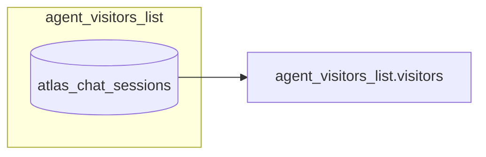

# Live visitor chat — chat sessions list (Socket.IO)

**Status:** Implemented.

---

## Overview

Team members monitoring an agent need a **Chat Sessions** view: every conversation that has occurred for that agent, not only visitors who are online right now.

Previously, `agent_visitors_list` returned **online visitors only** (Redis hash `atlas_{agent_id}_visitors`). A human agent logging in later could not see visitors who had already chatted and left.

Now, `agent_visitors_list` returns **all persisted chat sessions** from MongoDB (`atlas_chat_sessions`), sorted by **`last_message_at` descending** (most recent activity first). Each row includes **`visitor_online`** so the UI can distinguish live vs offline sessions.

**Removed (do not listen):** `agents_visitor_counts`, `POST /atlas-visitors/get-visitor-counts`, `agent_visitor_disconnected`, `agent_visitor_count_updated`, and `agent_visitors_pagination_updated`. See [Removed presence broadcast events](#removed-presence-broadcast-events) and [Pull-based list sync (frontend)](#pull-based-list-sync-frontend) below.

**List updates:** the server does **not** push pagination or presence changes over Socket.IO. Poll `GET /atlas-visitors/chat-sessions-summary` while the dashboard tab is focused; refetch the full list only when the human agent clicks refresh or “jump to newest”.

---

## Socket events

| Direction       | Event                                         | Purpose                                                                             |
| --------------- | --------------------------------------------- | ----------------------------------------------------------------------------------- |
| Client → server | `atlas-team-member-connected`                 | Join agent room; receive initial list (page 1)                                      |
| Client → server | `atlas-agent-visitors-list`                   | Request a paginated page of chat sessions                                           |
| Client → server | `atlas-agent-visitors-search`                 | Search sessions by `chat_session_id` or `alias_name` substring                      |
| Client → server | `atlas-agent-visitors-refresh-sessions`       | Refresh list rows for visible `chat_session_ids` (online status, etc.)              |
| Server → client | `agent_visitors_list`                         | Paginated chat sessions for the agent (on connect or explicit refetch)              |
| Server → client | `agent_visitors_search_results`               | Paginated search results for the requester socket                                   |
| Server → client | `agent_visitors_sessions_refreshed`           | Fresh rows for requested ids — **requester socket only**                            |
| Client → server | `atlas-team-member-monitor-conversation`      | Passive monitor: mirror visitor ↔ AI chat                                           |
| Client → server | `atlas-team-member-stop-monitor-conversation` | Stop passive monitoring                                                             |
| Client → server | `atlas-team-member-start-conversation`        | Human takeover (AI paused)                                                          |
| Client → server | `atlas-team-member-end-conversation`          | Hand conversation back to AI                                                        |
| Client → server | `atlas-team-member-resolve-session`           | Mark chat session as resolved                                                       |
| Server → client | `monitor_conversation_started`                | Ack for monitor start                                                               |
| Server → client | `monitor_conversation_ended`                  | Ack for monitor stop                                                                |
| Server → client | `message_from_visitor`                        | Visitor message (takeover or monitor mirror)                                        |
| Server → client | `message_from_agent`                          | Complete AI reply (monitor mirror only)                                             |
| Server → client | `message_from_team_member`                    | Human handler reply (owner/admin monitor mirror during takeover)                    |
| Server → client | `conversation_started`                        | Takeover active (visitor + team member who took over)                               |
| Server → client | `conversation_ended`                          | Takeover ended (visitor)                                                            |
| Server → client | `session_takeover_started`                    | Another team member took over; remaining monitors stay subscribed                   |
| Server → client | `session_takeover_ended`                      | Takeover ended; AI monitor mirror resumes for remaining monitors                    |
| Server → client | `chat_session_resolved`                       | Ack when team member marks session resolved                                         |
| Server → client | `chat_session_status_updated`                 | Broadcast resolved/reactivated status to agent dashboard room                       |
| Server → client | `chat_session_takeover_updated`               | Broadcast takeover handler change to agent dashboard room (all online team members) |

---

## Requesting the list

### On team member connect

Emit `atlas-team-member-connected` with `agent_id`, `team_id`, `user_id`, and optional pagination:

```json
{
  "agent_id": "695c342989c5797e0f344572",
  "team_id": "...",
  "user_id": "...",
  "page": 1,
  "limit": 10
}
```

The server joins socket room `agent_{agent_id}_members` and emits `agent_visitors_list` to that socket.

When `agent_id` is omitted (team-only connect), the server joins `team_{team_id}_members` and registers presence only — it does **not** emit `agents_visitor_counts` (removed).

### Paginated refresh

```json
{
  "agent_id": "695c342989c5797e0f344572",
  "page": 2,
  "limit": 10
}
```

Event: `atlas-agent-visitors-list`

Use this for the **refetch** button and whenever the team member wants a fresh page of sessions.

---

## Search chat sessions

Human agents can find sessions by a **case-insensitive substring** on `chat_session_id` or `alias_name`.

### Request

Event: `atlas-agent-visitors-search`

```json
{
  "agent_id": "695c342989c5797e0f344572",
  "query": "web-c043",
  "page": 1,
  "limit": 10
}
```

| Field      | Type     | Required | Notes                                                             |
| ---------- | -------- | -------- | ----------------------------------------------------------------- |
| `agent_id` | `string` | Yes      | Agent scope                                                       |
| `query`    | `string` | Yes      | 1–200 chars after trim; matches `chat_session_id` or `alias_name` |
| `page`     | `number` | No       | Default `1`                                                       |
| `limit`    | `number` | No       | Default `100`, max `100`                                          |

### Response

Event: `agent_visitors_search_results` (emitted **only to the requesting socket**, not the room)

```json
{
  "success": true,
  "message": null,
  "agent_id": "695c342989c5797e0f344572",
  "query": "web-c043",
  "visitors": [],
  "total": 3,
  "page": 1,
  "size": 10,
  "total_pages": 1,
  "has_next": false,
  "has_prev": false
}
```

Each item in `visitors` uses the **same row shape** as `agent_visitors_list` (including `visitor_online` from Mongo).

| Field     | Notes                                                        |
| --------- | ------------------------------------------------------------ |
| `success` | `false` when validation fails or the search errors           |
| `message` | Error detail when `success` is `false`; otherwise `null`     |
| `query`   | Normalized search string echoed back                         |
| `total`   | Number of matching sessions (not all sessions for the agent) |

**Sort:** `last_message_at` desc → `last_connected_at` desc → `created_at` desc (same as the default list).

**Validation errors** (still emitted on `agent_visitors_search_results` with `success: false`):

- Missing or empty `query`
- `query` longer than 200 characters
- Missing `agent_id`

---

## Removed presence broadcast events

These Socket.IO events were removed to avoid high fan-out traffic when many visitors connect and disconnect (e.g. thousands of new sessions per minute). The server still updates Mongo presence (`visitor_online`, `last_connected_at`); it no longer pushes list or count changes over sockets.

| Event                               | Former payload                                              | Former room                | Why removed                                                                 |
| ----------------------------------- | ----------------------------------------------------------- | -------------------------- | --------------------------------------------------------------------------- |
| `agent_visitor_disconnected`        | `{ agent_id, chat_session_id, sid, pagination: { total } }` | `agent_{agent_id}_members` | One room broadcast per visitor disconnect — does not scale.                 |
| `agent_visitor_count_updated`       | `{ agent_id, visitor_count }`                               | `team_{team_id}_members`   | One broadcast per online-count change — too noisy at scale.                 |
| `agent_visitors_pagination_updated` | `{ agent_id, total }`                                       | `agent_{agent_id}_members` | One broadcast per **new** chat session — still too noisy for large clients. |

Also removed (unchanged from earlier): `agents_visitor_counts` on team-member connect and `POST /atlas-visitors/get-visitor-counts`.

**Replacement:** poll `GET /elysium-agents/atlas-visitors/chat-sessions-summary?agent_id=...` (see [Pull-based list sync](#pull-based-list-sync-frontend)).

---

## Pull-based list sync (frontend)

The chat sessions list is a **snapshot**. While the human agent reads a page, **do not** auto-replace rows or change their page number when new visitors arrive elsewhere in the sort order.

### HTTP summary — poll for counts only

**`GET /elysium-agents/atlas-visitors/chat-sessions-summary?agent_id={agent_id}`**

JWT required (`Authorization: Bearer <session_jwt>`). Caller must be an active member of the agent’s team.

**Response `200`:**

```json
{
  "success": true,
  "agent_id": "695c342989c5797e0f344572",
  "total": 42,
  "online_count": 3
}
```

| Field          | Meaning                                                                  |
| -------------- | ------------------------------------------------------------------------ |
| `total`        | All persisted `atlas_chat_sessions` for the agent (same as list `total`) |
| `online_count` | Sessions with `visitor_online: true` in Mongo                            |

| Status | When                        |
| ------ | --------------------------- |
| `400`  | Missing `agent_id`          |
| `401`  | Invalid or missing JWT      |
| `403`  | User cannot read this agent |
| `500`  | Server error                |

This endpoint is cheap (two Mongo counts). Use it instead of any removed socket presence events.

### Recommended client behaviour

1. **Initial load:** `atlas-team-member-connected` → `agent_visitors_list` (page 1). Store `baselineTotal = response.total`, `currentPage = 1`, and the rendered rows.
2. **While tab is focused:** poll summary every **30–60 seconds** (use `document.visibilityState === 'visible'`; slow down or stop when hidden).
3. **Detect new activity:** if `polled.total > baselineTotal`, set `pendingNewCount = polled.total - baselineTotal` and show a non-blocking banner, e.g. **“12 new conversations — Refresh”** or **“Jump to newest”**. Update badge labels from `polled.total` / `polled.online_count` if you show them in the chrome.
4. **Do not** auto-call `atlas-agent-visitors-list` on poll. **Do not** move the user from page 1 to page 3 (or any other page). Keep their viewport stable until they act.
5. **User clicks Refresh / Jump to newest:** emit `atlas-agent-visitors-list` with `page: 1` and the active `limit`. Replace the list, set `baselineTotal = response.total`, clear `pendingNewCount`.
6. **User navigates to page 2+:** keep showing that page until they refresh or choose “jump to newest”. Summary polling only updates the banner/badge — not the table body.
7. **Visible row freshness:** every **~10 seconds** while the tab is focused, emit `atlas-agent-visitors-refresh-sessions` with the `chat_session_id`s currently rendered (max 100). Merge `agent_visitors_sessions_refreshed.visitors` into existing rows by `chat_session_id` — update `visitor_online`, `status`, `in_conversation_with`, `lead_collection`, etc. **Do not** reorder rows or change page.
8. **Global online badge:** use `online_count` from the summary HTTP poll (step 2).
9. **Real-time chat:** keep Socket.IO for messages, takeover, resolve, etc. — not for list pagination or room-wide presence broadcasts.

### Example state (pseudo-code)

```javascript
let baselineTotal = 0; // total from last manual list fetch
let pendingNewCount = 0;
let currentPage = 1;

function onAgentVisitorsList(response) {
  baselineTotal = response.total;
  pendingNewCount = 0;
  currentPage = response.page;
  renderRows(response.visitors);
}

async function pollSummary(agentId) {
  if (document.visibilityState !== "visible") return;
  const { total, online_count } = await fetchSummary(agentId);
  updateOnlineBadge(online_count);
  if (total > baselineTotal) {
    pendingNewCount = total - baselineTotal;
    showBanner(`${pendingNewCount} new conversation(s) — Refresh`);
  }
}

function onRefreshClick() {
  socket.emit("atlas-agent-visitors-list", { agent_id, page: 1, limit });
}

function refreshVisibleRows(agentId, rows) {
  const chat_session_ids = rows.map((r) => r.chat_session_id).filter(Boolean);
  if (!chat_session_ids.length) return;
  socket.emit("atlas-agent-visitors-refresh-sessions", {
    agent_id: agentId,
    chat_session_ids,
  });
}

function onAgentVisitorsSessionsRefreshed(response) {
  if (!response.success) return;
  mergeRowsByChatSessionId(response.visitors); // patch in place — no reorder
}

setInterval(() => {
  if (document.visibilityState !== "visible") return;
  refreshVisibleRows(agentId, currentRows);
}, 10_000);
```

---

## Visible row refresh (online status)

Use this for **row-level** fields on the current page (`visitor_online`, `status`, `in_conversation_with`, `lead_collection`, `last_connected_at`, etc.) without refetching the full paginated list or reordering the table.

### Request

Event: `atlas-agent-visitors-refresh-sessions`

```json
{
  "agent_id": "695c342989c5797e0f344572",
  "chat_session_ids": [
    "web-c0430c6c-0d3f-40ef-be30-864c7b9222b7",
    "app-f0ad51d1-30ba-48ae-95d7-88ea91fbf974"
  ]
}
```

| Field              | Type       | Required | Notes                                              |
| ------------------ | ---------- | -------- | -------------------------------------------------- |
| `agent_id`         | `string`   | Yes      | Agent scope                                        |
| `chat_session_ids` | `string[]` | Yes      | 1–100 ids (deduped server-side); visible page only |

Requires authenticated team member socket (JWT on connect). Caller must have read access to the agent.

### Response

Event: `agent_visitors_sessions_refreshed` (emitted **only to the requesting socket**)

```json
{
  "success": true,
  "message": null,
  "agent_id": "695c342989c5797e0f344572",
  "visitors": [
    {
      "chat_session_id": "web-c0430c6c-0d3f-40ef-be30-864c7b9222b7",
      "visitor_online": false,
      "status": "active",
      "in_conversation_with": null,
      "in_conversation_with_name": null,
      "last_connected_at": "2026-07-03T16:20:10.480+00:00"
    }
  ]
}
```

Each item uses the **same row shape** as `agent_visitors_list.visitors`. Unknown ids are omitted (no error).

| `success` | When                                      |
| --------- | ----------------------------------------- |
| `false`   | Validation, auth failure, or server error |

### Frontend rules

1. Poll every **~10 seconds** when the dashboard tab is visible; stop when hidden.
2. Send only ids from the **currently rendered** page (or search results), up to the active `limit` (max 100).
3. **Merge in place** by `chat_session_id` — patch fields on existing rows; do **not** replace the whole list, reorder, or change page.
4. Combine with summary HTTP poll (30–60s) for global `total` / `online_count` and the “N new conversations” banner.
5. Do **not** use this event to discover new sessions — use the banner + manual `atlas-agent-visitors-list` refetch for that.

**Why this scales:** one batched Mongo query per team member per interval, scoped to ≤100 ids, reply to one socket — not a room broadcast on every visitor connect.

---

### Visitor connect/disconnect (server)

On `atlas-visitor-connected`, the server updates Mongo and session rooms only — **no** list/pagination socket events. Duplicate connects for the same live session are ignored.

---

## `agent_visitors_list` payload

```json
{
  "agent_id": "695c342989c5797e0f344572",
  "visitors": [
    {
      "agent_id": "695c342989c5797e0f344572",
      "chat_session_id": "web-c0430c6c-0d3f-40ef-be30-864c7b9222b7",
      "created_at": "2026-07-03T16:20:10.480074+00:00",
      "last_message_at": "2026-07-03T16:22:01.120000+00:00",
      "last_connected_at": "2026-07-03T16:20:10.480+00:00",
      "sid": "ypq6yEU7cw-3MfvlAACZ",
      "alias_name": "web-c0430c6c-0d3f-40ef-be30-864c7b9222b7",
      "in_conversation_with": null,
      "in_conversation_with_name": null,
      "status": "active",
      "geo_data": {
        "country_name": "India",
        "country_flag": "https://ipgeolocation.io/static/flags/in_64.png",
        "district": "North Delhi",
        "ip": "103.248.119.227",
        "time_zone": "Asia/Kolkata"
      },
      "visitor_at": null,
      "visitor_online": true,
      "first_message_at": "2026-07-05T23:03:31.297000",
      "resolved_at": null,
      "resolved_by": null,
      "lead_status": "complete",
      "lead_email": "shubh@gmail.com",
      "lead_name": "Shubh",
      "lead_collection": {
        "enabled": true,
        "list_status": "complete",
        "status": "complete",
        "trigger_reason": "Visitor asked about pricing.",
        "triggered_at_message": 4,
        "completed_at": "2026-07-05T23:18:06.671Z",
        "next_field": null,
        "declined_fields": [],
        "skipped_fields": [],
        "fields": [
          {
            "key": "email",
            "label": "Email",
            "required": true,
            "order": 1,
            "value": "shubh@gmail.com",
            "captured": true
          },
          {
            "key": "name",
            "label": "Name",
            "required": true,
            "order": 2,
            "value": "Shubh",
            "captured": true
          }
        ]
      }
    }
  ],
  "total": 42,
  "page": 1,
  "size": 10,
  "total_pages": 5,
  "has_next": true,
  "has_prev": false
}
```

### Row fields

| Field                       | Type               | Notes                                                                                                                                    |
| --------------------------- | ------------------ | ---------------------------------------------------------------------------------------------------------------------------------------- |
| `chat_session_id`           | `string`           | Stable session key; use for chat history and replies                                                                                     |
| `visitor_online`            | `boolean`          | `true` when `visitor_online` is set on the `atlas_chat_sessions` document                                                                |
| `sid`                       | `null`             | Not exposed — visitor routing uses server-side session rooms                                                                             |
| `last_message_at`           | `string \| null`   | ISO-8601 UTC; primary sort key                                                                                                           |
| `last_connected_at`         | `string \| null`   | Last widget connect time                                                                                                                 |
| `alias_name`                | `string \| null`   | Team-assigned display name                                                                                                               |
| `in_conversation_with`      | `string \| null`   | Team member `user_id` when human takeover is active (stored on `atlas_chat_sessions`)                                                    |
| `in_conversation_with_name` | `string \| null`   | Full name of the handling team member (`first_name` + `last_name` from `elysium_atlas_users`); `null` when no takeover or user not found |
| `status`                    | `string`           | `active` (default / AI), `in_conversation` (human takeover), or `resolved` (closed by team; reopens on next visitor message)             |
| `first_message_at`          | `string` \| `null` | UTC ISO-8601 — first visitor message timestamp (also audited)                                                                            |
| `resolved_at`               | `string` \| `null` | UTC ISO-8601 — when a team member marked the session resolved                                                                            |
| `resolved_by`               | `string` \| `null` | `user_id` of the team member who resolved the session                                                                                    |
| `geo_data`                  | `object \| null`   | Geo from widget connect                                                                                                                  |
| `visitor_at`                | `string \| null`   | Marketing attribution param when provided                                                                                                |
| `lead_status`               | `string \| null`   | Dashboard badge: `null`, `partial`, or `complete` (legacy shortcut — prefer `lead_collection.list_status`)                               |
| `lead_email`                | `string \| null`   | Captured email preview when present (legacy shortcut)                                                                                    |
| `lead_name`                 | `string \| null`   | Captured name preview when present (legacy shortcut)                                                                                     |
| `lead_collection`           | `object`           | Full lead state for the session — see [Lead collection on session rows](#lead-collection-on-session-rows)                                |

Offline rows keep the same shape; `visitor_online` is `false`, `sid` is `null`. `in_conversation_with` is read from Mongo when the visitor is offline (takeover can persist across disconnect).

---

## Lead collection on session rows

When the agent has lead capturing configured, each visitor row includes **`lead_collection`** so human agents can see capture status and field values on the Chat Sessions page without opening the thread.

### `lead_collection` object

| Field                  | Type             | Notes                                                                 |
| ---------------------- | ---------------- | --------------------------------------------------------------------- |
| `enabled`              | `boolean`        | Agent-level `enable_lead_capturing` toggle                            |
| `list_status`          | `string \| null` | Badge: `null` (no data yet), `partial`, or `complete`                 |
| `status`               | `string`         | Pipeline state: `not_started`, `collecting`, `partial`, or `complete` |
| `trigger_reason`       | `string \| null` | Why AI collection started (when triggered)                            |
| `triggered_at_message` | `number \| null` | Visitor message count when collection started                         |
| `completed_at`         | `string \| null` | UTC ISO-8601 when all required fields were captured                   |
| `next_field`           | `string \| null` | Next configured field the AI would ask for (if any)                   |
| `declined_fields`      | `string[]`       | Fields the visitor explicitly refused                                 |
| `skipped_fields`       | `string[]`       | Optional fields skipped after refusal                                 |
| `fields`               | `array`          | One entry per configured field — see below                            |

### `lead_collection.fields[]` item

| Field      | Type             | Notes                                                         |
| ---------- | ---------------- | ------------------------------------------------------------- |
| `key`      | `string`         | Built-in key: `email`, `name`, `phone`, `company`, `interest` |
| `label`    | `string`         | Display label                                                 |
| `required` | `boolean`        | From agent lead collection config                             |
| `order`    | `number`         | Ask order from agent config                                   |
| `value`    | `string \| null` | Captured value (normalized)                                   |
| `captured` | `boolean`        | `true` when `value` is present                                |

**UI tips:**

- Row badge: use `lead_collection.list_status` (`partial` / `complete`).
- Row subtitle: first captured `email` / `name` from `lead_collection.fields` or legacy `lead_email` / `lead_name`.
- In-chat panel: render `lead_collection.fields` as a checklist (captured vs missing).
- After human takeover, allow editing via [Update session lead](#update-session-lead-human-agent) below — **owners/admins always**; **members only while they are the active handler** (`in_conversation_with`). Hide Save for members who have not taken over that session.

Included on: `agent_visitors_list`, `agent_visitors_search_results`, `agent_visitors_sessions_refreshed`, and `chat_session_takeover_updated` row patches.

---

## Update session lead (human agent)

Human agents may **manually add or update** captured lead fields during or after a conversation (e.g. visitor gave their name on a call while the human had taken over).

**`POST /elysium-agents/elysium-atlas/lead-collection/v1/update-session-lead`**

JWT required.

**RBAC:**

| Role       | View leads on session list |                               Update session lead                               |
| ---------- | :------------------------: | :-----------------------------------------------------------------------------: |
| **owner**  |             ✓              |                                 ✓ — any session                                 |
| **admin**  |             ✓              |                                 ✓ — any session                                 |
| **member** |             ✓              | ✓ **only while handling that chat** (`in_conversation_with` is their `user_id`) |

Members must **take over the conversation** (`atlas-team-member-start-conversation`) before they can save contact details for that session. Owners and admins may edit leads anytime.

### Request

```json
{
  "agent_id": "695c342989c5797e0f344572",
  "chat_session_id": "app-f0ad51d1-30ba-48ae-95d7-88ea91fbf974",
  "fields": {
    "name": "Shubhojeet Ghosh",
    "email": "shubh04@gmail.com"
  }
}
```

| Field             | Type     | Required | Notes                                        |
| ----------------- | -------- | -------- | -------------------------------------------- |
| `agent_id`        | `string` | Yes      | Agent scope                                  |
| `chat_session_id` | `string` | Yes      | Session to update                            |
| `fields`          | `object` | Yes      | Partial update — only include keys to change |

**`fields` keys:** Must be from the agent's configured lead fields when set; otherwise any built-in key (`email`, `name`, `phone`, `company`, `interest`).

**Clear a value:** Pass `null` or `""` for that key.

Only keys in the request body are updated; omitted keys are left unchanged.

### Success `200`

```json
{
  "success": true,
  "message": "Name saved. Still needed: Email.",
  "agent_id": "695c342989c5797e0f344572",
  "chat_session_id": "app-f0ad51d1-30ba-48ae-95d7-88ea91fbf974",
  "lead_status": "partial",
  "lead_email": "shubh04@gmail.com",
  "lead_name": "Shubhojeet Ghosh",
  "lead_collection": {}
}
```

`message` is **human-friendly copy for toasts** — contextual based on what was saved and what's still missing. Examples:

| Situation                         | Example `message`                              |
| --------------------------------- | ---------------------------------------------- |
| Single field saved                | `Email saved.`                                 |
| Two fields saved                  | `Email and Name saved.`                        |
| All required fields captured      | `Email and Name saved. This lead is complete.` |
| Saved but required fields missing | `Name saved. Still needed: Email.`             |

`lead_collection` matches the socket row shape above. Status is recomputed server-side (e.g. all required fields filled → `complete`).

### Errors

| Status | When                                                                       |
| ------ | -------------------------------------------------------------------------- |
| `400`  | No fields in request, invalid field, or value too long                     |
| `401`  | Invalid JWT                                                                |
| `403`  | Not allowed to edit (member not handling this session, or not on the team) |
| `404`  | Agent or conversation not found                                            |
| `500`  | Server error                                                               |

Example error messages (show in toast as-is):

- `Add at least one contact field to save.`
- `You can only edit contact details while you're handling this conversation. Take over the chat first.`
- `This conversation couldn't be found. Refresh the page and try again.`
- `Something went wrong while saving contact details. Please try again.`

### Frontend flow

1. Human opens session → read `lead_collection` from list row or refresh.
2. Show Save when: JWT `role` is `owner` or `admin`, **or** (`role` is `member` and row `in_conversation_with === user_id`).
3. On save in lead panel → `POST /v1/update-session-lead` with changed fields only.
4. Merge response `lead_collection` into the local session row (and panel).
5. Optionally emit `atlas-agent-visitors-refresh-sessions` for other tabs viewing the same page.

---

## Sorting and pagination

| Rule                | Behavior                                                                      |
| ------------------- | ----------------------------------------------------------------------------- |
| Sort                | `last_message_at` desc, then `last_connected_at` desc, then `created_at` desc |
| `total`             | Count of all `atlas_chat_sessions` for `agent_id`                             |
| Out-of-range `page` | Clamped to last valid page when `total > 0`                                   |
| Empty agent         | `total: 0`, `page: 1`, `total_pages: 0`                                       |

Use `GET /atlas-visitors/chat-sessions-summary` for live `total` / `online_count` between manual list refetches.

---

## Data sources



| Store                                                | Role                                                                                            |
| ---------------------------------------------------- | ----------------------------------------------------------------------------------------------- |
| **MongoDB `atlas_chat_sessions`**                    | Source of truth for the list, sort, pagination, `visitor_online`, and `in_conversation_with`    |
| **MongoDB `atlas_team_member_presence`**             | One doc per `(user_id, team_id)` — `status`, `connected_at`, `last_seen_at`, `active_agent_ids` |
| **Socket.IO `atlas_chat_session_{chat_session_id}`** | Ephemeral routing to the visitor widget (not stored in Mongo)                                   |
| **Socket.IO `atlas_user_{user_id}`**                 | Ephemeral routing to all of a team member's connected tabs (not stored in Mongo)                |

On visitor connect (`atlas-visitor-connected`), the server ensures a Mongo session exists (`ensure_chat_session_for_visitor`), joins the session room, and sets `visitor_online: true`.

---

## Team member chat sessions (HTTP)

JWT required (`authorize_user`). Base path: `/elysium-agents/atlas-team-members`.

Returns only sessions where the authenticated user appears in `team_member_ids` (conversations the human agent participated in).

### List — `POST /team-member-chat-sessions`

```json
{
  "agent_id": "695c342989c5797e0f344572",
  "page": 1,
  "limit": 20
}
```

| Field      | Type     | Required | Default          |
| ---------- | -------- | -------- | ---------------- |
| `agent_id` | `string` | No       | —                |
| `page`     | `number` | No       | `1`              |
| `limit`    | `number` | No       | `20` (max `100`) |

**Response `200`:**

```json
{
  "success": true,
  "data": [
    {
      "chat_session_id": "web-c0430c6c-0d3f-40ef-be30-864c7b9222b7",
      "alias_name": "Rajesh",
      "last_message_at": "2026-07-03T16:22:01.120000+00:00",
      "visitor_online": false,
      "last_connected_at": "2026-07-03T16:20:10.480+00:00",
      "geo_data": null,
      "last_message": {
        "message_id": "...",
        "role": "user",
        "content": "...",
        "created_at": "..."
      },
      "has_unread_messages": true,
      "unread_visitor_message_count": 2
    }
  ],
  "total": 15,
  "page": 1,
  "limit": 20,
  "has_next": false,
  "has_prev": false
}
```

### Search — `POST /team-member-chat-sessions/search`

Same row shape as the list endpoint. Matches **case-insensitive substrings** on `chat_session_id` or `alias_name`, scoped to sessions the team member participated in.

```json
{
  "query": "rajesh",
  "agent_id": "695c342989c5797e0f344572",
  "page": 1,
  "limit": 20
}
```

| Field      | Type     | Required | Notes                   |
| ---------- | -------- | -------- | ----------------------- |
| `query`    | `string` | Yes      | 1–200 chars after trim  |
| `agent_id` | `string` | No       | Optional agent filter   |
| `page`     | `number` | No       | Default `1`             |
| `limit`    | `number` | No       | Default `20`, max `100` |

**Response `200`:**

```json
{
  "success": true,
  "query": "rajesh",
  "data": [],
  "total": 2,
  "page": 1,
  "limit": 20,
  "has_next": false,
  "has_prev": false
}
```

| Status | When                           |
| ------ | ------------------------------ |
| `400`  | Missing/empty/too-long `query` |
| `401`  | Invalid or missing JWT         |
| `500`  | Unexpected server error        |

**Sort:** `last_message_at` descending (most recent first).

---

## Frontend integration notes

1. **Rename mentally:** `visitors` in the payload is now **chat sessions**; keep the event name for backward compatibility.
2. **Stable viewport:** never auto-change page or reorder rows — only merge field updates from `agent_visitors_sessions_refreshed` or replace on explicit refresh (see [Pull-based list sync](#pull-based-list-sync-frontend)).
3. **Badges:** poll `chat-sessions-summary` for `total` and `online_count`; show a “N new conversations” banner when `total > baselineTotal`.
4. **Row online status:** poll `atlas-agent-visitors-refresh-sessions` every ~10s for visible ids; merge refreshed rows in place.
5. **Reply to offline visitors:** Use `chat_session_id` to load history and send via existing team-member message events; `sid` is only required for real-time visitor socket delivery.
6. **Full list:** Refetch button, “jump to newest” (`atlas-agent-visitors-list` page 1), or team member connect (`atlas-team-member-connected` → initial `agent_visitors_list`).
7. **Search:** Debounce input, then emit `atlas-agent-visitors-search`; render `agent_visitors_search_results.visitors`. Clear search to return to the default list via `atlas-agent-visitors-list`.
8. **Removed sockets:** do not listen for `agent_visitor_disconnected`, `agent_visitor_count_updated`, or `agent_visitors_pagination_updated`.

---

## Code references

| Piece                            | Location                                                                                                        |
| -------------------------------- | --------------------------------------------------------------------------------------------------------------- |
| List emitter                     | `services/elysium_atlas_services/atlas_visitor_socket_services.py` → `emit_agent_visitors_list`                 |
| Search emitter                   | `services/elysium_atlas_services/atlas_visitor_socket_services.py` → `emit_agent_visitors_search_results`       |
| Visible row refresh              | `atlas-agent-visitors-refresh-sessions` → `emit_agent_visitors_sessions_refresh`                                |
| Batch row fetch                  | `services/elysium_atlas_services/atlas_chat_session_services.py` → `get_chat_sessions_by_ids_for_agent`         |
| Mongo query + sort               | `services/elysium_atlas_services/atlas_chat_session_services.py` → `get_paginated_chat_sessions_for_agent_list` |
| Mongo search (agent widget list) | `services/elysium_atlas_services/atlas_chat_session_services.py` → `search_paginated_chat_sessions_for_agent`   |
| Team member list API             | `services/elysium_atlas_services/atlas_chat_session_services.py` → `get_paginated_team_member_chat_sessions`    |
| Team member search API           | `services/elysium_atlas_services/atlas_chat_session_services.py` → `search_paginated_team_member_chat_sessions` |
| Query validation                 | `config/atlas_chat_config.py` → `validate_chat_session_search_query`                                            |
| Online presence on list rows     | `services/elysium_atlas_services/atlas_presence_services.py` → `session_doc_to_live_visitor`                    |
| Summary poll (counts)            | `GET /atlas-visitors/chat-sessions-summary` → `get_agent_chat_sessions_summary`                                 |
| Socket handlers                  | `sockets.py` → list, search, refresh-sessions, team-member-connected                                            |
| HTTP routes                      | `routes/elysium_atlas/atlas_visitors_routes.py`, `routes/elysium_atlas/atlas_team_members_routes.py`            |
| Index                            | `mongo_indexes.py` → `agent_id_last_message_at_index`                                                           |

---

## Human agent conversation modes

Team members can interact with a live visitor chat session in three modes:

| Mode                 | Client event to enter                    | AI responds?       | Team member can send messages? |
| -------------------- | ---------------------------------------- | ------------------ | ------------------------------ |
| **Monitor only**     | `atlas-team-member-monitor-conversation` | Yes                | No (read-only mirror)          |
| **Monitor + assist** | _(planned)_                              | Yes                | Yes                            |
| **Takeover**         | `atlas-team-member-start-conversation`   | No (until handoff) | Yes                            |

**Takeover** sets `in_conversation_with` on the `atlas_chat_sessions` Mongo document. Session `status` becomes **`in_conversation`**. The visitor widget receives `conversation_started`; further visitor messages skip the AI and route to the team member via `message_from_visitor`. End with `atlas-team-member-end-conversation` → clears `in_conversation_with`, sets `status` back to **`active`**, and emits `conversation_ended`.

**Dashboard broadcast:** When takeover starts or ends, every socket in room `agent_{agent_id}_members` receives `chat_session_takeover_updated` with the updated session row (`in_conversation_with`, `in_conversation_with_name`, `status`, full `visitor` object — same shape as `agent_visitors_list` items). Patch the list/search UI in place; no refetch required.

**Resolved** sessions have `status: resolved`. A team member who **holds takeover** may mark resolve via `atlas-team-member-resolve-session`. **Owner and admin** roles may also resolve **without taking over** (including AI-only sessions, or ending another member's active takeover). The server clears any active takeover when present (visitor receives `conversation_ended`), then sets `resolved`. When the visitor sends their **next** message, status returns to **`active`** automatically and the dashboard receives `chat_session_status_updated`. Lifecycle timestamps are recorded in `atlas_chat_session_audits` — see [chat-session-audit.md](./chat-session-audit.md).

When a visitor reconnects while takeover is still active, the server restores `in_conversation_with` from Mongo on the session document and re-emits `conversation_started` to the visitor widget.

**Takeover persists across team member disconnect.** Closing the dashboard, socket drop, or `atlas-team-member-disconnected` does **not** hand the chat back to the AI. `in_conversation_with` stays set in Mongo. Visitor messages continue to route to the assigned team member and are stored in Mongo even while that team member is offline. Takeover ends only via explicit `atlas-team-member-end-conversation` from the handling team member (or when they reconnect and end it).

When the handling team member reconnects, emit `atlas-team-member-start-conversation` for an idempotent ack (`conversation_started` / `success: true`) — no need to “re-take” the session if `in_conversation_with` already matches their `user_id`.

**Takeover lock:** Only **one** team member can hold takeover at a time (`in_conversation_with` in Mongo). A second `atlas-team-member-start-conversation` is rejected with `conversation_started` / `success: false`. The lock applies even when the visitor is offline. Multiple team members may **monitor** the same session at once, including while takeover is active.

**Monitor only** (implemented) does **not** change `in_conversation_with`. Visitor ↔ AI chat runs unchanged. The monitoring team member receives a real-time mirror of both sides.

### Takeover — start (`atlas-team-member-start-conversation`)

```json
{
  "agent_id": "695c342989c5797e0f344572",
  "chat_session_id": "web-c0430c6c-0d3f-40ef-be30-864c7b9222b7"
}
```

**Success** (to requesting team member): `conversation_started`

```json
{
  "success": true,
  "agent_id": "695c342989c5797e0f344572",
  "chat_session_id": "web-c0430c6c-0d3f-40ef-be30-864c7b9222b7",
  "in_conversation_with": "team_member_user_id",
  "conversation_mode": "takeover",
  "switched_from_monitor": false
}
```

**Rejected** — another team member already has takeover:

```json
{
  "success": false,
  "message": "This chat is already handled by another team member",
  "agent_id": "695c342989c5797e0f344572",
  "chat_session_id": "web-c0430c6c-0d3f-40ef-be30-864c7b9222b7",
  "in_conversation_with": "other_team_member_user_id",
  "conversation_mode": "takeover"
}
```

**Frontend:** Disable or hide “Take over” when `in_conversation_with` is set to another user (from `agent_visitors_list`, session row, or the rejection payload). Offer “Monitor” instead.

If the **same** team member retries takeover (e.g. reconnect), the server returns success idempotently without re-notifying the visitor or other monitors.

**Broadcast** (room `agent_{agent_id}_members`, all online team members except idempotent retries): `chat_session_takeover_updated`

```json
{
  "agent_id": "695c342989c5797e0f344572",
  "chat_session_id": "web-c0430c6c-0d3f-40ef-be30-864c7b9222b7",
  "in_conversation_with": "team_member_user_id",
  "in_conversation_with_name": "Jane Doe",
  "status": "in_conversation",
  "visitor_online": true,
  "visitor": {
    "agent_id": "695c342989c5797e0f344572",
    "chat_session_id": "web-c0430c6c-0d3f-40ef-be30-864c7b9222b7",
    "in_conversation_with": "team_member_user_id",
    "in_conversation_with_name": "Jane Doe",
    "status": "in_conversation",
    "visitor_online": true,
    "sid": "visitor_socket_id_or_null",
    "alias_name": null,
    "last_message_at": "2026-07-04T18:00:00.000000+00:00"
  }
}
```

On **end takeover**, the same event fires with `in_conversation_with: null`, `in_conversation_with_name: null`, and `status: "active"`.

**Frontend:** Listen on the agent members room; merge `visitor` (or top-level fields) into the matching row in `agent_visitors_list` / search results. Disable “Take over” when `in_conversation_with` is another user’s id.

### Switching monitor → takeover (same event)

Use the **existing** takeover event — no separate “switch mode” event:

Event: `atlas-team-member-start-conversation`

```json
{
  "agent_id": "695c342989c5797e0f344572",
  "chat_session_id": "web-c0430c6c-0d3f-40ef-be30-864c7b9222b7"
}
```

**Who was monitoring and clicks takeover** — server sequence on that socket:

1. `monitor_conversation_ended` — only if they were in monitor mode; `reason: "switched_to_takeover"`
2. `conversation_started` — takeover is active for them; `conversation_mode: "takeover"`, `switched_from_monitor: true`

**Other monitors when someone takes over** — role-based:

| Role              | Behavior                                                                                                                                                                  |
| ----------------- | ------------------------------------------------------------------------------------------------------------------------------------------------------------------------- |
| **owner / admin** | Stay monitoring. Receive `session_takeover_started`, then live takeover mirrors: `message_from_visitor` and `message_from_team_member` (`conversation_mode: "takeover"`). |
| **member**        | Monitor ends automatically: `monitor_conversation_ended` with `reason: "takeover_restricted"`. Cannot start monitor while takeover is active.                             |

**Team member who was not monitoring** — only receives `conversation_started` (`switched_from_monitor: false`).

**Frontend (monitor → takeover on same socket):**

1. User clicks “Take over” while in monitor mode.
2. Emit `atlas-team-member-start-conversation` (do **not** emit `atlas-team-member-stop-monitor-conversation` first).
3. On `monitor_conversation_ended` with `reason: "switched_to_takeover"`: tear down monitor listeners/state.
4. On `conversation_started` with `conversation_mode: "takeover"`: enable reply input, show takeover UI.
5. Use `atlas-team-member-message` to send; listen for `message_from_visitor` as in normal takeover.

**Frontend (owner/admin monitors while someone else took over):**

1. On `session_takeover_started`: show banner (“Agent X is handling this chat”); stop expecting `message_from_agent`.
2. Listen for `message_from_visitor` and `message_from_team_member` with `conversation_mode: "takeover"`.
3. On `session_takeover_ended`: hide banner; resume expecting AI mirror events (`message_from_agent`).

**Frontend (member monitors when takeover starts):**

1. On `monitor_conversation_ended` with `reason: "takeover_restricted"`: tear down monitor UI — members cannot watch human takeover chat.
2. Do not offer “Monitor” while `in_conversation_with` is set unless the user is owner/admin.

### End takeover

Event: `atlas-team-member-end-conversation` — same payload (`agent_id`, `chat_session_id`). This is the **only** way to release a human takeover and return the visitor to the AI.

- Clears `in_conversation_with` in Mongo.
- Visitor receives `conversation_ended`.
- Remaining monitors receive `session_takeover_ended`.
- Team member who ended takeover should start monitor again explicitly if they want read-only view (`atlas-team-member-monitor-conversation`).

**Not released on:** team member socket disconnect, browser close, or `atlas-team-member-disconnected`.

### Mark session resolved

Event: `atlas-team-member-resolve-session`

```json
{
  "agent_id": "695c342989c5797e0f344572",
  "chat_session_id": "web-c0430c6c-0d3f-40ef-be30-864c7b9222b7"
}
```

Requires authenticated team member (`user_id` on socket session from `atlas-team-member-connected`).

**Authorization:**

| Role              | Can resolve?                                                                                          |
| ----------------- | ----------------------------------------------------------------------------------------------------- |
| **member**        | Only when `in_conversation_with` matches their `user_id` (active takeover)                            |
| **owner / admin** | Always — with or without takeover; may resolve AI-only sessions or override another member's takeover |

Regular **member** role cannot resolve from monitor mode or the visitors list without taking over first.

**Ack** (to requesting socket): `chat_session_resolved`

Success:

```json
{
  "success": true,
  "agent_id": "695c342989c5797e0f344572",
  "chat_session_id": "web-c0430c6c-0d3f-40ef-be30-864c7b9222b7",
  "status": "resolved",
  "resolved_at": "2026-07-03T19:00:00.120Z",
  "resolved_by": "team_member_user_id",
  "already_resolved": false,
  "audit": {
    "audit_id": "...",
    "event_type": "session_resolved",
    "created_at": "2026-07-03T19:00:00.120Z"
  }
}
```

**Rejected** — not the active takeover handler:

```json
{
  "success": false,
  "agent_id": "695c342989c5797e0f344572",
  "chat_session_id": "web-c0430c6c-0d3f-40ef-be30-864c7b9222b7",
  "message": "Only the team member who has taken over this conversation can mark it as resolved",
  "in_conversation_with": "other_team_member_user_id"
}
```

`in_conversation_with` is omitted when no takeover is active (AI-only session).

**Broadcast** (room `agent_{agent_id}_members`): `chat_session_status_updated`

```json
{
  "agent_id": "695c342989c5797e0f344572",
  "chat_session_id": "web-c0430c6c-0d3f-40ef-be30-864c7b9222b7",
  "status": "resolved",
  "resolved_at": "2026-07-03T19:00:00.120Z",
  "resolved_by": "team_member_user_id"
}
```

**Behavior:**

- **Member:** must hold active takeover (`in_conversation_with` === their `user_id`).
- **Owner / admin:** may resolve without takeover; if another member holds takeover, it is cleared first.
- Sets `atlas_chat_sessions.status` to `resolved` and stores `resolved_at` / `resolved_by`.
- When a takeover was active, clears it and emits `conversation_ended` to the visitor when online; records `takeover_released` then `session_resolved` audits (`resolved_by_privileged: true` in metadata when owner/admin resolved without being the handler).
- Idempotent: resolving an already-resolved session returns `success: true`, `already_resolved: true` (no takeover check).

**Reactivation:** When the visitor sends the next `atlas-visitor-message`, the server sets `status` back to `active`, clears `resolved_at` / `resolved_by`, records `session_reactivated` audit, and emits `chat_session_status_updated` with `reactivated_at` and `previous_status: "resolved"`.

**Frontend guidance:**

1. **Member:** show “Mark resolved” only when `conversation_mode === "takeover"` and `in_conversation_with` matches the logged-in user.
2. **Owner / admin:** show “Mark resolved” on any non-resolved session row or chat view (monitor, list, or takeover).
3. Emit `atlas-team-member-resolve-session` from the resolve action.
4. On `chat_session_resolved` ack, update local session state to `resolved`.
5. On `success: false`, surface the message; use `in_conversation_with` if another member holds the session (member role only).
6. Listen for `chat_session_status_updated` on the agent room to refresh list rows when any teammate resolves or a visitor reactivates.
7. Listen for `chat_session_takeover_updated` on the agent room to update `in_conversation_with` / handler name when a teammate starts or ends takeover.
8. Filter or badge resolved sessions in the list using `status === "resolved"`.

Audit timeline details: [chat-session-audit.md](./chat-session-audit.md).

---

## Monitor only — passive session mirror

### Start monitoring

Event: `atlas-team-member-monitor-conversation`

```json
{
  "agent_id": "695c342989c5797e0f344572",
  "chat_session_id": "web-c0430c6c-0d3f-40ef-be30-864c7b9222b7"
}
```

`user_id` is taken from the team member's socket session (set on `atlas-team-member-connected`).

**Acknowledgement** (to requesting socket only): `monitor_conversation_started`

```json
{
  "success": true,
  "agent_id": "695c342989c5797e0f344572",
  "chat_session_id": "web-c0430c6c-0d3f-40ef-be30-864c7b9222b7",
  "conversation_mode": "monitor"
}
```

When takeover is already active, **only owners and admins** may start monitoring (to watch the live human ↔ visitor chat):

```json
{
  "success": true,
  "agent_id": "695c342989c5797e0f344572",
  "chat_session_id": "web-c0430c6c-0d3f-40ef-be30-864c7b9222b7",
  "conversation_mode": "monitor",
  "takeover_active": true,
  "takeover_mirror_enabled": true,
  "in_conversation_with": "team_member_user_id_handling_chat"
}
```

Multiple team members can monitor the same session concurrently. Monitor does **not** grant takeover; use `atlas-team-member-start-conversation` separately (subject to takeover lock).

Multiple owners/admins can monitor the same session concurrently. Monitor does **not** grant takeover; use `atlas-team-member-start-conversation` separately (subject to takeover lock).

Starting takeover (`atlas-team-member-start-conversation`) removes **only the initiating team member** from the monitor list. Other **owner/admin** monitors stay subscribed; **member** monitors are dropped with `reason: "takeover_restricted"`.

### Stop monitoring

Event: `atlas-team-member-stop-monitor-conversation`

Same payload shape as start (`agent_id`, `chat_session_id`).

**Acknowledgement:** `monitor_conversation_ended`

```json
{
  "success": true,
  "agent_id": "695c342989c5797e0f344572",
  "chat_session_id": "web-c0430c6c-0d3f-40ef-be30-864c7b9222b7",
  "reason": "stopped"
}
```

| `reason`               | When                                                                                |
| ---------------------- | ----------------------------------------------------------------------------------- |
| `stopped`              | Explicit `atlas-team-member-stop-monitor-conversation`                              |
| `switched_to_takeover` | Same socket emitted `atlas-team-member-start-conversation` while monitoring         |
| `takeover_restricted`  | Human takeover started; monitor was role **member** (owners/admins stay subscribed) |

Monitor registrations are also cleared when the team member disconnects or emits `atlas-team-member-disconnected`.

### Mirrored messages (server → monitoring team member)

While monitoring, the team member receives messages **only after they are persisted** to MongoDB so each payload includes the real `_id` for mark-read.

**AI chat (no active takeover)** — all monitoring roles (when allowed to monitor):

| Event                  | When                                          | Payload notes                                                 |
| ---------------------- | --------------------------------------------- | ------------------------------------------------------------- |
| `message_from_visitor` | After visitor message is stored (before LLM)  | `conversation_mode: "monitor"`, `sender: "visitor"`, `_id`, … |
| `message_from_agent`   | After full AI response is stored and streamed | `conversation_mode: "monitor"`, `sender: "agent"`, `_id`, …   |

**Human takeover (owner/admin monitors only)** — delivery order per message:

1. Persist to MongoDB.
2. Emit to the **visitor** (`visitor_message`) or **handler** (`message_from_visitor`) as today.
3. Emit to every **session monitor** registered in Redis for that `chat_session_id` (excluding the human handler), using the events below.

| Event                      | When                                           | Payload notes                                                                       |
| -------------------------- | ---------------------------------------------- | ----------------------------------------------------------------------------------- |
| `message_from_visitor`     | Visitor message stored and routed to handler   | `conversation_mode: "takeover"`, `sender: "visitor"`, `_id`, …                      |
| `message_from_team_member` | Human handler reply stored and sent to visitor | `conversation_mode: "takeover"`, `sender: "team_member"`, `role: "human"`, `_id`, … |

Monitors are resolved from `atlas_{agent_id}_session_monitors` (not a separate role lookup at emit time). Only owner/admin monitors remain registered once takeover starts; **member** monitors are removed with `takeover_restricted`.

Example `message_from_visitor`:

```json
{
  "agent_id": "695c342989c5797e0f344572",
  "chat_session_id": "web-c0430c6c-0d3f-40ef-be30-864c7b9222b7",
  "message": "Hello, I need help with pricing",
  "sender": "visitor",
  "_id": "67a1b2c3d4e5f6789012345a",
  "message_id": "f47ac10b-58cc-4372-a567-0e02b2c3d479",
  "role": "user",
  "created_at": "2026-07-03T18:05:12.340000+00:00"
}
```

Example `message_from_agent`:

```json
{
  "agent_id": "695c342989c5797e0f344572",
  "chat_session_id": "web-c0430c6c-0d3f-40ef-be30-864c7b9222b7",
  "sender": "agent",
  "conversation_mode": "monitor",
  "_id": "67a1b2c3d4e5f6789012345b",
  "message_id": "a1b2c3d4-e5f6-7890-abcd-ef1234567890",
  "message": "Our pricing starts at…",
  "content": "Our pricing starts at…",
  "role": "agent",
  "created_at": "2026-07-03T18:05:18.120000+00:00"
}
```

Example `message_from_team_member` (takeover mirror — listen for this while watching another agent handle the chat):

```json
{
  "agent_id": "695c342989c5797e0f344572",
  "chat_session_id": "web-c0430c6c-0d3f-40ef-be30-864c7b9222b7",
  "message": "Happy to help — let me check that for you.",
  "sender": "team_member",
  "conversation_mode": "takeover",
  "role": "human",
  "team_member_id": "handler_user_id",
  "_id": "67a1b2c3d4e5f6789012345c",
  "message_id": "b2c3d4e5-f6a7-8901-bcde-f12345678901",
  "created_at": "2026-07-03T18:06:02.500000+00:00"
}
```

The AI path is unchanged for the visitor: retrieval, LLM streaming, and `emit_atlas_response_chunk` run on the main handler thread. Takeover monitor emits run **after** visitor/handler delivery so mirrors never block the live chat; AI monitor emits remain fire-and-forget (`asyncio.create_task`).

### Mark as read (monitor mode)

When the team member views a mirrored message in the monitor UI, call the existing mark-read endpoint with the `_id` from the socket payload.

**Endpoint:** `POST /elysium-agents/elysium-atlas/agent/v1/mark-chat-message-read`

```json
{
  "message_id": "67a1b2c3d4e5f6789012345a",
  "agent_id": "695c342989c5797e0f344572",
  "chat_session_id": "web-c0430c6c-0d3f-40ef-be30-864c7b9222b7",
  "read_by": "team_member_user_id"
}
```

| Field        | Notes                                                                                                                                                                                  |
| ------------ | -------------------------------------------------------------------------------------------------------------------------------------------------------------------------------------- |
| `message_id` | Use `_id` from `message_from_visitor`, `message_from_agent`, or `message_from_team_member` (Mongo ObjectId string). The client UUID in `message_id` also works but `_id` is preferred. |
| `read_by`    | Optional; team member `user_id` stored on first read only                                                                                                                              |

**Response `200`:**

```json
{
  "success": true,
  "message": "Message marked as read",
  "data": {
    "_id": "67a1b2c3d4e5f6789012345a",
    "message_id": "f47ac10b-58cc-4372-a567-0e02b2c3d479",
    "read_at": "2026-07-03T18:05:20.000000+00:00",
    "read_by": "team_member_user_id"
  }
}
```

**Frontend guidance:**

1. On each `message_from_visitor` / `message_from_agent` / `message_from_team_member`, render the message and keep `_id` on the row.
2. When the message scrolls into view (or the monitor panel is focused), POST mark-read with that `_id`.
3. Mark-read is idempotent — safe to retry; the server preserves the first `read_at`.
4. Apply to both visitor and agent mirrored messages so unread counts stay accurate.

### Redis (session monitors only)

| Key                                 | Role                                                    |
| ----------------------------------- | ------------------------------------------------------- |
| `atlas_{agent_id}_session_monitors` | Hash: `chat_session_id` → JSON list of `{user_id, sid}` |

### Code references

| Piece                                               | Location                                                                                                                                       |
| --------------------------------------------------- | ---------------------------------------------------------------------------------------------------------------------------------------------- |
| Monitor start/stop controllers                      | `controllers/elysium_atlas_controller_files/atlas_team_member_chat_controllers.py`                                                             |
| Visitor + agent + takeover mirror emits             | `services/elysium_atlas_services/atlas_team_member_emit_services.py` → `mirror_takeover_*_to_monitors`, `emit_monitor_*`                       |
| Monitor registry (Redis)                            | `services/elysium_atlas_services/atlas_redis_services.py`                                                                                      |
| Orchestration on `atlas-team-member-message`        | `atlas_team_member_chat_controllers.py` → visitor emit, then `mirror_takeover_team_member_reply_to_monitors`                                   |
| Orchestration on `atlas-visitor-message` (takeover) | `atlas_chat_controllers.py` → `route_visitor_message_to_team_member` → `mirror_takeover_visitor_message_to_monitors`                           |
| Orchestration on `atlas-visitor-message` (AI)       | `agent_chat_services.py` → early visitor persist + monitor emit; `atlas_chat_controllers.py` → agent monitor emit                              |
| Mark read API                                       | `POST /elysium-agents/elysium-atlas/agent/v1/mark-chat-message-read`                                                                           |
| Socket handlers                                     | `sockets.py` → `atlas-team-member-monitor-conversation`, `atlas-team-member-stop-monitor-conversation`, `atlas-team-member-start-conversation` |
| Monitor → takeover transition                       | `atlas_team_member_chat_controllers.py` → `team_member_start_conversation_controller`                                                          |
