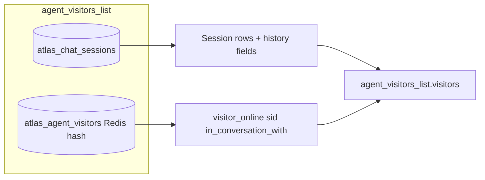

# Live visitor chat — chat sessions list (Socket.IO)

**Status:** Implemented.

---

## Overview

Team members monitoring an agent need a **Chat Sessions** view: every conversation that has occurred for that agent, not only visitors who are online right now.

Previously, `agent_visitors_list` returned **online visitors only** (Redis hash `atlas_{agent_id}_visitors`). A human agent logging in later could not see visitors who had already chatted and left.

Now, `agent_visitors_list` returns **all persisted chat sessions** from MongoDB (`atlas_chat_sessions`), sorted by **`last_message_at` descending** (most recent activity first). Each row includes **`visitor_online`** so the UI can distinguish live vs offline sessions.

**Unchanged:** live presence badges on the team dashboard still use Redis online counts (`agent_visitor_count_updated`, `agents_visitor_counts`).

---

## Socket events

| Direction       | Event                                         | Purpose                                                                |
| --------------- | --------------------------------------------- | ---------------------------------------------------------------------- |
| Client → server | `atlas-team-member-connected`                 | Join agent room; receive initial list (page 1)                         |
| Client → server | `atlas-agent-visitors-list`                   | Request a paginated page of chat sessions                              |
| Client → server | `atlas-agent-visitors-search`                 | Search sessions by `chat_session_id` or `alias_name` substring         |
| Server → client | `agent_visitors_list`                         | Paginated chat sessions for the agent (on connect or explicit refetch) |
| Server → client | `agent_visitors_search_results`               | Paginated search results for the requester socket                      |
| Server → client | `agent_visitors_pagination_updated`           | On visitor join — `{ agent_id, total }` only (no list rows)            |
| Server → client | `agent_visitor_count_updated`                 | On visitor join — `{ agent_id, visitor_count }`                        |
| Server → client | `agent_visitor_disconnected`                  | Visitor socket dropped                                                 |
| Client → server | `atlas-team-member-monitor-conversation`      | Passive monitor: mirror visitor ↔ AI chat                              |
| Client → server | `atlas-team-member-stop-monitor-conversation` | Stop passive monitoring                                                |
| Client → server | `atlas-team-member-start-conversation`        | Human takeover (AI paused)                                             |
| Client → server | `atlas-team-member-end-conversation`          | Hand conversation back to AI                                           |
| Client → server | `atlas-team-member-resolve-session`           | Mark chat session as resolved                                          |
| Server → client | `monitor_conversation_started`                | Ack for monitor start                                                  |
| Server → client | `monitor_conversation_ended`                  | Ack for monitor stop                                                   |
| Server → client | `message_from_visitor`                        | Visitor message (takeover or monitor mirror)                           |
| Server → client | `message_from_agent`                          | Complete AI reply (monitor mirror only)                                |
| Server → client | `message_from_team_member`                    | Human handler reply (owner/admin monitor mirror during takeover)       |
| Server → client | `conversation_started`                        | Takeover active (visitor + team member who took over)                  |
| Server → client | `conversation_ended`                          | Takeover ended (visitor)                                               |
| Server → client | `session_takeover_started`                    | Another team member took over; remaining monitors stay subscribed      |
| Server → client | `session_takeover_ended`                      | Takeover ended; AI monitor mirror resumes for remaining monitors       |
| Server → client | `chat_session_resolved`                       | Ack when team member marks session resolved                            |
| Server → client | `chat_session_status_updated`                 | Broadcast resolved/reactivated status to agent dashboard room          |

---

## Requesting the list

### On team member connect

Emit `atlas-team-member-connected` with `agent_id`, `team_id`, `user_id`, and optional pagination:

```json
{
  "agent_id": "695c342989c5797e0f344572",
  "team_id": "...",
  "user_id": "...",
  "page": 1,
  "limit": 10
}
```

The server joins socket room `agent_{agent_id}_members` and emits `agent_visitors_list` to that socket.

### Paginated refresh

```json
{
  "agent_id": "695c342989c5797e0f344572",
  "page": 2,
  "limit": 10
}
```

Event: `atlas-agent-visitors-list`

Use this for the **refetch** button and whenever the team member wants a fresh page of sessions.

---

## Search chat sessions

Human agents can find sessions by a **case-insensitive substring** on `chat_session_id` or `alias_name`.

### Request

Event: `atlas-agent-visitors-search`

```json
{
  "agent_id": "695c342989c5797e0f344572",
  "query": "web-c043",
  "page": 1,
  "limit": 10
}
```

| Field      | Type     | Required | Notes                                                             |
| ---------- | -------- | -------- | ----------------------------------------------------------------- |
| `agent_id` | `string` | Yes      | Agent scope                                                       |
| `query`    | `string` | Yes      | 1–200 chars after trim; matches `chat_session_id` or `alias_name` |
| `page`     | `number` | No       | Default `1`                                                       |
| `limit`    | `number` | No       | Default `100`, max `100`                                          |

### Response

Event: `agent_visitors_search_results` (emitted **only to the requesting socket**, not the room)

```json
{
  "success": true,
  "message": null,
  "agent_id": "695c342989c5797e0f344572",
  "query": "web-c043",
  "visitors": [],
  "total": 3,
  "page": 1,
  "size": 10,
  "total_pages": 1,
  "has_next": false,
  "has_prev": false
}
```

Each item in `visitors` uses the **same row shape** as `agent_visitors_list` (including `visitor_online` from Redis).

| Field     | Notes                                                        |
| --------- | ------------------------------------------------------------ |
| `success` | `false` when validation fails or the search errors           |
| `message` | Error detail when `success` is `false`; otherwise `null`     |
| `query`   | Normalized search string echoed back                         |
| `total`   | Number of matching sessions (not all sessions for the agent) |

**Sort:** `last_message_at` desc → `last_connected_at` desc → `created_at` desc (same as the default list).

**Validation errors** (still emitted on `agent_visitors_search_results` with `success: false`):

- Missing or empty `query`
- `query` longer than 200 characters
- Missing `agent_id`

---

## Visitor connect — signals only, no list push

When a widget visitor connects (`atlas-visitor-connected`), the server emits **only**:

| Event                               | Room                       | Payload                                                          |
| ----------------------------------- | -------------------------- | ---------------------------------------------------------------- |
| `agent_visitors_pagination_updated` | `agent_{agent_id}_members` | `{ "agent_id", "total" }` — session count for badges / page math |
| `agent_visitor_count_updated`       | `team_{team_id}_members`   | `{ "agent_id", "visitor_count" }` — live online count            |

The server does **not** emit `agent_visitors_list` on visitor join. Do not push or auto-request the full list in response to these events unless the human agent clicks refetch (`atlas-agent-visitors-list`).

Duplicate `atlas-visitor-connected` for the same `sid` is ignored (no duplicate signals).

---

## `agent_visitors_list` payload

```json
{
  "agent_id": "695c342989c5797e0f344572",
  "visitors": [
    {
      "agent_id": "695c342989c5797e0f344572",
      "chat_session_id": "web-c0430c6c-0d3f-40ef-be30-864c7b9222b7",
      "created_at": "2026-07-03T16:20:10.480074+00:00",
      "last_message_at": "2026-07-03T16:22:01.120000+00:00",
      "last_connected_at": "2026-07-03T16:20:10.480+00:00",
      "sid": "ypq6yEU7cw-3MfvlAACZ",
      "alias_name": "web-c0430c6c-0d3f-40ef-be30-864c7b9222b7",
      "in_conversation_with": null,
      "in_conversation_with_name": null,
      "status": "active",
      "geo_data": {
        "country_name": "India",
        "country_flag": "https://ipgeolocation.io/static/flags/in_64.png",
        "district": "North Delhi",
        "ip": "103.248.119.227",
        "time_zone": "Asia/Kolkata"
      },
      "visitor_at": null,
      "visitor_online": true
    }
  ],
  "total": 42,
  "page": 1,
  "size": 10,
  "total_pages": 5,
  "has_next": true,
  "has_prev": false
}
```

### Row fields

| Field                       | Type               | Notes                                                                                                                                    |
| --------------------------- | ------------------ | ---------------------------------------------------------------------------------------------------------------------------------------- |
| `chat_session_id`           | `string`           | Stable session key; use for chat history and replies                                                                                     |
| `visitor_online`            | `boolean`          | `true` when visitor is in Redis online hash                                                                                              |
| `sid`                       | `string \| null`   | Socket id when online; `null` when offline                                                                                               |
| `last_message_at`           | `string \| null`   | ISO-8601 UTC; primary sort key                                                                                                           |
| `last_connected_at`         | `string \| null`   | Last widget connect time                                                                                                                 |
| `alias_name`                | `string \| null`   | Team-assigned display name                                                                                                               |
| `in_conversation_with`      | `string \| null`   | Team member `user_id` when human takeover is active (persisted on `atlas_chat_sessions`; live overlay from Redis when visitor is online) |
| `in_conversation_with_name` | `string \| null`   | Full name of the handling team member (`first_name` + `last_name` from `elysium_atlas_users`); `null` when no takeover or user not found |
| `status`                    | `string`           | `active` (default / AI), `in_conversation` (human takeover), or `resolved` (closed by team; reopens on next visitor message)             |
| `first_message_at`          | `string` \| `null` | UTC ISO-8601 — first visitor message timestamp (also audited)                                                                            |
| `resolved_at`               | `string` \| `null` | UTC ISO-8601 — when a team member marked the session resolved                                                                            |
| `resolved_by`               | `string` \| `null` | `user_id` of the team member who resolved the session                                                                                    |
| `geo_data`                  | `object \| null`   | Geo from widget connect                                                                                                                  |
| `visitor_at`                | `string \| null`   | Marketing attribution param when provided                                                                                                |

Offline rows keep the same shape; `visitor_online` is `false`, `sid` is `null`. `in_conversation_with` is read from Mongo when the visitor is offline (takeover can persist across disconnect).

---

## Sorting and pagination

| Rule                | Behavior                                                                      |
| ------------------- | ----------------------------------------------------------------------------- |
| Sort                | `last_message_at` desc, then `last_connected_at` desc, then `created_at` desc |
| `total`             | Count of all `atlas_chat_sessions` for `agent_id`                             |
| Out-of-range `page` | Clamped to last valid page when `total > 0`                                   |
| Empty agent         | `total: 0`, `page: 1`, `total_pages: 0`                                       |

`agent_visitors_pagination_updated.total` uses the same session count so clients can recompute `total_pages` without refetching the full list.

---

## Data sources



| Store                                 | Role                                                                                 |
| ------------------------------------- | ------------------------------------------------------------------------------------ |
| **MongoDB `atlas_chat_sessions`**     | Source of truth for the list, sort, pagination, and persisted `in_conversation_with` |
| **Redis `atlas_{agent_id}_visitors`** | Live presence overlay (`visitor_online`, `sid`, `in_conversation_with` when online)  |

On visitor connect (`atlas-visitor-connected`), the server ensures a Mongo session exists (`ensure_chat_session_for_visitor`) before marking `visitor_online: true`, so new visitors appear in the list even before their first message.

---

## Team member chat sessions (HTTP)

JWT required (`authorize_user`). Base path: `/elysium-agents/atlas-team-members`.

Returns only sessions where the authenticated user appears in `team_member_ids` (conversations the human agent participated in).

### List — `POST /team-member-chat-sessions`

```json
{
  "agent_id": "695c342989c5797e0f344572",
  "page": 1,
  "limit": 20
}
```

| Field      | Type     | Required | Default          |
| ---------- | -------- | -------- | ---------------- |
| `agent_id` | `string` | No       | —                |
| `page`     | `number` | No       | `1`              |
| `limit`    | `number` | No       | `20` (max `100`) |

**Response `200`:**

```json
{
  "success": true,
  "data": [
    {
      "chat_session_id": "web-c0430c6c-0d3f-40ef-be30-864c7b9222b7",
      "alias_name": "Rajesh",
      "last_message_at": "2026-07-03T16:22:01.120000+00:00",
      "visitor_online": false,
      "last_connected_at": "2026-07-03T16:20:10.480+00:00",
      "geo_data": null,
      "last_message": {
        "message_id": "...",
        "role": "user",
        "content": "...",
        "created_at": "..."
      },
      "has_unread_messages": true,
      "unread_visitor_message_count": 2
    }
  ],
  "total": 15,
  "page": 1,
  "limit": 20,
  "has_next": false,
  "has_prev": false
}
```

### Search — `POST /team-member-chat-sessions/search`

Same row shape as the list endpoint. Matches **case-insensitive substrings** on `chat_session_id` or `alias_name`, scoped to sessions the team member participated in.

```json
{
  "query": "rajesh",
  "agent_id": "695c342989c5797e0f344572",
  "page": 1,
  "limit": 20
}
```

| Field      | Type     | Required | Notes                   |
| ---------- | -------- | -------- | ----------------------- |
| `query`    | `string` | Yes      | 1–200 chars after trim  |
| `agent_id` | `string` | No       | Optional agent filter   |
| `page`     | `number` | No       | Default `1`             |
| `limit`    | `number` | No       | Default `20`, max `100` |

**Response `200`:**

```json
{
  "success": true,
  "query": "rajesh",
  "data": [],
  "total": 2,
  "page": 1,
  "limit": 20,
  "has_next": false,
  "has_prev": false
}
```

| Status | When                           |
| ------ | ------------------------------ |
| `400`  | Missing/empty/too-long `query` |
| `401`  | Invalid or missing JWT         |
| `500`  | Unexpected server error        |

**Sort:** `last_message_at` descending (most recent first).

---

## Frontend integration notes

1. **Rename mentally:** `visitors` in the payload is now **chat sessions**; keep the event name for backward compatibility.
2. **Online indicator:** Use `visitor_online` (not `total`) for the live badge count if needed; `total` is all sessions.
3. **Reply to offline visitors:** Use `chat_session_id` to load history and send via existing team-member message events; `sid` is only required for real-time visitor socket delivery.
4. **On visitor join:** Update UI from `agent_visitors_pagination_updated.total` and `agent_visitor_count_updated.visitor_count` only — do **not** auto-call `atlas-agent-visitors-list`.
5. **Full list:** Refetch button or team member connect (`atlas-team-member-connected` → initial `agent_visitors_list`).
6. **Search:** Debounce input, then emit `atlas-agent-visitors-search`; render `agent_visitors_search_results.visitors`. Clear search to return to the default list via `atlas-agent-visitors-list`.

---

## Code references

| Piece                            | Location                                                                                                        |
| -------------------------------- | --------------------------------------------------------------------------------------------------------------- |
| List emitter                     | `services/elysium_atlas_services/atlas_visitor_socket_services.py` → `emit_agent_visitors_list`                 |
| Search emitter                   | `services/elysium_atlas_services/atlas_visitor_socket_services.py` → `emit_agent_visitors_search_results`       |
| Mongo query + sort               | `services/elysium_atlas_services/atlas_chat_session_services.py` → `get_paginated_chat_sessions_for_agent_list` |
| Mongo search (agent widget list) | `services/elysium_atlas_services/atlas_chat_session_services.py` → `search_paginated_chat_sessions_for_agent`   |
| Team member list API             | `services/elysium_atlas_services/atlas_chat_session_services.py` → `get_paginated_team_member_chat_sessions`    |
| Team member search API           | `services/elysium_atlas_services/atlas_chat_session_services.py` → `search_paginated_team_member_chat_sessions` |
| Query validation                 | `config/atlas_chat_config.py` → `validate_chat_session_search_query`                                            |
| Online overlay                   | `services/elysium_atlas_services/atlas_redis_services.py` → `get_online_visitors_map_by_chat_session`           |
| Socket handlers                  | `sockets.py` → `atlas-agent-visitors-list`, `atlas-agent-visitors-search`, `atlas-team-member-connected`        |
| HTTP routes                      | `routes/elysium_atlas/atlas_team_members_routes.py`                                                             |
| Index                            | `mongo_indexes.py` → `agent_id_last_message_at_index`                                                           |

---

## Human agent conversation modes

Team members can interact with a live visitor chat session in three modes:

| Mode                 | Client event to enter                    | AI responds?       | Team member can send messages? |
| -------------------- | ---------------------------------------- | ------------------ | ------------------------------ |
| **Monitor only**     | `atlas-team-member-monitor-conversation` | Yes                | No (read-only mirror)          |
| **Monitor + assist** | _(planned)_                              | Yes                | Yes                            |
| **Takeover**         | `atlas-team-member-start-conversation`   | No (until handoff) | Yes                            |

**Takeover** sets `in_conversation_with` on the live visitor (Redis) **and** on the `atlas_chat_sessions` Mongo document. Session `status` becomes **`in_conversation`**. The visitor widget receives `conversation_started`; further visitor messages skip the AI and route to the team member via `message_from_visitor`. End with `atlas-team-member-end-conversation` → clears `in_conversation_with`, sets `status` back to **`active`**, and emits `conversation_ended`.

**Resolved** sessions have `status: resolved`. A team member who **holds takeover** may mark resolve via `atlas-team-member-resolve-session`. **Owner and admin** roles may also resolve **without taking over** (including AI-only sessions, or ending another member's active takeover). The server clears any active takeover when present (visitor receives `conversation_ended`), then sets `resolved`. When the visitor sends their **next** message, status returns to **`active`** automatically and the dashboard receives `chat_session_status_updated`. Lifecycle timestamps are recorded in `atlas_chat_session_audits` — see [chat-session-audit.md](./chat-session-audit.md).

When a visitor reconnects while takeover is still active, the server restores `in_conversation_with` from Mongo onto Redis and re-emits `conversation_started` to the visitor widget.

**Takeover persists across team member disconnect.** Closing the dashboard, socket drop, or `atlas-team-member-disconnected` does **not** hand the chat back to the AI. `in_conversation_with` stays set in Mongo (and Redis when the visitor is online). Visitor messages continue to route to the assigned team member and are stored in Mongo even while that team member is offline. Takeover ends only via explicit `atlas-team-member-end-conversation` from the handling team member (or when they reconnect and end it).

When the handling team member reconnects, emit `atlas-team-member-start-conversation` for an idempotent ack (`conversation_started` / `success: true`) — no need to “re-take” the session if `in_conversation_with` already matches their `user_id`.

**Takeover lock:** Only **one** team member can hold takeover at a time (`in_conversation_with` in Mongo + Redis). A second `atlas-team-member-start-conversation` is rejected with `conversation_started` / `success: false`. The lock applies even when the visitor is offline (Mongo is checked). Multiple team members may **monitor** the same session at once, including while takeover is active.

**Monitor only** (implemented) does **not** change `in_conversation_with`. Visitor ↔ AI chat runs unchanged. The monitoring team member receives a real-time mirror of both sides.

### Takeover — start (`atlas-team-member-start-conversation`)

```json
{
  "agent_id": "695c342989c5797e0f344572",
  "chat_session_id": "web-c0430c6c-0d3f-40ef-be30-864c7b9222b7"
}
```

**Success** (to requesting team member): `conversation_started`

```json
{
  "success": true,
  "agent_id": "695c342989c5797e0f344572",
  "chat_session_id": "web-c0430c6c-0d3f-40ef-be30-864c7b9222b7",
  "in_conversation_with": "team_member_user_id",
  "conversation_mode": "takeover",
  "switched_from_monitor": false
}
```

**Rejected** — another team member already has takeover:

```json
{
  "success": false,
  "message": "This chat is already handled by another team member",
  "agent_id": "695c342989c5797e0f344572",
  "chat_session_id": "web-c0430c6c-0d3f-40ef-be30-864c7b9222b7",
  "in_conversation_with": "other_team_member_user_id",
  "conversation_mode": "takeover"
}
```

**Frontend:** Disable or hide “Take over” when `in_conversation_with` is set to another user (from `agent_visitors_list`, session row, or the rejection payload). Offer “Monitor” instead.

If the **same** team member retries takeover (e.g. reconnect), the server returns success idempotently without re-notifying the visitor or other monitors.

### Switching monitor → takeover (same event)

Use the **existing** takeover event — no separate “switch mode” event:

Event: `atlas-team-member-start-conversation`

```json
{
  "agent_id": "695c342989c5797e0f344572",
  "chat_session_id": "web-c0430c6c-0d3f-40ef-be30-864c7b9222b7"
}
```

**Who was monitoring and clicks takeover** — server sequence on that socket:

1. `monitor_conversation_ended` — only if they were in monitor mode; `reason: "switched_to_takeover"`
2. `conversation_started` — takeover is active for them; `conversation_mode: "takeover"`, `switched_from_monitor: true`

**Other monitors when someone takes over** — role-based:

| Role              | Behavior                                                                                                                                                                  |
| ----------------- | ------------------------------------------------------------------------------------------------------------------------------------------------------------------------- |
| **owner / admin** | Stay monitoring. Receive `session_takeover_started`, then live takeover mirrors: `message_from_visitor` and `message_from_team_member` (`conversation_mode: "takeover"`). |
| **member**        | Monitor ends automatically: `monitor_conversation_ended` with `reason: "takeover_restricted"`. Cannot start monitor while takeover is active.                             |

**Team member who was not monitoring** — only receives `conversation_started` (`switched_from_monitor: false`).

**Frontend (monitor → takeover on same socket):**

1. User clicks “Take over” while in monitor mode.
2. Emit `atlas-team-member-start-conversation` (do **not** emit `atlas-team-member-stop-monitor-conversation` first).
3. On `monitor_conversation_ended` with `reason: "switched_to_takeover"`: tear down monitor listeners/state.
4. On `conversation_started` with `conversation_mode: "takeover"`: enable reply input, show takeover UI.
5. Use `atlas-team-member-message` to send; listen for `message_from_visitor` as in normal takeover.

**Frontend (owner/admin monitors while someone else took over):**

1. On `session_takeover_started`: show banner (“Agent X is handling this chat”); stop expecting `message_from_agent`.
2. Listen for `message_from_visitor` and `message_from_team_member` with `conversation_mode: "takeover"`.
3. On `session_takeover_ended`: hide banner; resume expecting AI mirror events (`message_from_agent`).

**Frontend (member monitors when takeover starts):**

1. On `monitor_conversation_ended` with `reason: "takeover_restricted"`: tear down monitor UI — members cannot watch human takeover chat.
2. Do not offer “Monitor” while `in_conversation_with` is set unless the user is owner/admin.

### End takeover

Event: `atlas-team-member-end-conversation` — same payload (`agent_id`, `chat_session_id`). This is the **only** way to release a human takeover and return the visitor to the AI.

- Clears `in_conversation_with` in Mongo and Redis.
- Visitor receives `conversation_ended`.
- Remaining monitors receive `session_takeover_ended`.
- Team member who ended takeover should start monitor again explicitly if they want read-only view (`atlas-team-member-monitor-conversation`).

**Not released on:** team member socket disconnect, browser close, or `atlas-team-member-disconnected`.

### Mark session resolved

Event: `atlas-team-member-resolve-session`

```json
{
  "agent_id": "695c342989c5797e0f344572",
  "chat_session_id": "web-c0430c6c-0d3f-40ef-be30-864c7b9222b7"
}
```

Requires authenticated team member (`user_id` on socket session from `atlas-team-member-connected`).

**Authorization:**

| Role              | Can resolve?                                                                                          |
| ----------------- | ----------------------------------------------------------------------------------------------------- |
| **member**        | Only when `in_conversation_with` matches their `user_id` (active takeover)                            |
| **owner / admin** | Always — with or without takeover; may resolve AI-only sessions or override another member's takeover |

Regular **member** role cannot resolve from monitor mode or the visitors list without taking over first.

**Ack** (to requesting socket): `chat_session_resolved`

Success:

```json
{
  "success": true,
  "agent_id": "695c342989c5797e0f344572",
  "chat_session_id": "web-c0430c6c-0d3f-40ef-be30-864c7b9222b7",
  "status": "resolved",
  "resolved_at": "2026-07-03T19:00:00.120Z",
  "resolved_by": "team_member_user_id",
  "already_resolved": false,
  "audit": {
    "audit_id": "...",
    "event_type": "session_resolved",
    "created_at": "2026-07-03T19:00:00.120Z"
  }
}
```

**Rejected** — not the active takeover handler:

```json
{
  "success": false,
  "agent_id": "695c342989c5797e0f344572",
  "chat_session_id": "web-c0430c6c-0d3f-40ef-be30-864c7b9222b7",
  "message": "Only the team member who has taken over this conversation can mark it as resolved",
  "in_conversation_with": "other_team_member_user_id"
}
```

`in_conversation_with` is omitted when no takeover is active (AI-only session).

**Broadcast** (room `agent_{agent_id}_members`): `chat_session_status_updated`

```json
{
  "agent_id": "695c342989c5797e0f344572",
  "chat_session_id": "web-c0430c6c-0d3f-40ef-be30-864c7b9222b7",
  "status": "resolved",
  "resolved_at": "2026-07-03T19:00:00.120Z",
  "resolved_by": "team_member_user_id"
}
```

**Behavior:**

- **Member:** must hold active takeover (`in_conversation_with` === their `user_id`).
- **Owner / admin:** may resolve without takeover; if another member holds takeover, it is cleared first.
- Sets `atlas_chat_sessions.status` to `resolved` and stores `resolved_at` / `resolved_by`.
- When a takeover was active, clears it and emits `conversation_ended` to the visitor when online; records `takeover_released` then `session_resolved` audits (`resolved_by_privileged: true` in metadata when owner/admin resolved without being the handler).
- Idempotent: resolving an already-resolved session returns `success: true`, `already_resolved: true` (no takeover check).

**Reactivation:** When the visitor sends the next `atlas-visitor-message`, the server sets `status` back to `active`, clears `resolved_at` / `resolved_by`, records `session_reactivated` audit, and emits `chat_session_status_updated` with `reactivated_at` and `previous_status: "resolved"`.

**Frontend guidance:**

1. **Member:** show “Mark resolved” only when `conversation_mode === "takeover"` and `in_conversation_with` matches the logged-in user.
2. **Owner / admin:** show “Mark resolved” on any non-resolved session row or chat view (monitor, list, or takeover).
3. Emit `atlas-team-member-resolve-session` from the resolve action.
4. On `chat_session_resolved` ack, update local session state to `resolved`.
5. On `success: false`, surface the message; use `in_conversation_with` if another member holds the session (member role only).
6. Listen for `chat_session_status_updated` on the agent room to refresh list rows when any teammate resolves or a visitor reactivates.
7. Filter or badge resolved sessions in the list using `status === "resolved"`.

Audit timeline details: [chat-session-audit.md](./chat-session-audit.md).

---

## Monitor only — passive session mirror

### Start monitoring

Event: `atlas-team-member-monitor-conversation`

```json
{
  "agent_id": "695c342989c5797e0f344572",
  "chat_session_id": "web-c0430c6c-0d3f-40ef-be30-864c7b9222b7"
}
```

`user_id` is taken from the team member's socket session (set on `atlas-team-member-connected`).

**Acknowledgement** (to requesting socket only): `monitor_conversation_started`

```json
{
  "success": true,
  "agent_id": "695c342989c5797e0f344572",
  "chat_session_id": "web-c0430c6c-0d3f-40ef-be30-864c7b9222b7",
  "conversation_mode": "monitor"
}
```

When takeover is already active, **only owners and admins** may start monitoring (to watch the live human ↔ visitor chat):

```json
{
  "success": true,
  "agent_id": "695c342989c5797e0f344572",
  "chat_session_id": "web-c0430c6c-0d3f-40ef-be30-864c7b9222b7",
  "conversation_mode": "monitor",
  "takeover_active": true,
  "takeover_mirror_enabled": true,
  "in_conversation_with": "team_member_user_id_handling_chat"
}
```

Multiple team members can monitor the same session concurrently. Monitor does **not** grant takeover; use `atlas-team-member-start-conversation` separately (subject to takeover lock).

Multiple owners/admins can monitor the same session concurrently. Monitor does **not** grant takeover; use `atlas-team-member-start-conversation` separately (subject to takeover lock).

Starting takeover (`atlas-team-member-start-conversation`) removes **only the initiating team member** from the monitor list. Other **owner/admin** monitors stay subscribed; **member** monitors are dropped with `reason: "takeover_restricted"`.

### Stop monitoring

Event: `atlas-team-member-stop-monitor-conversation`

Same payload shape as start (`agent_id`, `chat_session_id`).

**Acknowledgement:** `monitor_conversation_ended`

```json
{
  "success": true,
  "agent_id": "695c342989c5797e0f344572",
  "chat_session_id": "web-c0430c6c-0d3f-40ef-be30-864c7b9222b7",
  "reason": "stopped"
}
```

| `reason`               | When                                                                                |
| ---------------------- | ----------------------------------------------------------------------------------- |
| `stopped`              | Explicit `atlas-team-member-stop-monitor-conversation`                              |
| `switched_to_takeover` | Same socket emitted `atlas-team-member-start-conversation` while monitoring         |
| `takeover_restricted`  | Human takeover started; monitor was role **member** (owners/admins stay subscribed) |

Monitor registrations are also cleared when the team member disconnects or emits `atlas-team-member-disconnected`.

### Mirrored messages (server → monitoring team member)

While monitoring, the team member receives messages **only after they are persisted** to MongoDB so each payload includes the real `_id` for mark-read.

**AI chat (no active takeover)** — all monitoring roles (when allowed to monitor):

| Event                  | When                                          | Payload notes                                                 |
| ---------------------- | --------------------------------------------- | ------------------------------------------------------------- |
| `message_from_visitor` | After visitor message is stored (before LLM)  | `conversation_mode: "monitor"`, `sender: "visitor"`, `_id`, … |
| `message_from_agent`   | After full AI response is stored and streamed | `conversation_mode: "monitor"`, `sender: "agent"`, `_id`, …   |

**Human takeover (owner/admin monitors only)**:

| Event                      | When                                           | Payload notes                                                                       |
| -------------------------- | ---------------------------------------------- | ----------------------------------------------------------------------------------- |
| `message_from_visitor`     | Visitor message stored and routed to handler   | `conversation_mode: "takeover"`, `sender: "visitor"`, `_id`, …                      |
| `message_from_team_member` | Human handler reply stored and sent to visitor | `conversation_mode: "takeover"`, `sender: "team_member"`, `role: "human"`, `_id`, … |

Example `message_from_visitor`:

```json
{
  "agent_id": "695c342989c5797e0f344572",
  "chat_session_id": "web-c0430c6c-0d3f-40ef-be30-864c7b9222b7",
  "message": "Hello, I need help with pricing",
  "sender": "visitor",
  "_id": "67a1b2c3d4e5f6789012345a",
  "message_id": "f47ac10b-58cc-4372-a567-0e02b2c3d479",
  "role": "user",
  "created_at": "2026-07-03T18:05:12.340000+00:00"
}
```

Example `message_from_agent`:

```json
{
  "agent_id": "695c342989c5797e0f344572",
  "chat_session_id": "web-c0430c6c-0d3f-40ef-be30-864c7b9222b7",
  "sender": "agent",
  "conversation_mode": "monitor",
  "_id": "67a1b2c3d4e5f6789012345b",
  "message_id": "a1b2c3d4-e5f6-7890-abcd-ef1234567890",
  "message": "Our pricing starts at…",
  "content": "Our pricing starts at…",
  "role": "agent",
  "created_at": "2026-07-03T18:05:18.120000+00:00"
}
```

The AI path is unchanged for the visitor: retrieval, LLM streaming, and `emit_atlas_response_chunk` run on the main handler thread. Monitor emits are fire-and-forget (`asyncio.create_task`) so they never block the visitor experience.

### Mark as read (monitor mode)

When the team member views a mirrored message in the monitor UI, call the existing mark-read endpoint with the `_id` from the socket payload.

**Endpoint:** `POST /elysium-agents/elysium-atlas/agent/v1/mark-chat-message-read`

```json
{
  "message_id": "67a1b2c3d4e5f6789012345a",
  "agent_id": "695c342989c5797e0f344572",
  "chat_session_id": "web-c0430c6c-0d3f-40ef-be30-864c7b9222b7",
  "read_by": "team_member_user_id"
}
```

| Field        | Notes                                                                                                                                                     |
| ------------ | --------------------------------------------------------------------------------------------------------------------------------------------------------- |
| `message_id` | Use `_id` from `message_from_visitor` or `message_from_agent` (Mongo ObjectId string). The client UUID in `message_id` also works but `_id` is preferred. |
| `read_by`    | Optional; team member `user_id` stored on first read only                                                                                                 |

**Response `200`:**

```json
{
  "success": true,
  "message": "Message marked as read",
  "data": {
    "_id": "67a1b2c3d4e5f6789012345a",
    "message_id": "f47ac10b-58cc-4372-a567-0e02b2c3d479",
    "read_at": "2026-07-03T18:05:20.000000+00:00",
    "read_by": "team_member_user_id"
  }
}
```

**Frontend guidance:**

1. On each `message_from_visitor` / `message_from_agent`, render the message and keep `_id` on the row.
2. When the message scrolls into view (or the monitor panel is focused), POST mark-read with that `_id`.
3. Mark-read is idempotent — safe to retry; the server preserves the first `read_at`.
4. Apply to both visitor and agent mirrored messages so unread counts stay accurate.

### Redis

| Key                                 | Role                                                    |
| ----------------------------------- | ------------------------------------------------------- |
| `atlas_{agent_id}_session_monitors` | Hash: `chat_session_id` → JSON list of `{user_id, sid}` |

### Code references

| Piece                                    | Location                                                                                                                                          |
| ---------------------------------------- | ------------------------------------------------------------------------------------------------------------------------------------------------- |
| Monitor start/stop controllers           | `controllers/elysium_atlas_controller_files/atlas_team_member_chat_controllers.py`                                                                |
| Visitor + agent mirror emits             | `services/elysium_atlas_services/atlas_team_member_emit_services.py`                                                                              |
| Monitor registry (Redis)                 | `services/elysium_atlas_services/atlas_redis_services.py`                                                                                         |
| Orchestration on `atlas-visitor-message` | `services/elysium_atlas_services/agent_chat_services.py` → early visitor persist + monitor emit; `atlas_chat_controllers.py` → agent monitor emit |
| Mark read API                            | `POST /elysium-agents/elysium-atlas/agent/v1/mark-chat-message-read`                                                                              |
| Socket handlers                          | `sockets.py` → `atlas-team-member-monitor-conversation`, `atlas-team-member-stop-monitor-conversation`, `atlas-team-member-start-conversation`    |
| Monitor → takeover transition            | `atlas_team_member_chat_controllers.py` → `team_member_start_conversation_controller`                                                             |
