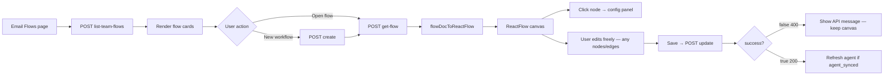

# Email Flows — Frontend Guide

Short guide for the **Email Flows** page and `@xyflow/react` integration. For backend node I/O and execution details, see [email-flow-nodes.md](./email-flow-nodes.md).

**Library:** [`@xyflow/react`](https://reactflow.dev) v12 (`^12.11.0`)

**Collections:** `email-flows`, `email-ai-agents`

---

## Overview

Workflows live in **`email-flows`** scoped by **`team_id` only** — there is **no `agent_id`** on the flow document.

Linking is **one-way** on **`email-ai-agents.flow_id`**:

- Each agent points to at most **one** workflow.
- Each workflow can be attached to **at most one** agent at a time (enforced by the API and a unique Mongo index on `email-ai-agents.flow_id`).

On **agent create** (no `flow_id` in body): a new default workflow is created for the team and linked.

On **agent create/update** with an existing **`flow_id`**: attach that workflow — rejected with **`409`** if already linked to another agent. On attach, **workflow node config overwrites the agent’s syncable fields** (KB, tools, rules, format template, LLM, reply action). The canvas is **not** rebuilt from the agent.

On **agent update** (omit `flow_id`): keep current link; sync graph from agent settings.

- **Editable workflows:** custom flows (`is_editable: true`) can be edited on the canvas. Saving calls **`POST /email-flows/v1/update`**, which validates the graph and syncs config to a linked agent when attached.
- **Runtime execution (Phase A):** still uses the hardcoded engine pipeline in code order — canvas order of optional middle nodes does not change runtime yet.

### Builder UX — free canvas, validate on save

**Do not block editing in the frontend.** The user may add, delete, and connect any nodes and edges however they like. No client-side “you can’t do that” rules, no greyed-out palette entries, no forced rewiring while they edit.

**All workflow rules are enforced on the backend** when the user clicks **Save** (`POST /email-flows/v1/update`):

- Invalid graph → **`400`** with `"success": false` and a human-readable `"message"` (nothing is written to Mongo; linked agent is unchanged).
- Valid graph → **`200`** with `"success": true` and updated flow data.

Use `validation_rules` from get-flow **only** for optional helper text (tooltips, docs panel) — **not** to restrict the canvas.

---

## Agent `flow_id`

`GET /email-ai-agents/v1/get-agent` and list responses now include:

```json
{
  "agent_id": "674d1a2b3c4e5f6789012345",
  "name": "Support Bot",
  "flow_id": "674f2b3c4d5e6f7890123456",
  "...": "..."
}
```

| Field           | Meaning                                                             |
| --------------- | ------------------------------------------------------------------- |
| `flow_id`       | Mongo `_id` of the workflow this agent runs / displays              |
| Empty / missing | Legacy agent — update the agent once to create or attach a workflow |

---

## Attach workflow on agent create / update

Optional on **`POST /email-ai-agents/v1/create`** and **`POST /email-ai-agents/v1/update`**:

```json
{
  "flow_id": "674f2b3c4d5e6f7890123456"
}
```

| Case                                                  | Behaviour                                                  |
| ----------------------------------------------------- | ---------------------------------------------------------- |
| Create, `flow_id` omitted                             | New default workflow created from agent + linked           |
| Create/update, `flow_id` set to unattached workflow   | Link + **push workflow config → agent** (canvas unchanged) |
| Create/update, `flow_id` already on **another** agent | **`409 Conflict`**                                         |

**Error — `409 Conflict`**

```json
{
  "success": false,
  "message": "This workflow is already attached to another email agent. Create a new workflow or choose an unattached one.",
  "data": {
    "flow_id": "674f2b3c4d5e6f7890123456",
    "attached_agent_id": "674d1a2b3c4e5f6789012345",
    "attached_agent_name": "Support Bot"
  }
}
```

On **update**, omit `flow_id` to keep the current link. Only pass `flow_id` when switching to a different workflow.

---

## APIs

Base path: `/elysium-agents/email-flows`

Both production endpoints require **JWT** (`Authorization: Bearer …`). `team_id` in the token must match the request.

### List team workflows

`POST /email-flows/v1/list-team-flows`

**Request**

```json
{
  "team_id": "team_abc123"
}
```

**Success — `200`**

```json
{
  "success": true,
  "message": "Email flows fetched successfully.",
  "data": {
    "team_id": "team_abc123",
    "count": 1,
    "flows": [
      {
        "flow_id": "674f2b3c4d5e6f7890123456",
        "attached_agent_id": "674d1a2b3c4e5f6789012345",
        "attached_agent_name": "Support Bot",
        "gmail_account_id": "674c0a1b2c3d4e5f6789012345",
        "inbox_name": "Support",
        "email_address": "support@company.com",
        "name": "Default — Support Bot",
        "slug": "default_agent_flow",
        "summary": "Inbound reply pipeline · 8 nodes · Draft only",
        "node_count": 8,
        "is_system_default": true,
        "is_deletable": false,
        "is_editable": true,
        "is_attached": true,
        "status": "active",
        "created_at": "2026-06-08T10:00:00+00:00",
        "updated_at": "2026-06-08T10:05:00+00:00"
      }
    ]
  }
}
```

| Field                                       | Use on UI                                                          |
| ------------------------------------------- | ------------------------------------------------------------------ |
| `is_attached`                               | `true` when some agent’s `flow_id` equals this workflow            |
| `attached_agent_id` / `attached_agent_name` | Empty when workflow is unattached                                  |
| `summary`                                   | One-line card description                                          |
| `node_count`                                | Badge on flow card                                                 |
| `is_deletable`                              | Always `false` for auto-generated defaults                         |
| `is_editable`                               | `true` for custom workflows; default agent flows are also editable |

---

### Create workflow

`POST /email-flows/v1/create`

Creates a new **custom** team workflow with a minimal valid scaffold:

`start → load_thread_context → generate_email → save_gmail_draft → stop`

The new flow is **unattached** until linked via agent create/update (`flow_id`).

**Request**

```json
{
  "team_id": "team_abc123",
  "name": "Support — draft pipeline",
  "description": "Optional description"
}
```

**Success — `201`**

Returns the same `data` shape as [get-flow](#get-workflow-by-flow_id-click-a-flow-card) (full graph, `node_editor_schema`, `validation_rules`, `layout`, `edges`).

```json
{
  "success": true,
  "message": "Email workflow created successfully.",
  "data": {
    "flow_id": "674f2b3c4d5e6f7890123456",
    "name": "Support — draft pipeline",
    "is_editable": true,
    "is_read_only": false,
    "is_attached": false,
    "attached_agent_id": "",
    "nodes": ["..."],
    "edges": ["..."],
    "node_editor_schema": { "...": "..." },
    "validation_rules": { "...": "..." }
  }
}
```

**Errors**

| Status | When                         |
| ------ | ---------------------------- |
| `400`  | Empty workflow name          |
| `403`  | `team_id` does not match JWT |

---

### Save workflow (edit name + graph)

`POST /email-flows/v1/update`

Use when the user saves changes on the flow builder canvas.

**Request**

```json
{
  "flow_id": "674f2b3c4d5e6f7890123456",
  "name": "Support — auto-send pipeline",
  "description": "Updated description",
  "nodes": [
    {
      "node_id": "start",
      "type": "start",
      "label": "Start",
      "position": { "x": 0, "y": 80 },
      "dimensions": { "width": 280, "height": 72 },
      "config": {},
      "edges": [{ "to": "load_thread_context" }]
    }
  ]
}
```

| Field         | Required | Notes                                                      |
| ------------- | -------- | ---------------------------------------------------------- |
| `flow_id`     | Yes      | Workflow to update                                         |
| `nodes`       | Yes      | Full graph — every node with `edges`, `position`, `config` |
| `name`        | No       | Omit to keep current name                                  |
| `description` | No       | Omit to keep current description                           |

**Success — `200`**

Same `data` shape as get-flow, plus:

```json
{
  "agent_synced": true
}
```

`agent_synced` is `true` when the workflow was attached to an agent and that agent document was updated from node config.

```json
{
  "agent_synced": true,
  "attached_agent_id": "674d1a2b3c4e5f6789012345"
}
```

Top-level `"message"` is always **`"Workflow saved."`** — do not append field lists to the toast. Use `agent_synced` only if you need to refresh agent settings silently.

**Validation errors — `400`**

Nothing is persisted until validation passes. Response shape:

```json
{
  "success": false,
  "message": "Load Thread Context must be the first node immediately after Start."
}
```

Malformed JSON or missing required fields → **`422`** (FastAPI/Pydantic) before business validation runs.

**Note:** React Flow sends **float** `position.x` / `position.y` (e.g. after drag). The API accepts floats and **rounds to integers** before save.

The API validates in order:

1. **Request shape** — `flow_id`, `nodes[]` with `node_id`, `type`, `position`, `edges`, `config` (Pydantic).
2. **Graph rules** — `validate_flow_graph()` (structure, order, allowed types).
3. **Config rules** — team-scoped IDs, tool counts, send confidence (see table below).

Common **`message`** values:

| Rule               | Error                                                                                                                                                                                  |
| ------------------ | -------------------------------------------------------------------------------------------------------------------------------------------------------------------------------------- |
| Linear chain       | Orphan nodes, cycles, multiple outgoing edges                                                                                                                                          |
| Start / Stop       | Exactly one of each; Stop has no outgoing edges                                                                                                                                        |
| First after Start  | Must be `load_thread_context`                                                                                                                                                          |
| Generate Email     | Exactly one; must appear before tail                                                                                                                                                   |
| Tail               | Exactly one of `save_gmail_draft` **or** `send_email`, immediately before `call_external_tool` or Stop                                                                                 |
| Call External Tool | At most one; when present must be `tail → call_external_tool → stop`; tool ids in `config.external_tools[]` (backend also accepts mistaken `config.tool_ids[]` and normalizes on save) |
| Read Tools         | If present with `tool_ids`, each id must be a valid team tool (empty list allowed)                                                                                                     |
| Send Email         | `config.reply_action.auto_send_min_confidence` must be 0–1                                                                                                                             |

`validation_rules` on get-flow is **documentation for the UI** — the server always re-validates on save. Do **not** use it to block edits client-side.

**Other errors**

| Status | When                                                       |
| ------ | ---------------------------------------------------------- |
| `403`  | Flow not in your team, or `is_editable: false` (read-only) |
| `404`  | Flow not found                                             |

---

### Get workflow by flow_id (click a flow card)

`POST /email-flows/v1/get-flow`

Use this when the user **clicks a flow** from the list. Pass the `flow_id` from the list row.

**Request**

```json
{
  "flow_id": "674f2b3c4d5e6f7890123456"
}
```

**Success — `200`**

Same `data` shape as [get-flow-for-agent](#get-workflow-for-agent-canvas) below, including full `nodes[]` with `position`, `config`, `edges`, and `binding` for `@xyflow/react`.

Also includes `is_attached`: `true` when an agent currently links this workflow via `email-ai-agents.flow_id`.

Every get-flow / get-flow-for-agent / create / update response also includes:

| Field                          | Use on UI                                                                                   |
| ------------------------------ | ------------------------------------------------------------------------------------------- |
| `is_editable` / `is_read_only` | When `is_read_only`, hide Save (flow not editable). Otherwise allow full free-form editing. |
| `node_editor_schema`           | Right panel field definitions per node type (see below)                                     |
| `validation_rules`             | Optional copy for help text only — **not** for blocking canvas edits                        |
| `layout` + `edges`             | Suggested layout hints; user may ignore when building freely                                |

When **unattached**, `attached_agent_id` is `""` and bindings use flow node `config` only (`binding.synced_from: "flow"`).

---

## Node editor (right panel)

When the user **clicks a node**, open the config panel using `node_editor_schema` from the flow response.

**System prompt is not on the canvas** — edit it on the agent settings page only. The Start node schema marks it read-only with a note.

| Node type                 | Editable config (`node.config`)                                   | Syncs to agent field on save (when attached)        |
| ------------------------- | ----------------------------------------------------------------- | --------------------------------------------------- |
| `start`                   | —                                                                 | —                                                   |
| `load_thread_context`     | — (uses agent Gmail inbox at runtime)                             | —                                                   |
| `read_kb`                 | `knowledge_id`                                                    | `knowledge_id`                                      |
| `read_tools`              | `tool_ids[]`                                                      | `tool_ids`                                          |
| `ai_department_router`    | `routing_rule_ids[]`                                              | `routing_rule_ids` (empty array if node removed)    |
| `ai_recipients_generator` | `recipient_rule_ids[]`                                            | `recipient_rule_ids` (empty if removed)             |
| `generate_email`          | `format_prompt`, `llm_model`                                      | `email_format_template`, `llm_model`                |
| `save_gmail_draft`        | — (implicit)                                                      | `reply_action.mode = "draft"`                       |
| `send_email`              | `reply_action.auto_send_min_confidence`                           | `reply_action.mode = "auto_send"`, confidence       |
| `call_external_tool`      | `external_tools[]` (or `tool_ids[]` — backend normalizes on save) | **No** — flow-only (not on agent create/update API) |
| `stop`                    | —                                                                 | —                                                   |

Use existing team pickers (same as agent settings):

- Knowledge → `POST /email-knowledge/v1/list` (or your knowledge list API)
- Tools → tool definitions list
- Routing rules → routing rules list
- Recipient rules → recipient rules list

**Example — Send Email node config in save payload:**

```json
{
  "node_id": "send_email",
  "type": "send_email",
  "config": {
    "reply_action": {
      "mode": "auto_send",
      "auto_send_min_confidence": 0.85
    }
  }
}
```

**Example — Generate Email:**

```json
{
  "config": {
    "format_prompt": "Use a friendly tone. Sign off as Support Team.",
    "llm_model": "gpt-4.1-mini"
  }
}
```

When swapping tail node (`save_gmail_draft` ↔ `send_email`) on the canvas, the user can wire it however they like until Save — the backend rejects invalid combinations (both tails, no tail, tail not before stop, etc.).

---

### Get workflow for agent (canvas)

`POST /email-flows/v1/get-flow-for-agent`

**Request**

```json
{
  "agent_id": "674d1a2b3c4e5f6789012345"
}
```

**Success — `200`**

Returns the **linked** workflow with hydrated `binding` objects for display labels.

```json
{
  "success": true,
  "message": "Email flow fetched successfully.",
  "data": {
    "flow_id": "674f2b3c4d5e6f7890123456",
    "attached_agent_id": "674d1a2b3c4e5f6789012345",
    "attached_agent_name": "Support Bot",
    "team_id": "team_abc123",
    "gmail_account_id": "674c0a1b2c3d4e5f6789012345",
    "inbox_name": "Support",
    "email_address": "support@company.com",
    "name": "Default — Support Bot",
    "summary": "Inbound reply pipeline · 8 nodes · Draft only",
    "is_system_default": true,
    "is_deletable": false,
    "is_editable": false,
    "is_read_only": false,
    "tail_mode": "draft",
    "palette_node_types": [
      "start",
      "load_thread_context",
      "read_kb",
      "read_tools",
      "ai_department_router",
      "ai_recipients_generator",
      "generate_email",
      "call_external_tool",
      "save_gmail_draft",
      "send_email",
      "stop"
    ],
    "nodes": [
      {
        "node_id": "start",
        "type": "start",
        "label": "Start",
        "position": { "x": 0, "y": 80 },
        "dimensions": { "width": 280, "height": 72 },
        "config": {},
        "edges": [{ "to": "load_thread_context" }],
        "binding": { "synced_from": "agent" }
      },
      {
        "node_id": "read_kb",
        "type": "read_kb",
        "label": "Read KB",
        "position": { "x": 640, "y": 80 },
        "dimensions": { "width": 280, "height": 72 },
        "config": {
          "limit": 5,
          "knowledge_id": "a1b2c3d4-e5f6-7890-abcd-ef1234567890"
        },
        "edges": [{ "to": "read_tools" }],
        "binding": {
          "synced_from": "agent",
          "knowledge_id": "a1b2c3d4-e5f6-7890-abcd-ef1234567890",
          "title": "Return Policy"
        }
      }
    ],
    "created_at": "2026-06-08T10:00:00+00:00",
    "updated_at": "2026-06-08T10:05:00+00:00"
  }
}
```

**Errors**

| Status | When                                                     |
| ------ | -------------------------------------------------------- |
| `404`  | Agent not found, or no `flow_id` yet (update agent once) |
| `403`  | Agent / flow not in your team                            |

---

## Validation rules (backend only — on Save)

The frontend **does not** enforce these while editing. The server enforces them on **`POST /email-flows/v1/update`** (summarized in `data.validation_rules` for reference):

1. **Required nodes:** `start`, `load_thread_context`, `generate_email`, `stop`
2. **First after start:** `load_thread_context` only
3. **Tail:** exactly one of `save_gmail_draft` or `send_email`, immediately before `stop` (not both)
4. **Before tail:** exactly one `generate_email`
5. **Optional middle** (any order between load and generate): `read_kb`, `read_tools`, `ai_department_router`, `ai_recipients_generator`
6. **Optional post-tail** (optional): `call_external_tool` — at most one; when present must be `tail → call_external_tool → stop`
7. **Graph shape:** single linear chain — one outgoing edge per node (except `stop`), no orphans or cycles
8. **Runtime note:** optional middle order on the canvas does not change Phase A engine order yet; Call External Tool always runs after the tail node when configured on the saved workflow

---

## Which nodes exist (reference)

These sections describe **valid saved workflows** and **agent sync behaviour** — not frontend edit restrictions.

### Valid saved pipeline (after successful Save)

When save succeeds, the persisted graph always matches:

1. `start`
2. `load_thread_context`
3. `generate_email`
4. Tail — **one of:**
   - `save_gmail_draft` when `reply_action.mode = "draft"`
   - `send_email` when `reply_action.mode = "auto_send"`
5. `stop`

Included **only when configured** on the agent:

| Node                      | Included when                     |
| ------------------------- | --------------------------------- |
| `read_kb`                 | `knowledge_id` is non-empty       |
| `read_tools`              | `tool_ids` is non-empty           |
| `ai_department_router`    | `routing_rule_ids` is non-empty   |
| `ai_recipients_generator` | `recipient_rule_ids` is non-empty |

Included **only when configured on the workflow** (flow-only — not on default agent flows):

| Node                 | Included when                                                                                   |
| -------------------- | ----------------------------------------------------------------------------------------------- |
| `call_external_tool` | Node present on saved workflow with `config.external_tools[]` (may be empty — skips at runtime) |

**Saved chain when Call External Tool is present:** `… → tail → call_external_tool → stop`

### Left sidebar palette

Expose every type in `palette_node_types`. **All types are draggable onto the canvas** — including types not in the last saved graph. Do not disable or grey out palette entries.

Register React components for every palette type:

```tsx
const nodeTypes = {
  start: StartNode,
  load_thread_context: LoadThreadContextNode,
  read_kb: ReadKbNode,
  read_tools: ReadToolsNode,
  ai_department_router: DepartmentRouterNode,
  ai_recipients_generator: RecipientsNode,
  generate_email: GenerateEmailNode,
  call_external_tool: ExternalToolNode,
  save_gmail_draft: SaveGmailDraftNode,
  send_email: SendEmailNode,
  stop: StopNode,
};
```

---

## Tail behaviour (Option A)

| `reply_action.mode` | Tail node on canvas | Runtime note                                                                                                              |
| ------------------- | ------------------- | ------------------------------------------------------------------------------------------------------------------------- |
| `draft`             | `save_gmail_draft`  | Always saves Gmail draft                                                                                                  |
| `auto_send`         | `send_email`        | Sends if confidence ≥ `auto_send_min_confidence`; otherwise draft fallback **inside** `send_email` (no extra canvas node) |

Use `data.binding.label_hint` on tail nodes for subtitle text, e.g. `"Auto-send when confidence >= 0.8 (otherwise save draft)"`.

---

## Canvas layout (default workflows — horizontal)

Default graph is a **single horizontal row** (left → right). Each `get-flow` response includes **`layout`**, **`nodes[]`**, and **`edges[]`**.

| Constant | Value | Meaning                                                         |
| -------- | ----- | --------------------------------------------------------------- |
| `ROW_Y`  | `80`  | Same `y` for every node                                         |
| `STEP_X` | `320` | Horizontal gap between node origins (280px width + 40px gutter) |

**Position rule:** pipeline index `i` → `"position": { "x": i * 320, "y": 80 }`

```json
{
  "layout": {
    "direction": "horizontal",
    "row_y": 80,
    "step_x": 320,
    "node_width": 280,
    "node_height": 72,
    "node_origin": [0, 0],
    "source_handle": "right",
    "target_handle": "left",
    "edge_type": "straight"
  },
  "edges": [
    {
      "id": "start-load_thread_context",
      "source": "start",
      "target": "load_thread_context",
      "type": "straight",
      "sourceHandle": "right",
      "targetHandle": "left"
    }
  ],
  "nodes": [
    {
      "node_id": "start",
      "position": { "x": 0, "y": 80 },
      "dimensions": { "width": 280, "height": 72 },
      "edges": [{ "to": "load_thread_context" }]
    },
    {
      "node_id": "load_thread_context",
      "position": { "x": 320, "y": 80 },
      "dimensions": { "width": 280, "height": 72 }
    },
    {
      "node_id": "read_kb",
      "position": { "x": 640, "y": 80 },
      "dimensions": { "width": 280, "height": 72 }
    }
  ]
}
```

### Edge rules (API / Mongo format on Save)

When the user clicks Save, convert the React Flow canvas into `nodes[]` where each node has:

| Field     | Detail                                                                                      |
| --------- | ------------------------------------------------------------------------------------------- |
| Format    | `"edges": [{ "to": "<target_node_id>" }]` on the source node (derive from React Flow edges) |
| `stop`    | `"edges": []`                                                                               |
| `node_id` | Stable id (usually matches React Flow `node.id`)                                            |

The backend then validates that this graph is a **single valid linear chain** (see validation rules). Invalid wiring → **`400`** + `message`; the canvas state in the browser is unchanged.

### When agent sync adds/removes optional nodes

1. Rewire into **one continuous chain** (no gaps).
2. Re-index `x` for the full chain: `0, 320, 640, …` at the same `y: 80`.
3. Pipeline order: `read_kb → read_tools → ai_department_router → ai_recipients_generator → generate_email → tail → stop`.

For `auto_send`, tail is `send_email` at the same slot index as `save_gmail_draft` would occupy.

---

## Straight edges checklist (React Flow — horizontal)

### 1. `<ReactFlow />` props (free-form builder)

```tsx
<ReactFlow
  nodes={nodes}
  edges={edges}
  nodeOrigin={[0, 0]}
  defaultEdgeOptions={{ type: "straight" }}
  nodesDraggable={true}
  nodesConnectable={true}
  edgesReconnectable={true}
  deleteKeyCode={["Backspace", "Delete"]}
  fitView
  fitViewOptions={{ padding: 0.2 }}
  onNodesChange={onNodesChange}
  onEdgesChange={onEdgesChange}
  onConnect={onConnect}
/>
```

Allow arbitrary adds/deletes/connects in the UI. On **Save**, serialize the canvas to `nodes[]` + per-node `edges` and POST update; show the API `message` if `success === false`.

### 2. Use API `edges[]` directly

```javascript
const { nodes, edges } = flowDocToReactFlow(
  data.nodes,
  data.layout,
  data.edges,
);
```

### 3. Every custom node component

```tsx
import { Handle, Position } from "@xyflow/react";

export function FlowNode({ data }) {
  return (
    <div className="flow-node">
      <Handle id="left" type="target" position={Position.Left} />
      <div className="flow-node__title">{data.label}</div>
      <Handle id="right" type="source" position={Position.Right} />
    </div>
  );
}
```

Handle **`id`** must be `"left"` and `"right"` to match API `targetHandle` / `sourceHandle`.

### 4. Do **not** use

- `smoothstep` / `step` edge types
- Variable node width without fixed `layout.node_width`
- Vertical handles (`top` / `bottom`) on a horizontal pipeline

---

## Mongo shape ↔ `@xyflow/react`

### Backend node (Mongo / API)

```json
{
  "node_id": "read_kb",
  "type": "read_kb",
  "label": "Read KB",
  "position": { "x": 640, "y": 80 },
  "dimensions": { "width": 280, "height": 72 },
  "config": { "limit": 5, "knowledge_id": "..." },
  "edges": [{ "to": "read_tools" }],
  "binding": { "title": "Return Policy", "knowledge_id": "..." }
}
```

### React Flow node

```json
{
  "id": "read_kb",
  "type": "read_kb",
  "position": { "x": 640, "y": 80 },
  "style": { "width": 280, "height": 72 },
  "data": {
    "label": "Read KB",
    "config": { "limit": 5, "knowledge_id": "..." },
    "binding": { "title": "Return Policy", "knowledge_id": "..." }
  }
}
```

### Adapter (frontend)

```javascript
export function flowDocToReactFlow(flowNodes, layout = {}, apiEdges = null) {
  const nodeWidth = layout.node_width ?? 280;
  const nodeHeight = layout.node_height ?? 72;
  const edgeType = layout.edge_type ?? "straight";
  const sourceHandle = layout.source_handle ?? "right";
  const targetHandle = layout.target_handle ?? "left";

  const nodes = flowNodes.map((n) => ({
    id: n.node_id,
    type: n.type,
    position: n.position ?? { x: 0, y: 0 },
    style: {
      width: n.dimensions?.width ?? nodeWidth,
      height: n.dimensions?.height ?? nodeHeight,
    },
    draggable: true,
    selectable: true,
    data: {
      label: n.label ?? n.type,
      config: n.config ?? {},
      binding: n.binding ?? {},
    },
  }));

  const edges =
    apiEdges ??
    flowNodes.flatMap((n) =>
      (n.edges ?? []).map((e) => ({
        id: `${n.node_id}-${e.to}`,
        source: n.node_id,
        target: e.to,
        type: edgeType,
        sourceHandle,
        targetHandle,
      })),
    );

  return { nodes, edges };
}

// Usage after get-flow:
// <ReactFlow nodeOrigin={data.layout.node_origin ?? [0, 0]} ... />
// const { nodes, edges } = flowDocToReactFlow(data.nodes, data.layout, data.edges);
```

### Serialize canvas → save payload

Before Save, convert React Flow state back to API `nodes[]` (one outgoing edge list per source node). Example:

```javascript
export function reactFlowToFlowDoc(reactFlowNodes, reactFlowEdges) {
  const edgesBySource = {};
  for (const edge of reactFlowEdges) {
    if (!edgesBySource[edge.source]) edgesBySource[edge.source] = [];
    edgesBySource[edge.source].push({ to: edge.target });
  }

  return reactFlowNodes.map((n) => ({
    node_id: n.id,
    type: n.type,
    label: n.data?.label ?? n.type,
    position: n.position,
    dimensions: {
      width: n.style?.width ?? 280,
      height: n.style?.height ?? 72,
    },
    config: n.data?.config ?? {},
    edges: edgesBySource[n.id] ?? [],
  }));
}

// On Save:
// const nodes = reactFlowToFlowDoc(rfNodes, rfEdges);
// POST /email-flows/v1/update { flow_id, name, nodes }
// if (!res.success) toast.error(res.message);
```

Preserve `position` from the canvas on save. The backend stores what you send (after validation passes).

---

## Binding cheat sheet

Use `binding` for display; `config` is the synced source of truth.

| Node type                         | Binding fields                                                                          |
| --------------------------------- | --------------------------------------------------------------------------------------- |
| `load_thread_context`             | `email_address`, `inbox_name`, `gmail_account_id`                                       |
| `read_kb`                         | `knowledge_id`, `title`                                                                 |
| `read_tools`                      | `tools[]` → `{ tool_id, name, display_name }`                                           |
| `ai_department_router`            | `routing_rules[]` → `{ routing_rule_id, rule_name, department_id }`                     |
| `ai_recipients_generator`         | `recipient_rules[]` → `{ recipient_rule_id, rule_name }`                                |
| `generate_email`                  | `llm_model`                                                                             |
| `save_gmail_draft` / `send_email` | `reply_action`, `label_hint`                                                            |
| `call_external_tool`              | `tools[]` → `{ tool_id, name, display_name }` (from `config.external_tools`; flow-only) |

### Call External Tool — UI panel

- **Palette:** draggable like any other node type (not greyed out).
- **Placement on Save:** must wire `tail → call_external_tool → stop` (at most one node).
- **Config:** `external_tools[]` — team tool ids for post-reply side effects.
- **Backend normalization:** if the canvas sends `tool_ids[]` (same key as Read Tools), the server still works at runtime and rewrites to `external_tools[]` on **`POST /email-flows/v1/update`** (drops `tool_ids` from the stored node).
- **Not on agent API:** do not send `external_tools` on agent create/update; only on the workflow node.
- **Preview chips:** show selected tool display names from `binding.tools[]`.
- **Create workflow:** user may add Call External Tool before first Save; backend validates on update.

**Example — save payload node:**

```json
{
  "node_id": "call_external_tool",
  "type": "call_external_tool",
  "label": "Call External Tool",
  "position": { "x": 1280, "y": 80 },
  "dimensions": { "width": 280, "height": 72 },
  "config": {
    "external_tools": ["674abc123def456789012345"]
  },
  "edges": [{ "to": "stop" }]
}
```

**Example — ExternalToolNode component:**

```tsx
export function ExternalToolNode({ data }) {
  const tools = data.binding?.tools ?? [];
  return (
    <div className="flow-node">
      <Handle id="left" type="target" position={Position.Left} />
      <div className="flow-node__title">
        {data.label ?? "Call External Tool"}
      </div>
      <div className="flow-node__chips">
        {tools.length ? (
          tools.map((t) => (
            <span key={t.tool_id}>{t.display_name || t.name}</span>
          ))
        ) : (
          <span className="muted">No tools selected</span>
        )}
      </div>
      <Handle id="right" type="source" position={Position.Right} />
    </div>
  );
}
```

---

## Page flow (suggested)



1. Load list on mount (JWT team).
2. **Create:** `POST create` with name → open returned graph in builder.
3. **Open:** `get-flow` with `flow_id` (or `get-flow-for-agent` with `agent_id`).
4. **Edit freely** on the canvas (add/delete/connect any nodes). Configure nodes in the right panel.
5. **Save:** serialize canvas → `POST update`. On failure, show `message` and keep the canvas as-is.
6. On success, if `data.agent_synced === true`, refresh agent settings UI.
7. After **agent settings** save, re-fetch flow — graph may be rebuilt from agent.

---

## Agent ↔ flow sync (two directions)

Both sides stay aligned when you save either one. **`system_prompt` is agent-only** — never stored on the workflow canvas and never overwritten by flow attach/save sync.

| Syncable via workflow | Agent field                           | Flow node                            |
| --------------------- | ------------------------------------- | ------------------------------------ |
| Yes                   | `knowledge_id`                        | Read KB                              |
| Yes                   | `tool_ids`                            | Read Tools                           |
| Yes                   | `routing_rule_ids`                    | AI Department Router                 |
| Yes                   | `recipient_rule_ids`                  | AI Recipients Generator              |
| Yes                   | `email_format_template`               | Generate Email → `format_prompt`     |
| Yes                   | `llm_model`                           | Generate Email                       |
| Yes                   | `reply_action`                        | Save Gmail Draft / Send Email        |
| **No**                | `system_prompt`                       | _(not on canvas)_                    |
| **No**                | `external_tools` / Call External Tool | _(flow-only — workflow node config)_ |
| **No**                | `gmail_account_id`                    | _(agent settings)_                   |

| You save                        | Direction        | API                                         |
| ------------------------------- | ---------------- | ------------------------------------------- |
| Workflow canvas (attached)      | **Flow → agent** | `POST /email-flows/v1/update`               |
| Agent settings (same `flow_id`) | **Agent → flow** | `POST /email-ai-agents/v1/update`           |
| Attach new `flow_id`            | **Flow → agent** | `POST /email-ai-agents/v1/update` or create |

### Attach workflow → agent

When **`flow_id`** is set on agent create/update (switching to a new unattached workflow):

- Backend links `email-ai-agents.flow_id` and runs **`push_flow_to_agent`**.
- Agent fields updated from flow nodes: `knowledge_id`, `tool_ids`, `routing_rule_ids`, `recipient_rule_ids`, `email_format_template`, `llm_model`, `reply_action`.
- **`system_prompt`** and **`gmail_account_id`** stay whatever was on the agent (or in the same create/update body).
- The **`email-flows`** document is **not** overwritten on attach — your saved canvas is kept.

After attach, re-fetch the agent if the settings UI should show the new KB/tools/tail mode.

### Flow save → agent (when attached)

When **`POST /email-flows/v1/update`** succeeds, the backend looks up whether any agent has this `flow_id` linked. If yes (**default or custom** workflow):

- Backend writes syncable fields from node `config` into **`email-ai-agents`** (runtime source of truth).
- Tail node sets `reply_action.mode` to `draft` or `auto_send`.
- Removing optional nodes clears the matching agent fields (e.g. no Read KB node → `knowledge_id` cleared on agent).
- **`system_prompt` is unchanged.**

Response includes `"agent_synced": true` and `"attached_agent_id"` when a linked agent was updated. Show **`message`** only (e.g. toast: “Workflow saved.”).

### Agent settings save → flow (automatic)

When the user saves **agent settings** (same linked `flow_id`, not switching workflows):

- Backend runs **`sync_flow_from_agent`** on that agent’s workflow.
- Optional nodes are **added or removed**; node `config` values match agent fields.
- Tail swaps between `save_gmail_draft` and `send_email` when `reply_action.mode` changes.
- Editable flows **keep stored positions**; structure/config follow the agent.
- **`system_prompt` stays on the agent only** — not copied to the flow document.

Agent update response includes `"flow_synced": true` when the linked workflow was updated.

**Frontend:** re-fetch both agent and flow after either save so both UIs stay in sync.

---

## Related docs

- [email-ai-agent-setup.md](./email-ai-agent-setup.md) — agent fields including `flow_id`
- [email-flow-nodes.md](./email-flow-nodes.md) — full node reference (backend)
- [email-flow-plan.md](./email-flow-plan.md) — architecture & future phases
